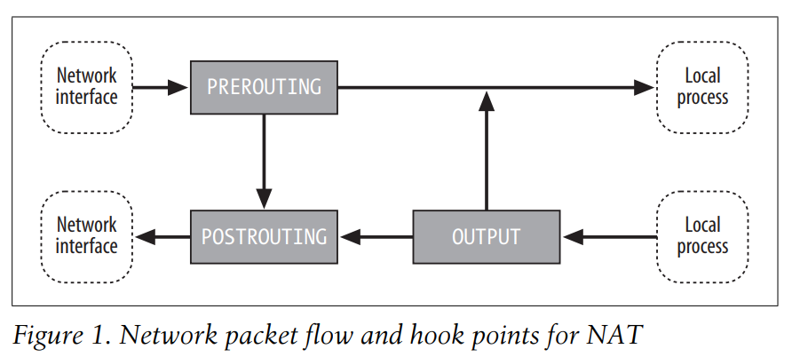
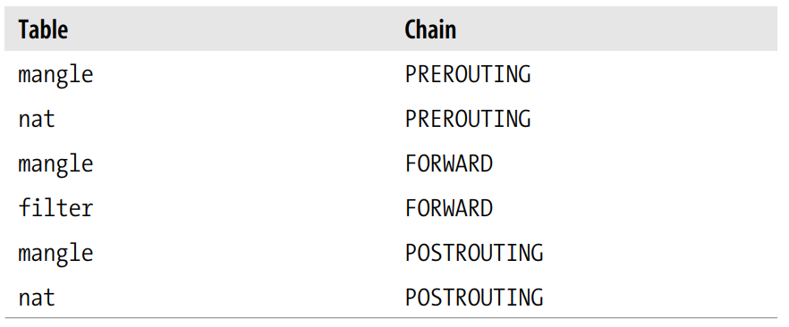
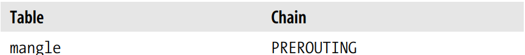
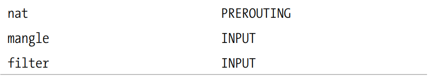
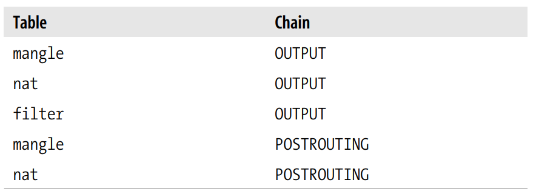
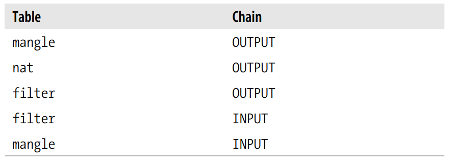

- [Giới thiệu](#giới-thiệu)
  - [1. Khái niệm](#1-khái-niệm)
    - [Tables](#tables)
    - [Chains](#chains)
    - [Packet flow](#packet-flow)
    - [Rules](#rules)
    - [Matches](#matches)
    - [Targets](#targets)
  - [2. Applications](#2-applications)
  - [3. Cấu hình iptables](#3-cấu-hình-iptables)
  - [4. Connection Tracking](#4-connection-tracking)


# Giới thiệu 
Hệ thống con xử lý network packet của Linux kernel được gọi là *Netfilter* 

**iptables** là câu lệnh được dùng để cấu hình *Netfilter*. 

Quyển sách đang sử dụng được viết tại thời điểm phiên bản **iptables** là 1.2.7a, Linux kernel 2.4.

Tại thời điểm viết tài liệu này phiên bản **iptables** là 1.8.10. 

Kiến trúc **iptables** gộp các quy tắc xử lý network packet thành các bảng theo chức năng (lọc packet, dịch địa chỉ mạng, và, thay đổi header của packet (packet mangling)), mỗi bảng sẽ có các chuỗi (chain) quy tắc xử lý (processing rules). Các rules sẽ bao gồm matches (dùng để quyết định áp dụng rule lên packet nào) và targets (thao tác thực thi lên các matching packet)

**iptables** hoạt động ở OSI Layer 3 (Network). Với OSI Layer 2, có các công nghệ khác như **ebtables** (Ethernet Bridge Tables). 

Ví dụ 

Ví dụ câu lệnh **iptables** 
```
iptables -t nat -A PREROUTING -i eth1 -p tcp --dport 80 -j DNAT --to-destination 192.168.1.13:8080 
```

Bảng 1 giải thích câu lệnh trên 

|Thành phần |Mô tả  |
|---------- |-------|
|-t nat     |Thực thi trên bảng nat|
|-A PREROUTING| Gán rule sau vào chain *PREROUTING*|
|-i eth1|Match các packet tới giao diện mạng *eth1*...|
|-p tcp |mà sử dụng giao thức tcp...|
|--dport 80|cho cổng 80|
|-j DNAT|Nhảy tới DNAT target...|
|--to-destination 192.168.1.3:8080|và thay đổi địa chỉ đích thành 192.168.1.3 và cổng đích 8080|


## 1. Khái niệm 
**iptables** định nghĩa 5 "hook points* trên luồng xử lý packet của kernel: *PREROUTING*, *INPUT*, *FORWARD*, và *OUTPUT*. Các chain có sẵn được gắn vào các hook points này; bạn có thể thêm chuỗi các rules cho mỗi hook point. Mỗi rule đại diện cho một quy luật để ảnh hưởng hoặc giám sát luồng packet. 

*TIP*
Nhiều người hay nói "PREROUTING chain là của bảng nat", tức là *chains thuộc về tables*. Tuy nhiên chains và tables chỉ liên quan đến nhau một phần, và không cái nào thực sự "thuộc về" cái nào. *Chains* đại diện cho hook points trong packet flow, *tables* đại diện cho loại xử lý. Hình 1 tới 3 minh họa tất cả các kết hợp có thể, và thứ tự packet chảy qua hệ thống gặp các hook point. 

Hình 1 minh họa cách packet đi qua hệ thống để dịch địa chỉ. Đây là các chains cho bảng nat 



Hình 2 minh họa cách packet đi qua hệ thống để lọc packet. Đây là các chain cho bảng *filter* 

Hình 3 minh họa cách packet đi qua hệ thống để mangle packet. Là các chains cho bảng *mangle* 

Bảng 2 minh họa 5 hook points và mô tả các điểm trong luồng packet có thể đặc tả xử lý 

|Hook|Cho phép bạn xử lý packets...|
|-----|-----|
|FORWARD|...chảy qua một gateway computer, đi vào một giao diện và đi ngay ra một giao diện khác|
|INPUT|...ngay trước khi chúng được chuyển cho một tiến trình cục bộ|
OUTPUT|...ngay sau khi chúng được sinh ra bởi một tiến trình cục bộ|
POSTROUTING|...ngay trước khi chúng rời một giao diện mạng|
PREROUTING|...ngay khi chúng tới từ một giao diện mạng (sau khi drop bất kì packets nếu giao diện sử dụng promiscuous mode, và sau khi checksum - tức là việc drop packet do promiscuous mode hay checksum được ưu tiên trước, rồi mới đưa cho PREROUTING)

*TIP*: Các hook points được định nghĩa trong file header của kernel */usr/include/linux/netfilter_ipv4.h* với các tên là *NF_IP_FORWARD, NF_IP_LOCAL_\{IN, OUT\}* và *NF_IP_\{PRE,POST\}_ROUTING*. 

Việc sử dụng chain nào sẽ dựa trên vị trí trên vòng đời của packet mà bạn muốn áp dụng rules vào. Ví dụ, nếu muốn filter các packet đi ra, thì nên làm ở *OUTPUT* chain vì *POSTROUTING* chain không có liên kết tới bảng *filter*. 

### Tables 
**iptables** có ba bảng có sẵn: *filter*, *mangle* và *nat*. Mỗi bảng được cấu hình với các chains tương ứng với một hay nhiều hook points được mô tả ở Bảng 2 và minh họa từ Hình 1 đến 3. Cả ba bảng có sẵn được mô tả ở Bảng 3

|Bảng|Mô tả|
|----|-----|
|nat|Sử dụng cho dịch địa chỉ. Các chain có sẵn của nó là *OUTPUT, POSTROUTING và PREROUTING*|
|filter|Lọc các traffic đi ra và vào máy tính, mặc định **iptables** thực thi trên bảng này. Các chain có sẵn của nó là *FORWARD,INPUT và OUTPUT*|
|mangle|Dùng để thay đổi packet, như là bỏ các tùy chọn IP,...Các chains có sẵn là *FORWARD,INPUT,OUTPUT,POSTROUTING, và PREROUTING*|

### Chains 
Mặc định, mỗi table có các chains, ban đầu rỗng, cho một vài hoặc tất cả các hook points. 

Bạn có thể tạo custom chain để tổ chức rules 

*Policy* của chain quyết định số phận của các packets tới cuối chain mà không được gửi tới một target cụ thể. Chỉ các built-in targets (xem Bảng 8) *ACCEPT* và *DROP* có thể được dùng làm policy cho một built-in chain, và mặc định là *ACCEPT*. Tất cả các chains được định nghĩa bởi người dùng có một policy implicit *RETURN* không thể thay đổi

Nếu bạn muốn một policy phức tạp hơn cho một built-in chain hoặc một policy khác *RETURN* cho một user-defined chain, bạn có thể thêm một rule tới cuối chain match với tất cả các packets, với bất kì target.

### Packet flow

Packet đi qua chuỗi, và gặp từng rule một theo thứ tự. Nếu packet không match tiêu chí của rule, nó sẽ đi tới rule tiếp theo trong chain. Nếu packet tới rule cuối trong một chain và không match, policy của chain (target mặc định của chain) sẽ được áp lên nó. 

Dựa vào flow ở Hình 1 tới 3, thứ tự các packets gặp các bảng có sẵn và chains được minh họa trong Bảng 4 tới 7 

Bảng 4: Packet chảy từ một giao diện mạng tới một giao diện khác (forwarding) 


Bảng 5: Packet chảy từ một giao diện mạng tới một tiến trình cục bộ (input)



Bảng 6: Packet chảy từ một tiến trình cục bộ tới một giao diện mạng (output) 


Bảng 7: Packet chảy từ một tiến trình cục bộ tới một tiến trình cục bộ (local) 


### Rules 
Rules chứa một hoặc nhiều tiêu chí match quyết định network packet nào bị ảnh hưởng (tất cả tùy chọn match phải được thỏa mãn để một rule match một packet) và đặc tả target quyết định network packet bị ảnh hưởng như thế nào 

Hệ thống lưu giữ hai bộ đếm cho mỗi rule: 
- packet counter 
- byte counter

Mỗi khi một packet tới một rule và match tiêu chí của rule đó, packet counter được tăng, và byte counter được giảm với kích cỡ của packet được match 

Match và target của rule là optional. Nếu không có tiêu chí match, tất cả packets được coi là match. Nếu không đặc tả target, packet không bị ảnh hưởng gì cả (xử lý cứ như là rule không tồn tại - chỉ là bộ đếm packet và byte được cập nhật) có thể thêm null rule vào FORWARD chain của bảng filter với câu lệnh 
```
iptables -t filter -A FORWARD 
```

### Matches 
Có nhiều loại match 
- Generic 
  - IP match (protocol, source, destination,...)
- Specialized 
  - Phải nạp extension (sử dụng **iptables** -m hoặc --match)
  - Có match extension để xử lý tầng data-link (dưới tầng IP). Extension *mac* match dựa trên Ethernet MAC address 

### Targets 
- Targets được dùng để đặc tả hành động thực thi khi rule match một packet 
- Target cũng được dùng để đặc tả chain policies 

Bốn targets có sẵn trong **iptables**, và các module extension cung cấp các target khác. Bảng 8 mô tả các targets có sẵn 

|Target|Mô tả|
|------|-----|
|ACCEPT|Cho packet chảy tới giai đoạn xử lý kế tiếp, ngừng chảy qua chain hiện tại, bắt đầu ở giai đoạn tiếp theo|
|DROP|Không xử lý packet. Sử dụng target extension REJECT để thông báo cho người dùng|
|QUEUE|Gửi packet tới userspace. Xem thêm thông tin ở *libipq* manpage|
|RETURN||

[//]: # (Cần Lab để hiểu sâu) 

## 2. Applications 
Danh sách dưới liệt kê tổng quan các ứng dụng xử lý packet 
- Lọc packet 
  Kiểm tra packet ở nhiều điểm khi nó chảy qua code của kernel đưa ra quyết định về cách xử lý packet (cho đi vào giai đoạn kiểm xử lý tiếp theo, hủy nó mà không phản hồi, hủy với phản hồi,...)
- Giám sát thông lượng mạng 
  Sử dụng bộ đếm packet hay byte từ các packet matching criteria để giám sát thông lượng traffic 
- Theo dõi kết nối 
  Cung cấp thêm thông tin để match các packet. Ví dụ, FTP sẽ có hai kết nối: một kết nối control một kết nối chuyển dữ liệu. Connection tracking cho FTP giám sát kết nối control và sử dụng thông tin của giao thức FTP để trích xuất đủ thông tin từ các tương tác để định danh được kết nối data khi chúng được tạo. 

- Thay đổi packet (packet mangling)
  Thay đổi các trường trong header của packet (như là địa chỉ mạng số hiệu cổng) hay payloads.  
- Dịch địa chỉ mạng (NAT) 
  Là một loại packet mangling liên quan tới việc thay đổi địa chỉ đích và nguồn và/hoặc số hiệu cổng. 
- Masquerading (SNAT)
  Là một lại SNAT đặc biệt, trong đó một máy tính thay đổi packets để khiến như chúng đi từ máy tính đó. IP của máy tính được quyết định tự động, các kết nối cũ được hủy nếu IP thay đổi. Masquerading thường được dùng 
- Port Forwading 
  Là một loại DNAT trong đó một máy tính (ví dụ như một firewall) hoạt động như là một proxy cho một hoặc nhiều máy tính khác. Firewall nhận packets có địa chỉ đích là của nó, sau đó nó thay đổi địa chỉ đích thành các địa chỉ cho các máy tính khác bên trong mạng trước khi gửi đi. Hơn nữa, các packets phản hồi từ các máy tính bên trong mạng có địa chỉ nguồn được thay đổi thành địa chỉ của firewall và gửi lại cho máy tính phù hợp ở bên ngoài. 
  
  Port forwarding thường được sử dụng để cung cấp các dịch vụ mạng công cộng (như là web hay email) bởi các máy tính mà không phải firewall, mà không cần nhiều hơn 1 địa chỉ IP public. Với thế giới bên ngoài, dịch vụ cứ như là được cung cấp bởi máy proxy, và với server thật sự, cứ như là tất cả request tới từ máy proxy 
- Cân bằng tải (Load balancing)
  Load balancing liên quan tới việc phân tán kết nối qua một nhóm các servers để thông lượng tăng lên. Một cách để cài đặt cân bằng tải đơn giản là cài đặt port forwarding để địa chỉ đích được lựa chọn từ một danh sách các destination có thể với thuật toán round-robin

## 3. Cấu hình iptables 

|Đường dẫn|Mục đích|
|---------|--------|
|/etc/sysctl.conf|Chứa cấu hình được áp dụng ở thời điểm boot. Ví dụ /proc/sys/netipv4/ip_forward có thể được đặt thành 1 ở thời điểm boot bằng cách thêm dòng *net.ipv4.ip_forward = 1* vào file này|
|/proc/sys/net/ipv4/ip_forward|Phải đặt thành 1 nếu muốn host hoạt động như một gateway \(chuyển packets trong network kết nối với các giao diện của nó\) |

## 4. Connection Tracking 
