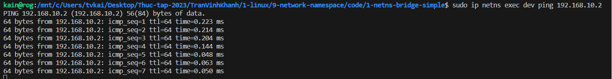
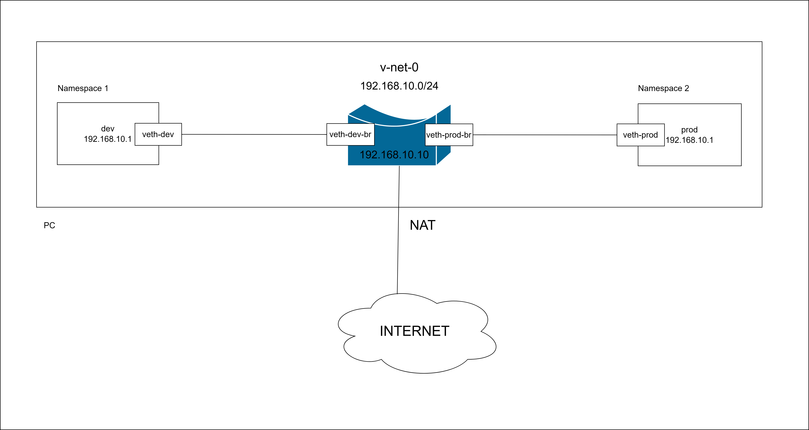
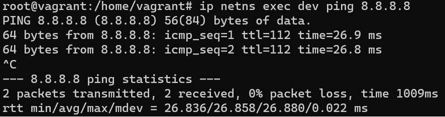

# 1. Namespace 
Namespace cung cấp sự cô lập về mặt tài nguyên hệ thống. Với namespace Linux kernel có thể nhóm một hoặc nhiều tiến trình với một tập các tài nguyên.

Một vài loại namespace:
- PID
  
  Cô lập về pid của các tiến trình, các tiến trình bên trong PID namespace khác nhau có thể có PID trùng nhau 
- Mount 
  
  Cô lập mount point, các tiến trình chỉ nhìn thấy mount trong cùng namespace
- Network

    Cô lập về mạng, các tiến trình bên trong một network namespace sẽ nhìn thấy các giao diện mạng, các tuyến và bảng định tuyến khác so với các tiến trình bên trong network namespace khác. Cho phép tách mạng của container khỏi mạng host. 

# 2. Network namespace 
Network namespace cho phép nhiều giao diện mạng và bảng định tuyến hoạt động độc lập với nhau trên một kernel duy nhất. => Ảo hóa mạng

## 2.1 Liệt kê các network namespace 

```
# ip netns list
```
## 2.2 Tạo network namespace
```
# ip netns add <new-namespace-name>
```

Khi công cụ ip tạo ra một network namespace mới, nó sẽ tạo ra một bind mount ở trong /var/run/netns; cho phép namespace tồn tại ngay cả khi không có tiến trình chạy bên trong namespace. 

```
# ip netns add blue
```

## 2.3 Chạy các câu lệnh quản lý network bên trong namespace
```
# ip netns exec <command>
```

```
# ip netns exec blue ip a 
```

## 2.4 Xóa network namespace 

```
# ip netns delete <namespace-name>
```

## 2.5 Cấu hình network namespace 
Mặc định, network namespace mới tạo sẽ có loopback device nhưng không có network device nào khác. 

Mỗi network device (giao diện physical hay virtual) chỉ có thể thuộc về một network namespace. 

Giao diện physical hay virtual đều có thể được gán cho các namespace. 

Các giao diện virtual (virtual ethernet) có thể được tạo, cho phép các tiến trình bên trong namespace giao tiếp với các tiến trình bên trong namespace khác qua mạng.

Tạo virtual ethernet interface, veth lúc nào cũng có cặp được kết nối như một cái ống, bất cứ gì đi vào một veth sẽ đi ra khỏi veth còn lại (veth peer) 
```
# ip link add veth0 type veth peer name veth1
```

Chạy câu lệnh ip link list để kiểm tra cặp veth được tạo
```
# ip link list
```

Để kết nối global namespace tới namespace nào đó (ví dụ là blue), di chuyển một veth tới namespace blue sử dụng
```
# ip link set veth1 netns blue
```

Kiểm tra veth ở trong namespace blue

```
# ip netns exec blue ip link list
```

Cấu hình giao diện ở namespace 
```
# ip netns exec blue ip a add 10.1.1.1/24 dev veth1
# ip netns exec blue ip link set dev veth1 up
```

Gán giao diện VLAN vào một namespace. 

Bước 1: Tạo namespace 
```
ip netns add red
```

Bước 2: Tạo giao diện VLAN ở namespace "default"
```
ip link add link eth0 name eth0.100 type vlan id 100
```

Bước 3: Chuyển giao diện VLAN vừa tạo vào namespace
```
ip link set eth0.100 netns blue
```
Bước 4: Cấu hình giao diện VLAN trong namespace
```
ip netns exec blue ip addr add 10.1.1.1/24 dev eth0.100 
ip netns exec blue ip link set eth0.100 up
```

## 2.6 Network namespace với bridge
Sử dụng bridge để namespace network giao tiếp với mạng bên ngoài 

Chúng ta sẽ cấu hình namespace network như sau


### 2.6.1 Cấu hình hai namespace giao tiếp với nhau qua bridge

Tạo hai namespace *dev* và *prod*

```
# ip netns add dev
# ip netns add prod
```

Tạo bridge *v-net-0*
```
# ip link add v-net-0 type bridge 
# ip link set dev v-net-0 up
```

Tạo cặp giao diện để liên kết từ *dev* tới bridge
```
# ip link add veth-dev type veth peer name veth-dev-br
```

Tạo cặp giao diện để liên kết từ *prod* tới bridge
```
# ip link add veth-dev type veth peer name veth-dev-br
```

Chuyển giao diện *veth-dev* sang namespace *dev*
```
# ip link set veth-dev netns dev
```

Gắn giao diện *veth-dev-br* vào bridge *v-net-0*
```
# ip link set veth-dev-br master v-net-0
```

Chuyển giao diện *veth-prod* sang namespace *prod*
```
# ip link set veth-prod netns prod
```

Gắn giao diện *veth-prod-br* vào bridge *v-net-0*
```
# ip link set veth-prod-br master v-net-0
```

Gán địa chỉ ip cho mỗi giao diện của namespace *dev* và *prod*
```
# ip -n dev addr add 192.168.10.1/24 dev veth-dev
# ip -n prod addr add 192.168.10.2/24 dev veth-prod
```

Bật các giao diện 
```
# ip -n dev link set veth-dev up
# ip -n prod link set veth-prod up
# ip link set veth-dev-br up
# ip link set veth-prod-br up
```

Thử ping từ namespace *dev* sang namespace *prod*
```
# ip netns exec dev ping 192.168.10.2 
```



### 2.6.2 Cấu hình namespace giao tiếp với mạng bên ngoài qua bridge sử dụng NAT 

Chúng ta sẽ cấu hình namespace như sau


Mở rộng từ phân 2.6.1

Gán địa chỉ IP cho bridge 
```
# ip addr add 192.168.10.10/24 dev v-net-0
```

Thêm default gateway vào namespace *dev*
```
# ip -n dev route add default via 192.168.10.10 
```

Thử ping từ namespace *dev* tới địa chỉ 8.8.8.8 (địa chỉ IP của DNS của google)

```
# ip netns exec dev ping -c 4 8.8.8.8
```

Không ping được 

Packet rời hỏi namespace dev tới Linux bridge không thể gửi được ra ngoài và cần NAT để chuyển địa chỉ IP của packet thành địa chỉ IP public 

Cài đặt NAT rule cho bảng NAT
```
# iptables --table nat -A POSTROUTING -s 192.168.10.0/24 -j MASQUERADE 
```

Thử ping từ namespace *dev* tới địa chỉ 8.8.8.8 (địa chỉ IP của DNS của google)

Ping được 


