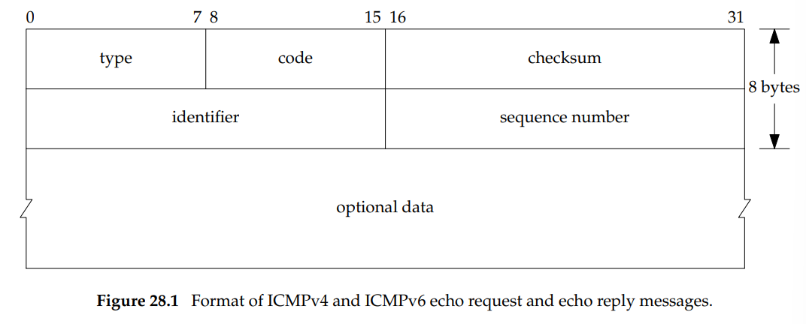
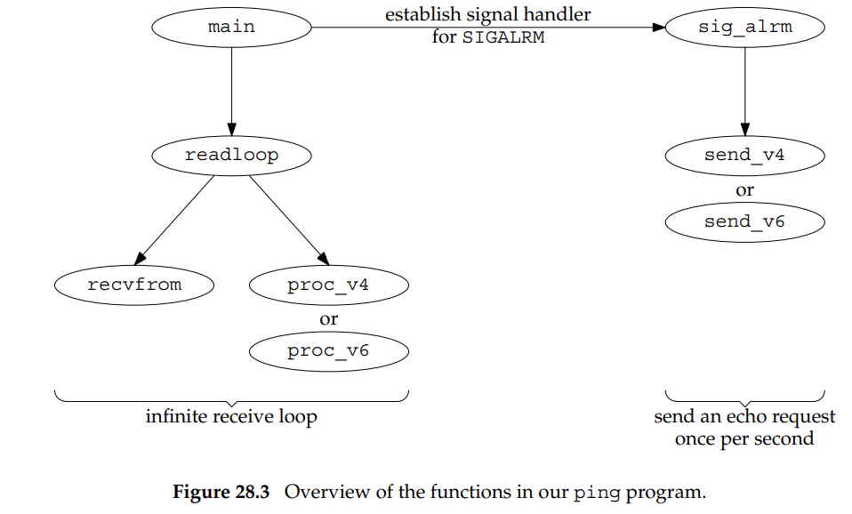

# 1. Giới thiệu
Raw socket cung cấp ba tính năng mà TCP và UDP socket không cung cấp:
- Raw socket cho phép đọc và viết các packet ICMPv4, IGMPv4, và ICMPv6. Chương trình ping, sử dụng ICMP echo requesst và nhận ICMP echo replies
- Raw socket cho phép tiến trình đọc và viết IPv4 packet, với trường giao thức mà không được xử lý bởi kernel. Nhớ lại IPv4 có trường giao thức 8 bit. Phần lớn kernel chỉ xử lý datagrams chứa giá trị 1 (ICMP), 2 (IGMP), 6 (TCP), và 17(UDP). Các giá trị khác cũng được định nghĩa cho trường protocol: IANAA "Protocol Numbers" có danh sách tất cả các giá trị. Ví dụ, OSPF không sử dụng TCP hay UDP, đặt trường protocol của IP packet là 89.
- Một tiến trình có thể sử dụng raw socket để xây IPv4 header sử dungj IP_HDRINCL. Với kĩ thuật này, chúng ta có thể xây dựng UDP và TCP packet.  

# 2. Tạo raw socket 

Bước 1: Sử dụng hàm socket. Ví dụ để tạo IPv4 raw socket. 
```
int sockfd; 
sockfd = socket(AF_INET, SOCK_RAW, protocol)
```
protocol là hằng số, IPPROTO_xxx, được định nghĩa bên trong header <netinet/in.h> như là IPPROTO_ICMP
Chỉ superuser mới được tạo raw socket. 

Bước 2: IP_HDRINCL có thể được đặt như sau
```
const int on = 1;
if (setsockopt(sockfd, IPPROTO_IP, IP_HDRINL, &on, sizeof(on)) < 0) {
    err
}
```
Bước 3 (ít dùng): bind có thể gọi trên raw socket, nhưng mà ít dùng. Hàm này chỉ đặt địa chỉ cục bộ: với raw socket thì không có khái niệm số hiệu cổng. Nếu bind được gọi, địa chỉ IP nguồn cho packet sẽ được đặt (chỉ khi IP_HDRINL chưa được đăt). Nếu bind không được gọi, kernel sẽ đặt địa chỉ IP nguồn bằng địa chỉ IP chính của giao diện đi ra. 

Bước 4 (ít dùng): connect có thể được gọi trên raw socket, nhưng mà ít dùng. Một lần nữa không có khái niệm cổng với raw socket. Liên quan tới output, gọi connect cho phép chúng ta gọi write và send thay vì sendto, vì địa chỉ IP đích đã được đặc tả. 

# 3. Raw socket output
Output với raw socket phải tuân theo các quy luật sau:
- Đầu ra bình thường bằng cách gọi sendto hoặc sendmsg và đặc tả địa chỉ IP đích. write, writev và send có thể được gọi nếu như socket đã được kết nối. 
- Nếu IP_HDRINCL chưa được đặt, địa chị của dữ liệu để kernel gửi là byte đầu tiên sau IP header vì kernel sẽ xây IP header và gán nó vào trước dữ liệu của tiến trình. 
- Nếu IP_HDRINCL được đặt, địa chỉ bắt đầu của dữ liệu cho kernel gửi là byte đầu tiên của IP header. Tiến trình sẽ xây dựng IP header, trừ khi (i) trường id IPv4 có thể được đặt thành 0, bảo kernel đặt giá trị này, (ii) kernel luôn tính và lưu IPv4 header checksum; và (iii) IP có thể có hoặc không có 
- Kernel phân mảnh raw packet vượt quá MTU của giao diện ra 

Với IPv4, tiến trình user có trách nhiệm tính và đặt header checksum vào IPv4 header. 

Ngoài ra còn IPv6 (không được trình bày)

# 4. Raw socket input 
Câu hỏi đầu tiên cần trả lời: Khi nhận IP packet, IP packet nào được kernel chuyển cho raw sockets. Có các quy luật sau:
- Các UDP và TCP packet không bao giờ được truyền cho raw socket. 
- Phần lớn ICMP packet được truyền cho raw socket, sau khi kernel xử lý xong thông điệp ICMP. 
- Tất cả IGMP packets được truyền cho raw socket sau khi kernel xử lý xong thông điệp IGMP 
- Tất cả IP packet với trường protocol mà kernel không biết sẽ được truyền cho raw socket. Kernel chỉ xử lý một vài xác thực cơ bản như: phiên bản IP, IPv4 header checksum, header length, và địa chỉ Ip đích. 
- Nếu packet tới là một phân mảnh, không truyền tới raw socket tới khi tất cả các mảnh tới và được ghép lại. 

Khi kernel có một IP packet để truyền cho raw sockets, tất cả các raw sockets của tất cả các tiến trình được xem xét để tìm socket phù hợp. Một copy của IP packet được đưa tới mỗi socket phù hợp. Các test sau để kiểm tra mỗi raw socket, nếu pass cả ba thì IP packet sẽ được đưa tới socket:
- Nếu protocol khác 0 được đặc tả khi tạo raw socket, trường protocol của ip packet được nhận phải giống với giá trị này 
- Nếu địa chỉ IP cục bộ gắn với raw socket bởi bind, thì địa chỉ IP đích của IP packet phải giống với giá trị này. 
- Nếu địa chỉ IP đích được đặc tả cho raw socket bởi connect, địa chỉ IP nguồn của IP packet phải giống với giá trị này. 

Lưu ý: nếu raw socket được tạo với protocol 0, và bind và connect không được gọi lên nó, nó sẽ nhận được tất cả IP packet mà kernel truyền cho IP packet 

# 5. Chương trình ping 

Cơ chế ping:
ICMP echo requesst gửi cho địa chỉ IP nào đó, và node với địa chỉ IP đó phản hồi bằng ICMP echo reply. 

Định dạng thông điệp ICMP


Tổng quát chức năng của chương trình ping 



