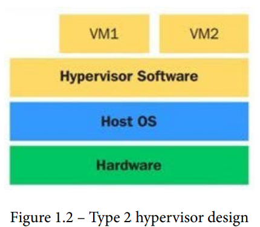

- [Phần 1: Giới thiệu](#phần-1-giới-thiệu)
  - [1. Lịch sử ảo hóa Linux](#1-lịch-sử-ảo-hóa-linux)
  - [2. Các loại ảo hóa](#2-các-loại-ảo-hóa)
  - [3. Hypervisor](#3-hypervisor)
  - [4. Các loại hypervisor](#4-các-loại-hypervisor)
    - [4.1 Hypervisor loại 1](#41-hypervisor-loại-1)
    - [4.2 Hypervisor loại 2](#42-hypervisor-loại-2)
  - [5. Các dự án ảo hóa mã nguồn mở](#5-các-dự-án-ảo-hóa-mã-nguồn-mở)
    - [5.1 Xen](#51-xen)
      - [Lịch sử](#lịch-sử)
      - [Kĩ thuật](#kĩ-thuật)
    - [5.2 KVM](#52-kvm)
  - [6. Ảo hóa Linux và cloud](#6-ảo-hóa-linux-và-cloud)

# Phần 1: Giới thiệu

## 1. Lịch sử ảo hóa Linux

Ảo hóa là một khái niệm liên quan tới việc tạo ra các tài nguyên ảo và ánh xạ chúng tới các tài nguyên vật lý.

Quá trình này có thể được thực hiện sử dụng phần cứng (phân vùng thông qua partition controller) hay phần mềm (sử dụng hypervisor).

Ví dụ, nếu bạn có một PC với 16 cores chạy một hypervisor, bạn có thể dễ dàng tạo một hay nhiều máy ảo mỗi máy có 2 cores. Giới hạn số máy ảo của tạo ra có liên quan tới hãng, nếu bạn sử dụng Red Hat Enterprise Virtualization v4.x (Hypervisor KVM-based), bạn có thể dùng tới 768 logical CPU core hay threads.

Phần lớn các trường hợp, hypervisor sẽ phù hợp cho việc quản lý tài nguyên hiệu quả nhất.

Ảo hóa không phải là một công nghệ mới nó có từ năm 1967 với hệ điều hành CP-40 trên S/360 Model 40 của IBM.

Vào năm 2003, là sự ra đời của hypervisor mã nguồn mở đầu tiên cho kiến trúc x86: **Xen**. **Xen** hỗ trợ nhiều kiến trúc CPU (Itanium, x86, x86_64, và ARM), nó có thể chạy nhiều OS - Windows, Linux, Solaris, BSD. Ngày nay **Xen** vẫn được sử dụng bởi một số hãng như Oracle (Oracle VM), Citrix (XenServer),...

Vào năm 2007, Red Hat tích hợp Xen vào Red Hat Enterprise Linux 5. Tuy nhiên, vào năm 2010, Red Hat chuyển từ Xen sang **KVM** khi cho ra mắt Red Hat Enterprise Linux 6.

Về mặt kĩ thuật, KVM sử dụng cách tiếp cận module, biến đổi Linux kernel thành một hypervisors cho các kiến trúc CPU được hỗ trợ (các CPU được hỗ trợ ở đây là các CPU có hỗ trợ hardware virtualization extensions, như là AMD-V hay Intel VT).

Vào thời điểm hiện tại (2023), thị trường có rất nhiều giải pháp ảo hóa - Red Hat với KVM, Microsoft với HyperV, VMWare với ESXi, Oracle với Oracle VM,... Từ đó dẫn tới sự phát triển của nhiều giải pháp cloud như EC2, AWS, Office 365, Azure,...

## 2. Các loại ảo hóa

Có thể phân chia các loại ảo hóa dựa trên

- Ca sử dụng (tức là ảo hóa _cái gì_)
- Cách ảo hóa

Phân chia theo ca sử dụng

- Ảo hóa desktop (Virtual Desktop Infrastructure (VDI))
- Ảo hóa server
- Ảo hóa ứng dụng
- Ảo hóa mạng (Software defined networking (SDN))
- Ảo hóa storage (Software defined Storage (SDS))

Phân chia theo cách ảo hóa

- Partitioning
- Ảo hóa toàn phần
- Ảo hóa dựa trên phần mềm
- Ảo hóa dựa trên phần cứng
- Ảo hóa song song
- Ảo hóa hyprid
- Ảo hóa dựa trên container (Docker, Podman)

Khi sử dụng những giải pháp ảo hóa trên và scale chúng lên (_thành cloud_), không thể nào dựa vào các công cụ bình thường như scripts, commands,... để quản lý hạ tầng, phải có công cụ để quản lý hạ tầng một cách _hiệu quả_ (ví dụ như Ansible). Đó là lý do ra đời của các nền tảng như OpenStack, OpenShift, Elasticsearch, Logstash, Kibana (ELK),...

## 3. Hypervisor

Hypervisor là phần mềm chịu trách nhiệm giám sát và điều khiển các máy ảo (máy khách).

Hypervisor cung cấp phần cứng ảo, quản lý vòng đời máy ảo, migrate máy ảo, cấp phát tài nguyên thời gian thực, định nghĩa ra các chính sách để quản lý máy ảo,...

Hypervisor cũng có trách nhiệm điều khiển các tài nguyên phần cứng như, _memory translation_ và _I/O mapping_.

Công nghệ ảo hóa cho phép chạy nhiều máy ảo trên một hệ thống vật lý. Ví dụ, có thể có nhiều máy ảo Linux trên một hệ thống vật lý. Hypervisor sẽ chịu trách nhiệm cấp phát tài nguyên (bộ xử lý, bộ nhớ,...) mà các máy ảo yêu cầu.

## 4. Các loại hypervisor

Hypervisor thường được chia làm hai loại: type 1 hoặc type 2, dựa trên vị trí của chúng trên hệ thống.

- Nếu hypervisor chạy trực tiếp trên phần cứng, nó là hypervisor loại 1

- Nếu có OS và hypervisor là một lớp riêng, nó là hypervisor loại 2

### 4.1 Hypervisor loại 1

Hypervisor loại 1 tương tác với phần cứng của hệ thống; nó không cần host OS. Bạn có thể cài nó trực tiếp trên các hệ thống _bare-metal_.

Các thuật ngữ khác cũng dùng để gọi hypervisor loại 1 là **bare-metal, embedded** hay **native hypervisor**.

Các ví dụ của hypervisor loại 1 là: oVirt-node, VMware ESXi/vSphere, Red Hat Enterpise Virtualization Hypervisor (RHEV-H)

Hình phía dưới minh họa thiết kế hypervisor loại 1

Điểm mạnh của hypervisor loại 1:

- Dễ cài đặt và cấu hình
- Nhỏ; tối ưu việc cấp phát tài nguyên cho các máy ảo
- Ít overhead: hypervisor loại 1 chỉ có ứng dụng cần để chạy máy ảo
- An toàn, các vấn đề bảo mật của máy ảo này không ảnh hưởng đến các máy ảo khác chạy trên hypervisor

Điểm yếu của hypervisor loại 1

- Khó customize, sẽ có hạn chế khi cố cài đặt các ứng dụng bên thứ ba hay driver.

### 4.2 Hypervisor loại 2

Hypervisor loại 2 nằm trên OS, nó còn được gọi là _hosted hypervisors_ vì nó phụ thuộc vào host OS để tương tác với phần cứng.

Các ví dụ của hypervisor loại 2 là: VMware Player, Workstation, Fusion và oracle VirtualBox.

Hình dưới minh họa thiết kế hypervisor loại 2

Điểm mạnh của hypervisor loại 2:

- Nhiều phần cứng hỗ trợ, vì host OS điều khiển việc truy cập hardware.
- Customize dễ

Điểm yếu của hypervisor loại 2:

- Chậm hơn hypervisor loại 1

## 5. Các dự án ảo hóa mã nguồn mở

| Dự án                              | Loại ảo hóa                 |
| ---------------------------------- | --------------------------- |
| KVM (Kernel-based Virtual Machine) | Ảo hóa toàn bộ              |
| VirtualBox                         | Ảo hóa toàn bộ              |
| Xen                                | Ảo hóa toàn bộ và song song |

### 5.1 Xen

#### Lịch sử

Ban đầu Xen là một dự án nghiên cứu của trường Đại Học Cambridge dưới sự dẫn dắt của Ian Pratt . Xen được release vào năm 2003. Sau đó Ian Pratt và Simon Crosby đồng sáng lập công ty XenSource. Công ty này tiếp tục phát triển dự án Xen theo phương hướng mã nguồn mở. Vào 15/4/2013, dự án Xen được chuyển cho Linux Foundation và tiếp tục được phát triển.

#### Kĩ thuật

Xen gồm bốn thành phần chính

- Xen hypervisor: Xử lý giao tiếp giữa các máy ảo và phần cứng. Xử lý ngắt, yêu cầu CPU, yêu cầu bộ nhớ, các tương tác với phần cứng,..
- Dom0: Máy ảo chính quản lý môi trường của máy ảo. Phần chính của Dom0 là QEMU, phần mềm mô phỏng một hệ thống máy tính bằng cách dịch mã máy để mô phỏng CPU.
- Các công cụ quản lý: Các công củ Commmand-line và GUi sử dụng để quản lý môi trường Xen
- Các máy ảo (Unprivleged domain, DomU): Các guests chạy trên Xen.

Hình dưới minh họa kiến trúc của Xen

### 5.2 KVM

Mục tiêu của dự án KVM là tạo ra một hypervisor hiện đại sử dụng các phần cứng hiện đại ngày nay (VT-x, AMD-V,...)

KVM biến Linux kernel thành một hypervisor khi cài kernel module KVM. Vì Linux kernel chính là hypervisor, hypervisor cũng được nâng cấp khi kernel được nâng cấp. Ví dụ như các tối ưu cho các thành phần linux, như là bộ lập lịch trong kernel 3.1, cải thiện ảo hóa lồng nhau (nested virtualization) từ kernel 4.20, các tính năng mới để ngăn chạn Spectre attacks, hỗ trợ AMD SEV,... Để mô phỏng I/O, KVM sử dụng QEMU

QEMU mô phỏng bộ xử lý và các thiết bị ngoại vi như là disk, network, VGA, PCI, USB, các cổng, để xây dựng phần cứng ảo,... để guest OS có thể được cài đặt lên.

## 6. Ảo hóa Linux và cloud

Cloud là _buzzword_ trong IT trong khoảng 10 năm vừa qua.

Amazon là ông lớn đầu tiên trong thị trường cloud, khi cho ra mắt Amazon Web Service (AWS) và Amazon Elastic Compute Cloud (EC2) vào năm 2006.

Google đi sau và cho ra mắt Google Cloud Platform vào năm 2008, Microsoft Azure vào năm 2010.

Về các mô hình cloud **Infrastructure as a Service (Iaas) (Hạ tầng làm dịch vụ)**, Google và Amazon là hai nhà cung cấp cloud lớn nhất, mặc dù còn các nhà cung cấp khác (IBM Cloud, VMware Cloud, Oracle Cloud, Alibaba Cloud,...)

Phần lớn các nền tảng cloud này đều dựa trên Linux (ví dụ, Amazon sử dụng Xen và KVM, Google Cloud sử dụng KVM)

Hiện tại, có ba dự án cloud mã nguồn mở chính sử dụng ảo hóa Linux để xây dựng các giải pháp IaaS cho các hybrid và/hoặc private cloud

- OpenStack: Cloud OS mã nguồn mở bao gồm nhiều dự án mã nguồn mở con cung cấp các thành phần để tạo ra một cloud IaaS. KVM (ảo hóa Linux) là hypervisor được sử dụng nhiều nhất (và được hỗ trợ tốt nhất) khi triển khai OpenStack. Dự án được quản lý bởi OpenStack Foundation.
- CloudStack: Dự án mã nguồn mở **Apache Software Foundation (ASF)** sử dụng để xây dựng và quản lý cloud IaaS tương thích hoàn toàn với API của EC2/S3. Nó hỗ trợ tất cả hypervisors của Linux, nhưng phần lớn người dùng CloudStack sử dụng Xen vì nó được tích hợp với CloudStack
- Eucalyptus: Là phần mềm private cloud cho các tổ chức sử dụng để giảm thiểu chi phí cloud công cộng dành được kiểm soát về bảo mật và hiệu năng. Hỗ trợ cả Xen và KVM
