- [Phần 2: KVM](#phần-2-kvm)
  - [1. Các khái niệm liên quan đến ảo hóa](#1-các-khái-niệm-liên-quan-đến-ảo-hóa)
    - [1.1 Môi trường ảo hóa vs môi trường vật lý](#11-môi-trường-ảo-hóa-vs-môi-trường-vật-lý)
  - [1.2 Yêu cầu phần cứng cho ảo hóa](#12-yêu-cầu-phần-cứng-cho-ảo-hóa)
  - [1.3 Yêu cầu phần mềm cho ảo hóa](#13-yêu-cầu-phần-mềm-cho-ảo-hóa)
    - [1.3.1 Ảo hóa toàn bộ (Full virtualizatino)](#131-ảo-hóa-toàn-bộ-full-virtualizatino)
    - [1.3.2 Ảo hóa song song (Paravirtualization)](#132-ảo-hóa-song-song-paravirtualization)
    - [1.3.3 Ảo hóa hỗ trợ bởi phần cứng (Hardware asissted virtualization)](#133-ảo-hóa-hỗ-trợ-bởi-phần-cứng-hardware-asissted-virtualization)
  - [2. libvirt, QEMU, KVM](#2-libvirt-qemu-kvm)
    - [2.1 libvirt](#21-libvirt)
      - [Cơ bản](#cơ-bản)
      - [Kiến trúc libvirt](#kiến-trúc-libvirt)
      - [Ví dụ về QEMU/KVM](#ví-dụ-về-qemukvm)
    - [2.2 QEMU](#22-qemu)
      - [2.2.1 Sử dụng QEMU làm emulator](#221-sử-dụng-qemu-làm-emulator)
      - [2.2.2 Sử dụng QEMU làm virtualizer](#222-sử-dụng-qemu-làm-virtualizer)
      - [2.2.3 QEMU - KVM](#223-qemu---kvm)
        - [2.2.3.1 Các cấu trúc dữ liệu](#2231-các-cấu-trúc-dữ-liệu)
          - [KVMState](#kvmstate)
          - [CPUX86State](#cpux86state)
      - [2.4 Mô hình luồng trong QEMU](#24-mô-hình-luồng-trong-qemu)
    - [2.3 KVM](#23-kvm)
      - [2.3.1 Ảo hóa dưới góc nhìn của CPU](#231-ảo-hóa-dưới-góc-nhìn-của-cpu)
- [Tổng quát](#tổng-quát)
- [Notes](#notes)


# Phần 2: KVM 
## 1. Các khái niệm liên quan đến ảo hóa 
Ảo hóa tách phần cứng khỏi phần mềm. Nó cung cấp một cách tiếp cận tốt hơn, hiệu quả hơn để tách và chia sẻ tài nguyên giữa các công việc. 

Nếu chúng ta sử dụng hyperviser loại 1, điều này nghĩa là hypervisor sẽ quản lý việc cho phép các server ảo truy cập vào tài nguyên phần cứng. Việc quản lý này được hỗ trợ bởi một thuật toán lập lịch, được cài đặt bên trong hypervisor sao cho việc truy cập là tối ưu và hiệu quả. 

### 1.1 Môi trường ảo hóa vs môi trường vật lý 

Trên một server vật lý, chúng ta cài OS ngay trên phần cứng và chạy ứng dụng, hình dưới minh họa cách tiếp cận này 

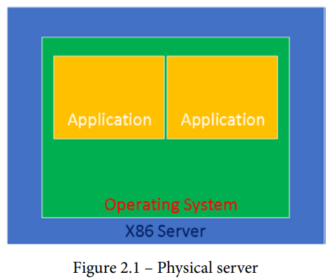

Trong thế giới ảo hóa, chúng ta chạy một hypervisor (ví dụ như KVM) và các máy ảo ở trên hypervisor. Bên trong các máy ảo, chúng ta chạy các OS và ứng dụng, như server vật lý. Cách tiếp cận ảo hóa được minh họa trong hình dưới. 

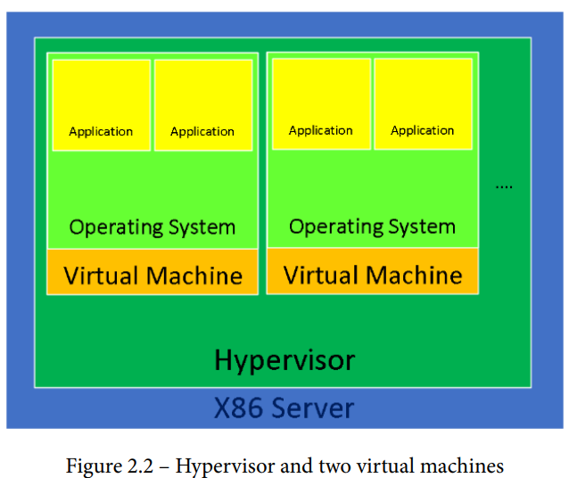

Có nhiều tình huống vẫn cần cách tiếp cận vật lý, vì có nhiều servers không thể sử dụng ảo hóa. Lý do chính là các ứng dụng chạy trên OS không được hỗ trợ phần cứng ảo hóa, phổ biến là network hay storage adapter. 

## 1.2 Yêu cầu phần cứng cho ảo hóa 

Sau sự ra đời của ảo hóa dựa trên phần mềm cho PCs, cả phần mềm và phần cứng đều phát triển. Kết quả là CPU vừa mạnh vừa có rất nhiều tính năng. Điều này dẫn tới ảo hóa hỗ trợ bởi phần cứng. Vào những năm 2003-2006 nhiều CPU không hỗ trợ ảo hóa phần cứng, đến năm 2006 các CPU của Intel và AMD bắt đầu hỗ trợ ảo hóa phần cứng. 

Ngày nay những yêu cầu để có thể chạy hypervisor hiện đại với hỗ trợ ảo hóa phần cứng 
- Hỗ trợ Second-Level Address Translation, Rapid Virtualization Indexing, Extend Page Tables (SLAT/RVI/EPT): Công nghệ CPU mà hypervisor sử dụng để ánh xạ địa chỉ bộ nhớ ảo tới địa chỉ vật lý. Các máy ảo hoạt động trong không gian bộ nhớ ảo rải rác khắp bộ nhớ vật lý, bằng cách sử dụng bản đồ như là SLAT/EPT (cài đặt thông qua Translation Lookaside Buffer, hay TLB), độ trễ truy cập bộ nhớ được giảm. Nếu như không có các công nghệ trên, chúng ta phải có truy cập trực tiếp vào địa chỉ vật lý của bộ nhớ máy tính, rất rối, kém bảo mật, và chậm. Để không gây lú, EPT là tên mà Intel sử dụng cho công nghệ SLAT trong CPUs của họ (AMD sử dụng thuật ngữ RVI cho công nghệ SLAT trong CPus của họ)
- Hỗ trợ Intel VT hoặc AMD-V: Nếu Intel CPU có VT (hay AMD CPU có AMD-V), nó hỗ trợ các extensions ảo hóa phần cứng và full virtualization 
- Hỗ trợ Long mode: CPU hỗ trợ 64-bit. Nếu CPU chỉ hỗ trợ 32-bit => Chỉ có 4gb RAM tối đa, ảo hóa gần như là vô dụng 
- Có ảo hóa Input/Output Memory Management Unit (IOMMU) (Như là AMD-Vi, Intel VT-d, stage 2 tables trên ARM): cho phép máy ảo truy cập vào các thiết bị ngoại vi phần cứng trực tiếp (card đồ họa, thiết bị network,...). Chức năng này phải được kích hoạt trên cả CPU và trên motherboard. 
- Có thể ảo hóa Single Root Input Output (SR/IOV), cho phép chúng ta trực tiếp chuyển tiếp thiết bị PCI Express (Ví dụ như cổng Ethernet) tới nhiều máy ảo. Khía cạnh chính của SR-IOV là khả năng chia sẻ thiết bị vật lý với nhiều máy ảo thông qua Virtual Function (VFs). Virtual Function cần hỗ trợ từ phần cứng và driver. 
- Có thể thực thi PCI passthrough, tức là chúng ta có thể lấy một thẻ PCI Express (ví dụ như video card) kết nối nó tới một server motherboard, và máy ảo sẽ coi như card đó được kết nối trực tiếp tới nó, nhờ vào chức năng **Physical Functions (PFs)**. 
- Hỗ trợ Trusted Platform Module (TPM), thường được cài đặt vào một chip trên motherboard. TPM hỗ trợ bảo mật (như là tạo, lưu, bảo vệ các khóa bí mật)

## 1.3 Yêu cầu phần mềm cho ảo hóa 

Trước tiên chúng ta phải hiểu cơ chế **protection ring**. 

Protection ring là cơ chế bảo vệ dữ liệu hoặc chống chịu lỗi bằng cách phân quyền truy cập khi truy cập tài nguyên trên hệ thống máy tính 

Hình dưới minh họa protection ring 

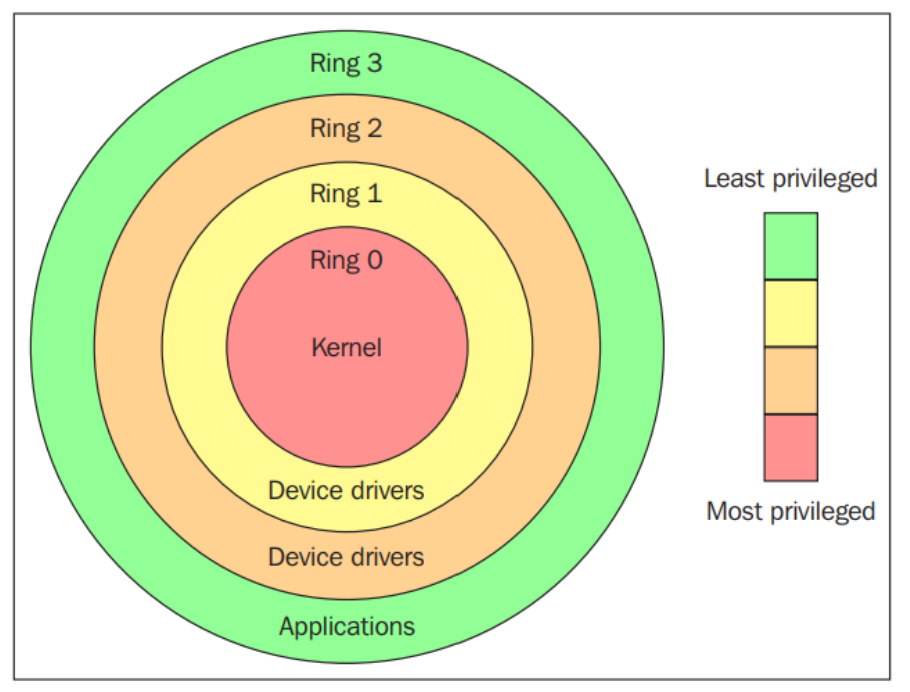

Protection ring được phân vùng từ quyền hạn cao nhất đến thấp nhất. Ring số 0 có quyền cao nhất và tương tác trực tiếp với phần cứng, chẳng hạn như CPU và bộ nhớ. Các tài nguyên, như là bộ nhớ, cổng I/O, các câu lệnh CPU, được bảo vệ thông qua các rings. Ring 1 và 2 thường ít dùng. Phần lớn các hệ thống chỉ dùng hai rings, ngay cả khi phần cứng mà các hệ thống đó chạy trên cung cấp nhiều chế độ CPU hơn là 2. Hai chế độ CPU chính là chế độ kernel và chế độ user, chúng có liên quan tới việc cách các tiến trình được thực thi. Dưới góc nhìn của OS, ring 0 được gọi là kernel mode/supervisor mode và ring 3 được gọi là user mode. Các ứng dụng chạy trên ring 3. 

Để thực thi các chức năng đặc biệt (như là các thao tác với file, với I/O), các tiến trình chạy ở user mode phải sử dụng system call tới kernel mode để yêu cầu dịch vụ ở đó mã nguồn của OS sẽ thực thi dịch vụ được yêu cầu và trả quyền điều khiển về userspace. Hình dưới minh họa khái niệm này 

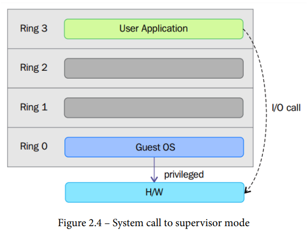

Việc ảo hóa kiến trúc x86 nói riêng yêu cầu đặt lớp ảo hóa dưới hệ điều hành để nó có thể tạo và quản lý các máy ảo. 

Các OS của máy ảo sẽ được đặt ở Ring 1, vì không thể có hai OS ở ring 0 tại cùng một thời điểm. Vậy Guest OS phải được đặt ở ring khác ring 0 -> một số vấn đề nảy sinh là có các câu lệnh quyền hạn cao không thể được ảo hóa nếu như chúng không được thực thi ở Ring 0. Từ đó sinh ra các kĩ thuật ảo hóa khác nhau

Có 3 kĩ thuật để xử lý việc ảo hóa các câu lệnh quyền hạn cao để ảo hóa CPU trên kiến trúc x86 
- Ảo hóa toàn bộ sử dụng binary translation 
- Ảo hóa song song (OS hỗ trợ)
- Ảo hóa hỗ trợ bởi phần cứng (thế hệ 1) 

### 1.3.1 Ảo hóa toàn bộ (Full virtualizatino)

Hình dưới minh họa ảo hóa toàn bộ 

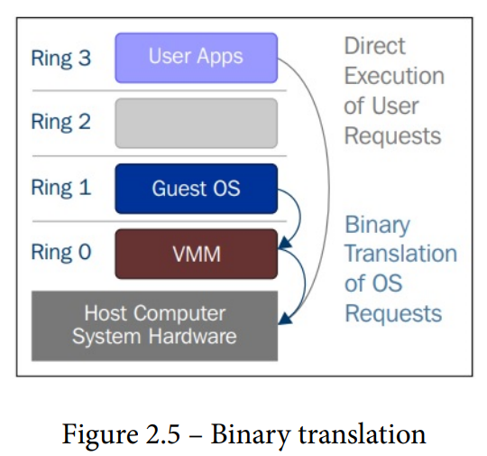

VMM được đặt ở ring 0 và Guest OS được đặt ở ring 1. Guest OS không cần được sửa đổi (không biết đang được ảo hóa)

Các câu lệnh không đặc quyền (non privilege instructions) được thực thi trực tiếp, các câu lệnh đặc quyền (đọc file, ghi file,...) sẽ được thông dịch và viết lại bởi VMM trong quá trình thực thi (động). Quá trình trên được gọi là Binary Translation. 

=> Gây ra overhead, gặp vấn đề về mặt hiệu năng 

### 1.3.2 Ảo hóa song song (Paravirtualization)

Guest OS cần được sửa đổi để hỗ trợ ảo hóa song song cụ thể Guest OS cần được sửa đổi để có khả năng giao tiếp với VMM thông qua hypercall (nói cách khác Guest OS biết là nó đang được ảo hóa)

Ảo hóa song song là kĩ thuật trong đó VMM cung cấp API, các câu lệnh đặc quyền sẽ được thực thi thông qua việc gọi các API (hypercall) 

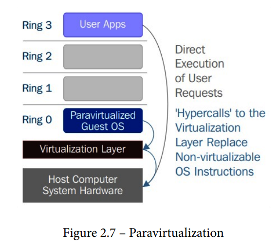


### 1.3.3 Ảo hóa hỗ trợ bởi phần cứng (Hardware asissted virtualization)
Intel và AMD xây dựng các mở rộng vi xử lý kiến trúc x86 gọi là Intel VT-x và AMD-V (thêm các lệnh hỗ trợ ảo hóa vào kiến trúc tập lệnh IA-32). 

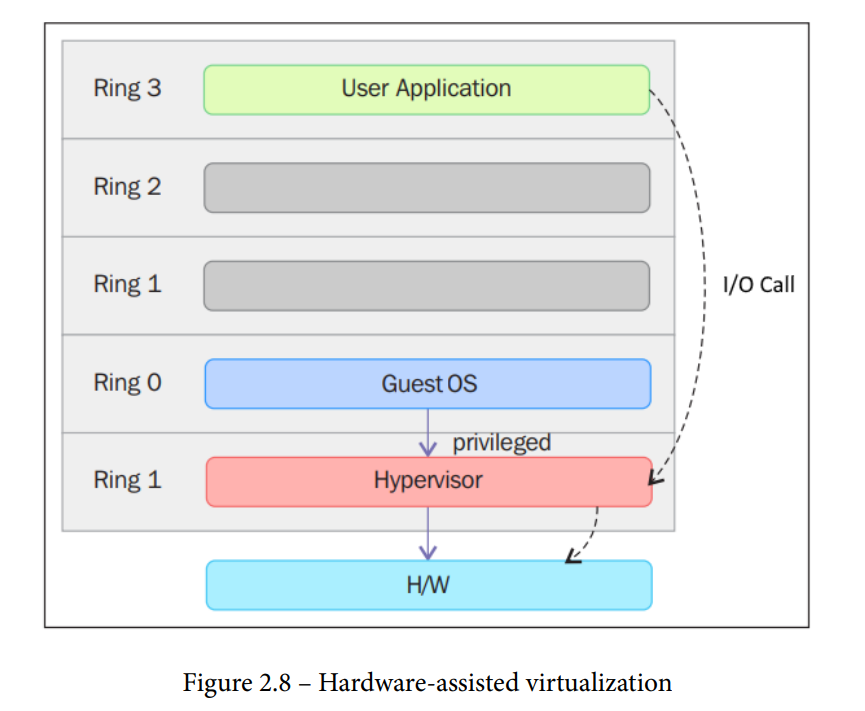

Hypervisor hoạt động ở ring -1 có quyền cao hơn Guest OS hoạt động ở ring 0


## 2. libvirt, QEMU, KVM 

### 2.1 libvirt

#### Cơ bản 
Mục tiêu chính của libvirt: Cung cấp một lớp ổn định để quản lý các máy ảo cung cấp bởi hypervisor trên một máy vật lý (có thể từ xa)

Libvirt cung cấp tất cả APIs cần thiết cho việc quản lý như là: cấp phát, tạo, cập nhật, giám sát, điều khiển, migrate, dừng các domains - trong giới hạn sự hỗ trợ của hypervisor cho các thao tác trên. Không phải hypervisor nào cũng cung cấp các thao tác giống nhau. 

Đối tượng đầu tiên được thao túng qua API là *virConnectPtr*, đại diện cho kết nối tới một hypervisor. Bất kì ứng dụng nào sử dụng libvirt đều bắt đầu bằng việc gọi một trong cách hàm *virConnectOpen*. Các hàm này sẽ nhận vào tham số *name* đại diện cho *connection URI* để mở hypervisor tương ứng. Ví dụ, trên một hệ thống Linux, có thể dùng cả hypervisor KVM và LinuxContainers. 

Sau khi gọi *virConnectOpen*, ứng dụng nhận được *virConnectPtr*, đối tượng này được sử dụng để quản lý các máy ảo (domain) của hypervisor cũng như các tài nguyên ảo hóa, như là storage và networking. 

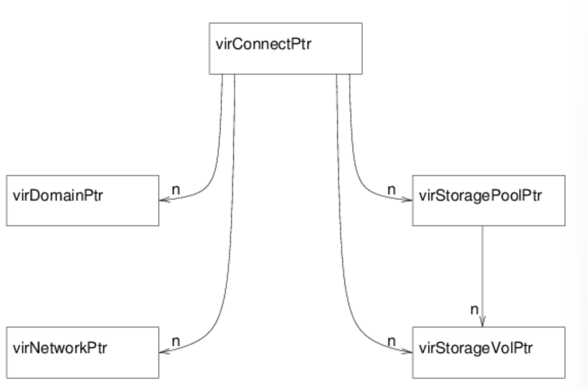

Hình trên cho thấy 5 đối tượng chính mà API cung cấp 
- *virConnectPtr*: Đại diện cho kết nối tới hypervisor 
- *virDomainPtr*: Đại diện cho một máy ảo active/defined 
- *virStorageVolPtr*: Đại diện cho storage volume được expose cho các máy ảo 
- *virStoragePoolPtr*: Đại diện cho các storage pool, một storage pool sẽ chứa một hoặc nhiều storage volume 
- *virNetworkPtr*: Đại diện cho mạng ảo (active/defined) 

#### Kiến trúc libvirt 

Libvỉrt sử dụng kiến trúc *driver-based*, cho phép libvirt giao tiếp với nhiều hypervisors bên ngoài. 

Bên trong libvirt có các drivers dùng để tương tác với các hypervisors khác như LXC, Xen, QEMU,...

Hình dưới minh họa kiến trúc *driver-based* của libvirt 

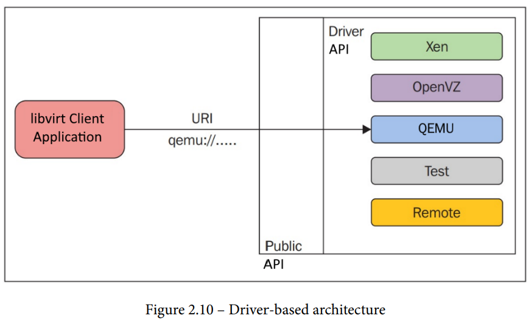

Các loại driver trong libvirt 
- hypervisor 
- interface 
- network 
- nodeDevice 
- nwfilter 
- secret 
- storage 

Cũng có thể chia thành hai loại 
- primary driver (các driver cho hypervisor...) 
    - bhyve: BSD hypvervisor 
    - esx/: VMware ESX and GSX driver sử dụng vSphere API thông qua SOAP 
- secondary driver 
    - cpu/: quản lý các tính năng liên quan tới CPU 
    - interface/: Quản lý giao diện mạng của host 
    - network/: Mạng NAT ảo 
    - nwfilter/: Lọc network packet 
    - node_device/: Thông tin về thiết bị host
    - secret/: Các giá trị bí mật (thường được sử dụng với "volume", "ceph", ...)
    - security/: Các driver quản lý quyền truy cập
    - storage/: Các driver quản lý lưu trữ

#### Ví dụ về QEMU/KVM 

libvirt thăm dò hypervisor/emulator. Ví dụ củ thể là libvirt tìm sự hiện diện của QEMU/KVM (đọc code driver của QEMU sẽ thấy). Driver này cố tìm *qemu-kvm* binary và device */dev/kvm* để xác thực rằng có KVM trên hệ thống. Nếu không có thì emulator QEMU (không có KVM) được xác thực bằng các binary như *qemu, qemu-systemx86-64, qemu-system-mips, qemu-system-microblze,...*

libvirt sẽ sinh ra câu lệnh cho tiến trình QEMU-KVM và gọi exec() để tạo ra tiến trình QEMU-KVM 

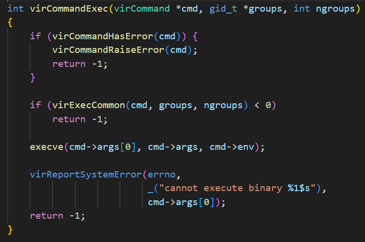

**Lưu ý:** Nhiều người tưởng rằng libvirt sử dụng trực tiếp /dev/kvm để giao tiếp với KVM thông qua các hàm ioctl(). libvirt không làm vậy. Libvirt sinh tiến trình QEMU-KVM và QEMU giao tiếp với module KVM, thông qua ioctl() khác với ioctl() từ file device /dev/kvm. Để tạo ra một máy ảo (virsh create), libvirt chỉ sinh ra một tiến trình QEMU, tiến trình đó sẽ tạo máy ảo. Lưu ý rằng với mỗi máy ảo tạo ra bởi libvirtd một tiến trình QEMU-KVM mới được snh ra. Các thuộc tính của các máy ảo (số CPUs, bộ nhớ, cấu hình thiết bị I/O) được định nghĩa trong các file XML trong thư mục */etc/libvirt/qemu*. Các file XML này chứa các cài đặt cần thiết để tiến trình QEMU-KVM chạy các máy ảo. libvirt clients gửi yêu cầu thông AF_UNIX socket /var/run/libvirt/libvirt-sock, libvirtd lắng nghe socket đó. 

### 2.2 QEMU 
QEMU là một emulator và virtualizer mã nguồn mở. QEMU là một hypervisor loại 2 thực hiện ảo hóa phần cứng.

Khi sử dụng làm emulator nó có thể chạy hệ điều hành và các chương trình được làm cho một máy tính trên máy tính khác (chạy OS dành cho kiến trúc ARM trên kiến trúc x86_64)

QEMU sử dụng kĩ thuật dynamic translation, khi gặp code nó chuyển code đó thành các tập lệnh của host. QEMU sử dụng một vài thủ thuật để khiến việc dịch động này đơn giản, khả chuyển và có hiệu năng tốt. Backend của dynamic translation của QEMU được gọi là TCG (Tiny code generator). 


#### 2.2.1 Sử dụng QEMU làm emulator 

Khi QEMU hoạt động ở chế độ emulator, nó có thể chạy OS hay chương trình cho một loại máy trên máy khác thông qua kĩ thuật *binary translation*. Ở chế độ này QEMU cung cấp một tập các device models và giả lập CPUs thông qua kĩ thuật *dynamic binary translation*. Vì vậy, nó có thể chạy nhiều guest OSs (không cần phải sửa đổi) trên nhiều kiến trúc khác nhau. *Binary translation*. 

Module thực thi *binary translation* của QEMU là **Tiny Code Generator (TCG)**; nó chỉ là một **Just-In-Time (JIT) compiler**. 

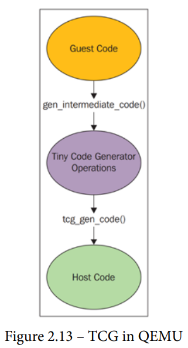

Kĩ thuật trên khiến hiệu năng giảm đi nhưng đổi lại có được sự tương thích tốt. 

#### 2.2.2 Sử dụng QEMU làm virtualizer 

Đây là chế độ QEMU thực thi code guest trực tiếp trên CPU của host đạt được hiệu năng native. Ví dụ, khi hoạt động dưới hypervisor XEM/KVM, QEMU có thể hoạt động trong chế độ này. Nếu KVM là hypervisor ở dưới, QEMU có thể ảo hóa guest như Power PC, S390, x86,...

Ở cả hai chế độ QEMU mô phỏng các thiết bị ngoại vi như là đĩa và network, VGA, PCI, USB,... Khi làm việc trong chế độ virtualizer với KVM, QEMU-KVM tạo và khởi tạo các máy ảo.

Hình dưới minh họa sử dụng QEMU làm virtualizer 

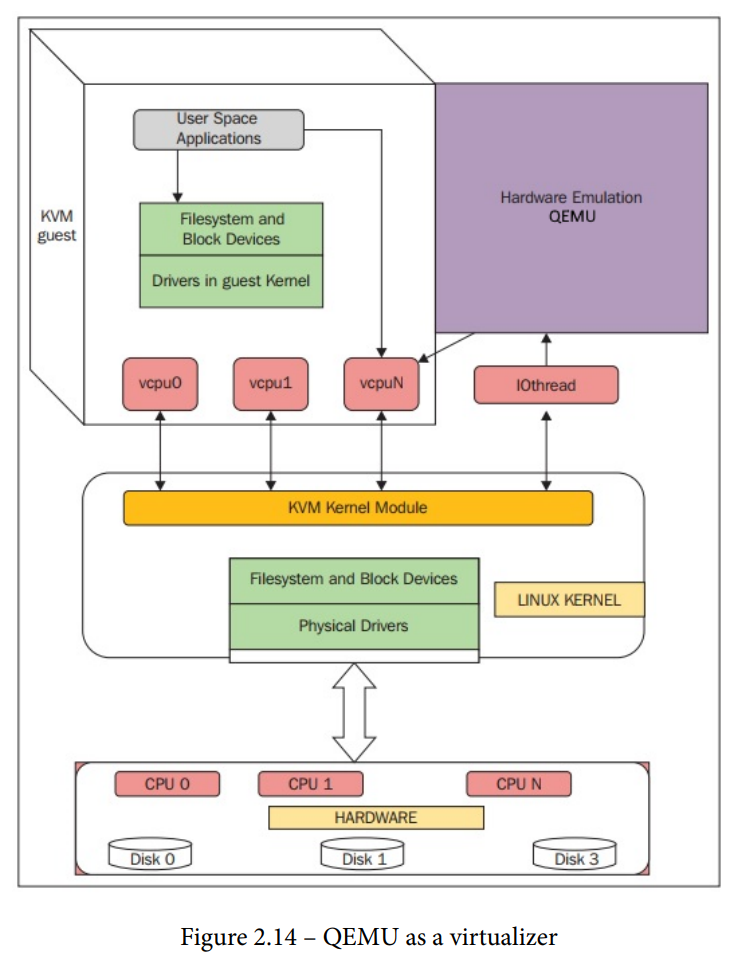

QEMU khởi tạo các luồng POSIX cho mỗi CPU ảo (vCPU) của guest. Nó cung cấp framework sử dụng để mô phỏng không gian địa chỉ vật lý của máy ảo bên trong không gian địa chỉ user-mode của QEMU-KVM. 

Để thực thi code guest trên CPU vật lý, QEMU sử dụng luồng POXIS tức là vCPUs của guests được thực thi bên trong kernel của host như là một luồng POSIX. 

QEMU mở device file (/dev/kvm) có được từ module KVM kernel và thực thi ioctl(). 

Tóm lại, KVM sử dụng QEMU để trở thành một hypervisor hoàn chỉnh. KVM cho phép sử dụng mở rộng ảo hóa hỗ trợ bởi phần cứng cung cấp bởi vi xử lý giúp tăng hiệu năng. 

#### 2.2.3 QEMU - KVM 

##### 2.2.3.1 Các cấu trúc dữ liệu 

###### KVMState 

Chứa các file descriptor biểu diễn cho máy ảo trong QEMU. 

###### CPUX86State 

- Mỗi vCPU có một struct này
- Các thanh ghi general purpose cũng như RSP và RIP là một phần của cấu trúc dữ liệu này 

<!---

##### Cách máy ảo và vCPUs được tạo và khởi tạo bởi QEMU trong ngữ cảnh ảo hóa KVM. 

*kvm_init()* là hàm mở file KVM device 

```
static int kvm_init(MachineState *ms)
{ 
    ...
    KVMState *s;
    s = KVM_STATE(ms->accelerator);
    ...
    s->vmfd = -1;
    s->fd = qemu_open("/dev/kvm", O_RDWR); ---- > [1]
    ...
    do {
        ret = kvm_ioctl(s, KVM_CREATE_VM, type); --- > [2]
    } while (ret == -EINTR);
    s->vmfd = ret;
    ...
    ret = kvm_arch_init(ms, s); --- > ( target-i386/kvm.c: ) 
    .....
 }

```

Trong đoạn code trên, lời gọi hàm ioctl() với tham số *KVM_CREATE_VM* sẽ trả về *vmfd*. 

Khi QEMU có *fd* và *vmfd*, chỉ cần một file descriptor nữa cần có là *kvm_fd* hay *vcpu fd*

```
main() ->
 -> cpu_init(cpu_model); [#define cpu_
init(cpu_model) CPU(cpu_x86_init(cpu_model)) ]
 -> cpu_x86_create()
 -> qemu_init_vcpu
 -> qemu_kvm_start_vcpu()
 -> qemu_thread_create
 -> qemu_kvm_cpu_thread_fn()
 -> kvm_init_vcpu(CPUState *cpu)
int kvm_init_vcpu(CPUState *cpu) 
{
    KVMState *s = kvm_state;
    ...
    ret = kvm_vm_ioctl(s, KVM_CREATE_VCPU, (void *)kvm_
    arch_vcpu_id(cpu));
    cpu->kvm_fd = ret; --- > [vCPU fd]
    ...
    mmap_size = kvm_ioctl(s, KVM_GET_VCPU_MMAP_SIZE, 0);
    cpu->kvm_run = mmap(NULL, mmap_size, PROT_READ | PROT_WRITE, 
    MAP_SHARED, cpu->kvm_fd, 0); [3]
    ...
    ret = kvm_arch_init_vcpu(cpu); [target-i386/kvm.c]
    ....
}
```

-->

#### 2.4 Mô hình luồng trong QEMU 
QEMU-KVM là một ứng dụng đa luồng hướng sự kiện. Các luồng quan trọng như sau 
- Luồng chính 
- Luồng worker cho backend disk I/O ảo 
- Mỗi luồng cho mỗi vCPU 

Với mỗi máy ảo, có một tiến trình QEMU chạy trên hệ thống host. Nếu hệ thống guest tắt tiến trình này sẽ được hủy. Ngoài các luồng vCPU, có các luồng I/O chạy vòng lặp sự kiện để xử lý I/O, như là network packet và disk I/O. Các luồng I/O cũng được sinh bởi QEMU. 

Hình dưới mô tả KVM guest 

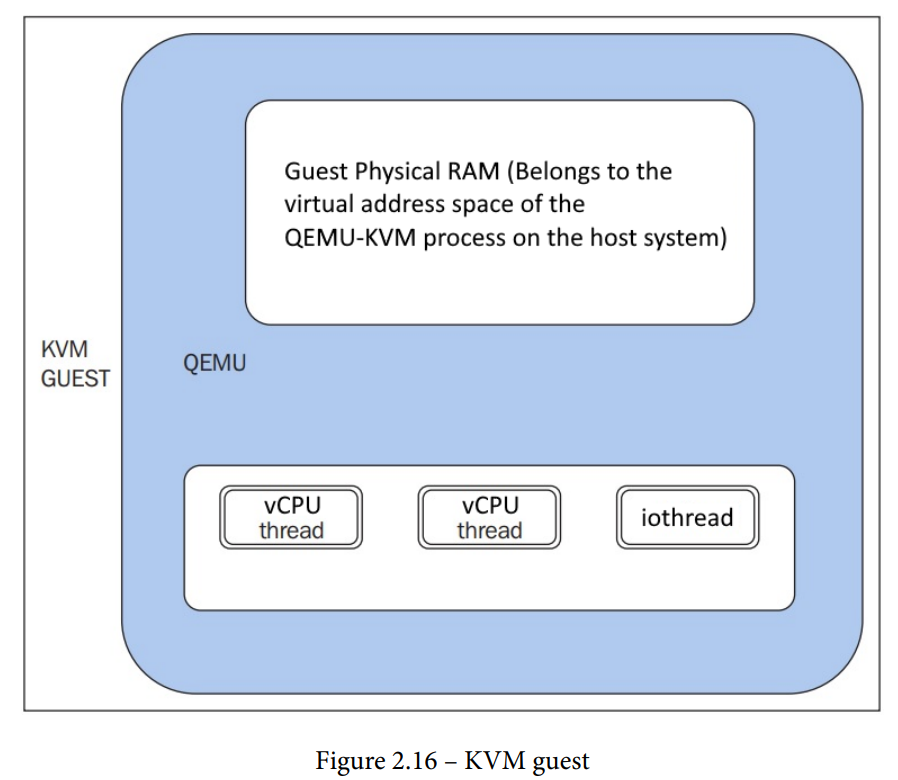

Bộ nhớ vật lý của hệ thống guest ở đâu ? RAM của guest được gán bên trong không gian địa chỉ ảo của tiến trình QEMU.

Luồng vòng lặp sự kiện được gọi là *iothread*. Các vòng lặp này được sử dụng cho timers, giám sát file descriptor,... 

### 2.3 KVM 

Có các kernel module sau 
- kvm.ko (chung)
- kvm-intel.ko (dựa trên phần cứng của intel)
- kvm-amd.ko (dựa trên phần cứng của amd)

KVM sẽ nạp kvm-intel.ko (nếu có cờ vmx), kvm-amd.ko (nếu có cờ svm). Biến Linux kernel thành hypervisor 

KVM cung cấp một device file /dev/kvm cho các ứng dụng tương tác với KVM thông qua ioctl() system call. QEMU cũng sử dụng device file này để tương tác với KVM để tạo, khởi tạo, quản lý, thiết lập và cấu hình các tài nguyên mức kernel của host để tạo và quản lý việc môi trường thự thi của máy ảo. 

Các máy ảo của QEMU/KVM có không gian địa chỉ vật lý bên trong không gian địa chỉ user mode của tiến trình QEMU/KVM. KVM giúp 
- Giả lập thiết bị I/O (Thông qua Memory Mapped IO)
- Giả lập các quyền (Đọc/Ghi các thanh ghi hệ thống)
- Chạy code của guest thông qua *VMENTRY* xử lý sự kiện thông qua *VMEXIT*
- *Inject* sự kiện, như là ngắt ảo hay lỗi page,... 

KVM không phải là một hypervisor hoàn chỉnh, tuy nhiên với QEMU, KVM có thể là một hypervisor hoàn chỉnh. KVM cần các vi xử lý có hỗ trợ ảo hóa phần cứng (Intel-VT hay AMD-V). Thỏa mãn điều kiện trên, KVM biến Linux kernel thành hypervisor. Khi KVM chạy máy ảo, mỗi máy ảo là một tiến trình Linux, có thể được lập lịch chạy trên CPU bởi kernel của host như bất kỳ tiến trình nào khác. 

#### 2.3.1 Ảo hóa dưới góc nhìn của CPU 
TODO 


# Tổng quát 
- Libvirt: Cung cấp giao diện quản lý máy ảo, có thể sử dụng nhiều loại hypervisor khác nhau ở dưới (QEMU-KVM, Xen,...)
- KVM: Kernel based virtual machine là một module của linux biến linux kernel thành một hypervisor 
- QEMU: Là emulator cho phép thực thi code cho một nền tảng này trên code ở một nền tảng khác (thực thi arm trên x86)
- QEMU và KVM: sử dụng QEMU cùng với KVM, tăng tốc độ ảo hóa (QEMU chỉ giả lập IO, bộ nhớ, KVM chịu trách nhiệm thực thi lệnh máy ảo trực tiếp trên CPU vật lý) (chỉ sử dụng được khi os của guest cùng kiến trúc với os của host)
- Mỗi vCPU có một luồng, không gian địa chỉ bộ nhớ vật lý của máy ảo nằm trong không gian địa chỉ user-space của tiến trình QEMU


# Notes 
https://unix.stackexchange.com/questions/340912/qemu-with-kvm-with-differing-host-guest-architectures