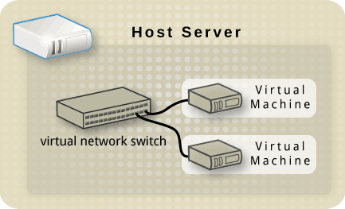
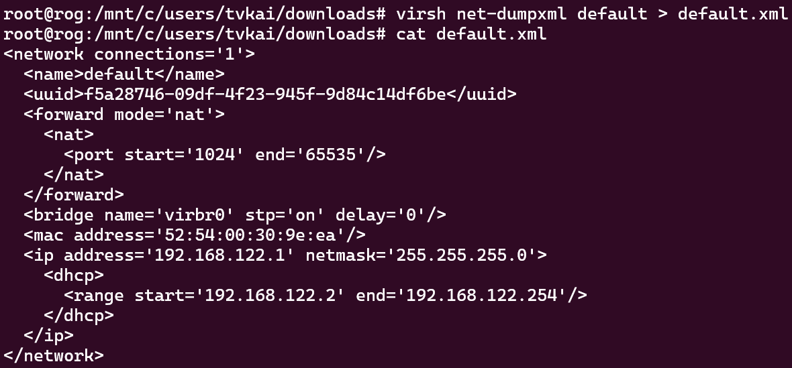

- [Libvirt Networking](#libvirt-networking)
  - [1. Switch ảo (Virtual network switch)](#1-switch-ảo-virtual-network-switch)
  - [2. Network Address Transslation (NAT)](#2-network-address-transslation-nat)
  - [3. DNS và DHCP](#3-dns-và-dhcp)
  - [4. Cấu hình virtual network bằng file XML](#4-cấu-hình-virtual-network-bằng-file-xml)
  - [5.](#5)

# Libvirt Networking 

## 1. Switch ảo (Virtual network switch)

Libvirt sử dụng khái niệm *switch ảo* 

Switch ảo là một chương trình phần mềm trên host server mà máy ảo "cắm vào" và đưa traffic qua 

Trên Linux host server, switch ảo hiển thị dưới dạng một giao diện mạng 

Switch ảo mặc định, được tạo ra khi libvirt daemon được cài đặt lần đầu và khởi chạy, là **virbr0**. 

## 2. Network Address Transslation (NAT) 

Mặc định, switch ảo hoạt động ở chế độ NAT (sử dụng IP masquerading)

Cơ bản là bất kì máy ảo kết nối tới switch này, sẽ sử dụng địa chỉ IP của host để giao tiếp với bên ngoài. Các máy tính bên ngoài host không thể khởi tạo giao tiếp với các máy ảo bên trong, khi switch ảo hoạt động ở chế độ NAT. 

*Lưu ý*: NAT được cấu hình sử dụng *iptables rules*. 

## 3. DNS và DHCP 

Mỗi switch ảo có thể được cấp một dải địa chỉ IP, để cung cấp cho guests thông qua DHCP 

Libvirt sử dụng chương trình **dnsmasq**. 

## 4. Cấu hình virtual network bằng file XML 

File xml trên là cấu hình mặc định khi mới cài libvirt 

Tạo một virtual network NAT mới. Cần hai thứ 
- UUID mới (sinh được từ uuidgen)
- Mac Address độc nhất ([Red hat script](https://access.redhat.com/documentation/en-us/red_hat_enterprise_linux/6/html/virtualization_administration_guide/sect-virtualization-tips_and_tricks-generating_a_new_unique_mac_address))

## 5. 

<!-- 
## . Virtual networking 

Để switch ảo kết nối tới máy ảo, chúng ta cần một đối tượng để nó kết nối tới - và đó là virtual network interface card, thường được gọi là *vNIC* (NIC ảo). 

Mỗi bạn cấu hình NIC ảo cho máy ảo, bạn đang cho máy ảo khả năng kết nối tới switch ảo, switch ảo đó sử dụng NIC vật lý làm uplink tới switch vật lý. 

Tuy nhiên cách tiếp cận trên vẫn có nhược điểm. Giả dụ có 50 máy ảo kết nối tới cùng một switch ảo sử dụng 1 NIC vật lý làm uplink khi uplink đó hỏng, 50 máy ảo đó sẽ không truy cập được vào mạng vật lý. Làm thế nào để giải quyết được vấn đề này ? Bằng cách sử dụng nhiều hơn một uplink vật lý kết nối tới cùng một switch ảo. 

Linux có nhiều loại giao diện mạng, một vài loại: 
- Bridge: Giao diện Layer 2 cho mạng ảo 
- Bond: Kết nối các giao diện mạng thành một giao diện logic (load balancing và failover)
- Team: Dùng cho load balancing và failover nhưng không tạo giao diện logic 
- MACVLAN: Tạo nhiều địa chỉ MAC trên một giao diện vật lý (tạo subinterface) trên Layer 2 
- IPVLAN: Sử dụng cùng MAC address và multiplexes trên Layer 3 
- VXLAN: Sử dụng cho overlay network 
- VETH: Virtual Ethernet 
- MACVTAP/IPVTAP: Kết hợp TUN, TAP, và bridge thành một module 

Linux có các loại giao diện tunneling 
- GRETAP, GRE: Giao thức Generic Routing Encapsulation để bọc các giao thức Layer 2 và Layer 3 
- GENEVE: Giao thức cho mạng overlay network cloud kết hợp VXLAN, GRE, và các giao thức khác thành một. Được hỗ trợ bởi Open vSwitch, VMware NSX,..
- IPIP: IP over IP tunnel kết nối subnet IPv4 nội bộ thông qua mạng public 
- IP6GRE, IP6GRETAP 

-->