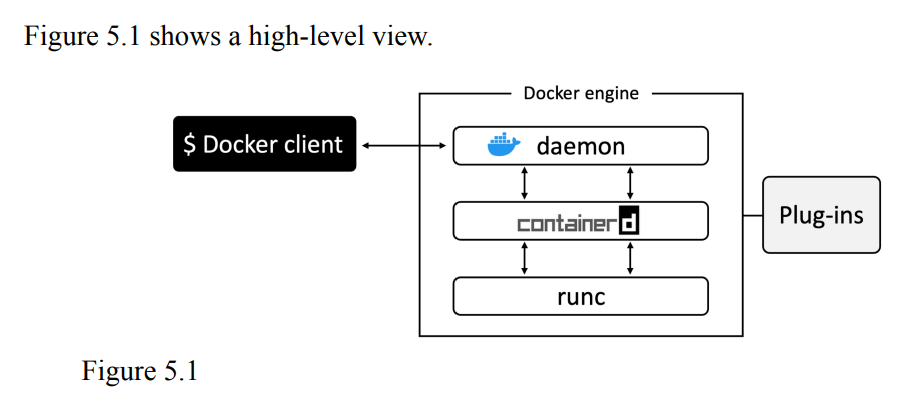
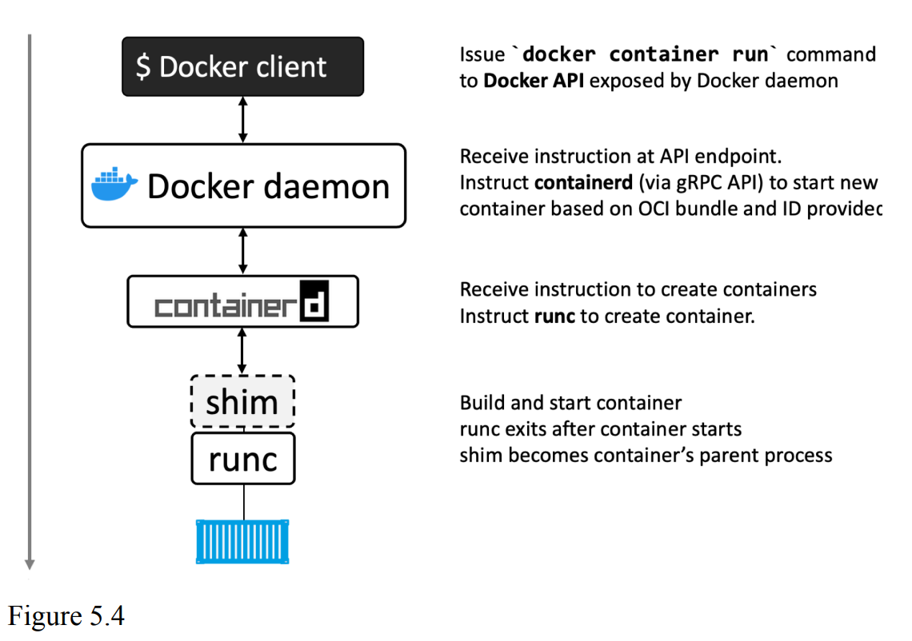
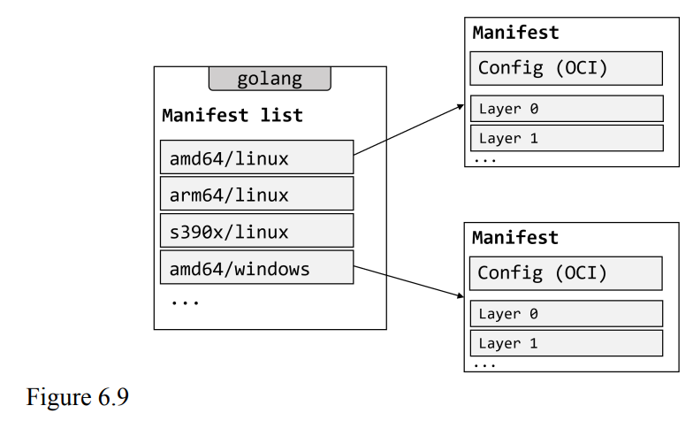
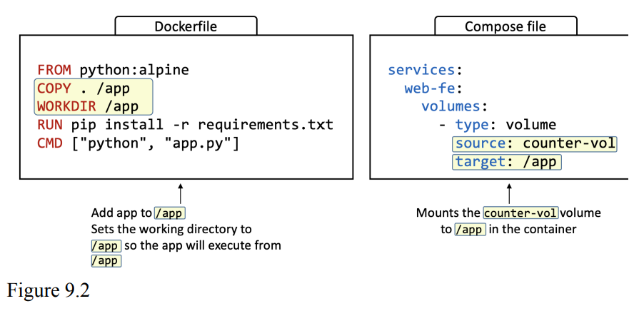
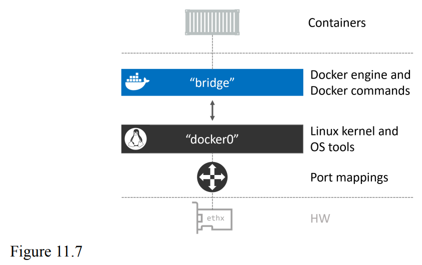
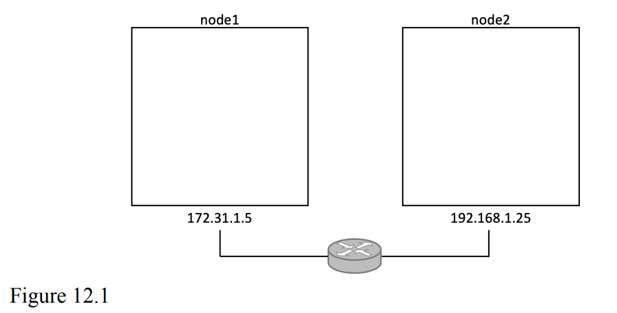
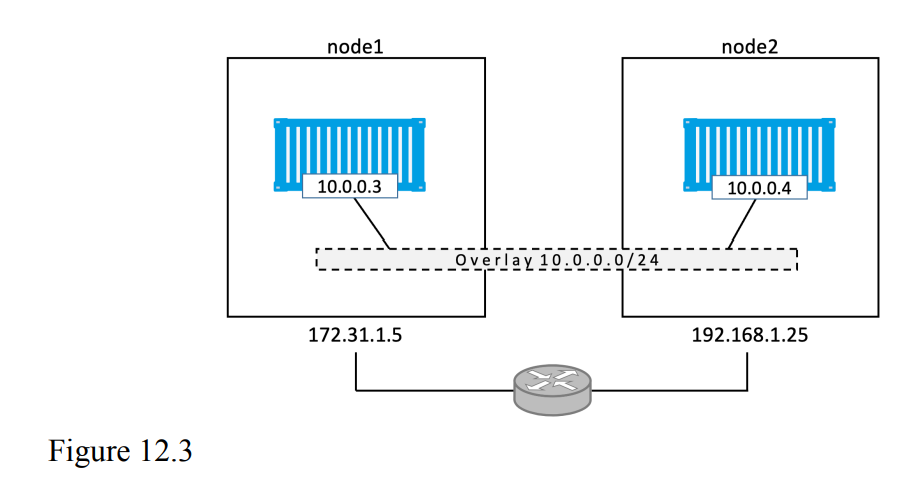

- [Phần 1: Bức tranh tổng quan](#phần-1-bức-tranh-tổng-quan)
  - [1: Containers](#1-containers)
    - [Thời xưa](#thời-xưa)
    - [VMware](#vmware)
    - [Containers](#containers)
    - [Linux Containers](#linux-containers)
    - [Docker](#docker)
    - [Docker và Windows](#docker-và-windows)
    - [Windows containers vs Linux containers](#windows-containers-vs-linux-containers)
    - [Mac Containers ?](#mac-containers-)
    - [Kubernetes](#kubernetes)
  - [2: Docker](#2-docker)
    - [Docker](#docker-1)
    - [Docker, Inc.](#docker-inc)
    - [Công nghệ Docker](#công-nghệ-docker)
    - [Open Container Initiative (OCI)](#open-container-initiative-oci)
  - [3. Cài đặt Docker](#3-cài-đặt-docker)
    - [Docker Desktop](#docker-desktop)
    - [Chuẩn bị cho Windows](#chuẩn-bị-cho-windows)
    - [Cài đặt Docker Desktop trên Windows 10 và 11](#cài-đặt-docker-desktop-trên-windows-10-và-11)
    - [Cài đặt Docker Desktop cho Mac](#cài-đặt-docker-desktop-cho-mac)
    - [Cài đặt Docker với Multipass](#cài-đặt-docker-với-multipass)
    - [Cài Docker trên Linux](#cài-docker-trên-linux)
    - [Play with Docker](#play-with-docker)
  - [4. Bức tranh tổng quan](#4-bức-tranh-tổng-quan)
    - [Khía cạnh Ops](#khía-cạnh-ops)
      - [Images](#images)
      - [Containers](#containers-1)
      - [Gắn vào container đang chạy](#gắn-vào-container-đang-chạy)
    - [Khía cạnh Dev](#khía-cạnh-dev)
- [Phần 2: Phần kĩ thuật](#phần-2-phần-kĩ-thuật)
  - [1. Docker Engine](#1-docker-engine)
    - [TLDR](#tldr)
    - [Deep Dive](#deep-dive)
    - [Loại bỏ LXC](#loại-bỏ-lxc)
    - [Loại bỏ monolithic Docker daemon](#loại-bỏ-monolithic-docker-daemon)
    - [Ảnh hưởng của Open Container Initiative (OCI)](#ảnh-hưởng-của-open-container-initiative-oci)
    - [runc](#runc)
    - [containerd](#containerd)
    - [Bắt đầu một container mới (ví dụ)](#bắt-đầu-một-container-mới-ví-dụ)
  - [2. Images](#2-images)
    - [TLDR](#tldr-1)
    - [Deep dive](#deep-dive-1)
      - [Images và containers](#images-và-containers)
      - [Images thường có kích cỡ nhỏ](#images-thường-có-kích-cỡ-nhỏ)
      - [Kéo images](#kéo-images)
      - [Tên image](#tên-image)
        - [Image registries](#image-registries)
        - [Official repositories](#official-repositories)
        - [Image naming và tagging](#image-naming-và-tagging)
        - [Images với nhiều tags](#images-với-nhiều-tags)
        - [Lọc output của _docker images_](#lọc-output-của-docker-images)
        - [Tìm kiếm trên Docker Hub từ CLI](#tìm-kiếm-trên-docker-hub-từ-cli)
      - [Images và layers](#images-và-layers)
      - [Chia sẻ image layers](#chia-sẻ-image-layers)
      - [Kéo images bằng digest](#kéo-images-bằng-digest)
      - [Thêm về image hashes (digests)](#thêm-về-image-hashes-digests)
      - [Image đa kiến trúc](#image-đa-kiến-trúc)
      - [Xóa Images](#xóa-images)
  - [3. Containers](#3-containers)
    - [TLDR](#tldr-2)
    - [Deepdive](#deepdive)
      - [Containers vs VMs](#containers-vs-vms)
      - [Vấn đề của mô hình Hypervisor](#vấn-đề-của-mô-hình-hypervisor)
      - [Kiểm tra xem Docker đang chạy](#kiểm-tra-xem-docker-đang-chạy)
      - [Chạy một container đơn giản](#chạy-một-container-đơn-giản)
      - [Các tiến trình container](#các-tiến-trình-container)
      - [Container lifecycle](#container-lifecycle)
      - [Dừng container gracefully](#dừng-container-gracefully)
      - [Self-healing containers với restart policies](#self-healing-containers-với-restart-policies)
      - [Ví dụ Web server](#ví-dụ-web-server)
      - [Kiểm tra container](#kiểm-tra-container)
      - [Dọn dẹp](#dọn-dẹp)
  - [4. Container hóa ứng dụng](#4-container-hóa-ứng-dụng)
    - [TLDR](#tldr-3)
    - [Deepdive](#deepdive-1)
      - [Container hóa ứng dụng một container](#container-hóa-ứng-dụng-một-container)
        - [Lấy mã nguồn của ứng dụng](#lấy-mã-nguồn-của-ứng-dụng)
        - [Xem Dockerfile](#xem-dockerfile)
      - [Build image/Container hóa ứng dụng](#build-imagecontainer-hóa-ứng-dụng)
      - [Đẩy images](#đẩy-images)
      - [Chạy ứng dụng](#chạy-ứng-dụng)
      - [Kiểm thử ứng dụng](#kiểm-thử-ứng-dụng)
      - [Đi sâu hơn](#đi-sâu-hơn)
      - [Multi-stage builds trên production](#multi-stage-builds-trên-production)
      - [Build đa stage và build target](#build-đa-stage-và-build-target)
      - [Build đa nền tảng](#build-đa-nền-tảng)
      - [Best practices](#best-practices)
        - [Tận dụng cache tăng tốc quá trình build](#tận-dụng-cache-tăng-tốc-quá-trình-build)
        - [Không Squash image](#không-squash-image)
        - [Sử dụng no-install-recommends](#sử-dụng-no-install-recommends)
  - [5. Các ứng dụng đa container với Compose](#5-các-ứng-dụng-đa-container-với-compose)
    - [TLDR](#tldr-4)
    - [Deepdive](#deepdive-2)
      - [Compose background](#compose-background)
      - [Cài đặt Compose](#cài-đặt-compose)
      - [Files Compose](#files-compose)
      - [Triển khai ứng dụng với Compose](#triển-khai-ứng-dụng-với-compose)
      - [Quản lý ứng dụng với Compose](#quản-lý-ứng-dụng-với-compose)
      - [Sử dụng volumes để chèn dữ liệu](#sử-dụng-volumes-để-chèn-dữ-liệu)
  - [6. Docker Swarm](#6-docker-swarm)
    - [TLDR](#tldr-5)
    - [Deep dive](#deep-dive-2)
      - [Swarm primer](#swarm-primer)
      - [Xây dựng một cụm Swarm bảo mật](#xây-dựng-một-cụm-swarm-bảo-mật)
        - [Pre-reqs](#pre-reqs)
        - [Khởi tạo một swarm mới](#khởi-tạo-một-swarm-mới)
        - [Swarm manager high availability (HA)](#swarm-manager-high-availability-ha)
        - [Swarm security](#swarm-security)
          - [Lock một swarm](#lock-một-swarm)
          - [Dedicated manager nodes](#dedicated-manager-nodes)
      - [Triển khai các dịch vụ Swarm](#triển-khai-các-dịch-vụ-swarm)
        - [Inspect service](#inspect-service)
        - [Replicated vs global service](#replicated-vs-global-service)
        - [Scaling một service](#scaling-một-service)
        - [Xóa services](#xóa-services)
        - [Rolling updates](#rolling-updates)
      - [Troubleshooting](#troubleshooting)
      - [Back up và khôi phục một Swarm](#back-up-và-khôi-phục-một-swarm)
        - [Backup một swarm](#backup-một-swarm)
        - [Khôi phục một Swarm](#khôi-phục-một-swarm)
  - [7. Docker Networking](#7-docker-networking)
    - [TLDR](#tldr-6)
    - [Deep dive](#deep-dive-3)
      - [Lý thuyết](#lý-thuyết)
        - [Container Network Model (CNM)](#container-network-model-cnm)
        - [Libnetwork](#libnetwork)
        - [Drivers](#drivers)
          - [Single-host bridge network](#single-host-bridge-network)
          - [Multi-host overlay networks](#multi-host-overlay-networks)
          - [Kết nối tới mạng đã có sẵn](#kết-nối-tới-mạng-đã-có-sẵn)
      - [Container và Service logs để troubleshooting](#container-và-service-logs-để-troubleshooting)
      - [Service discovery](#service-discovery)
      - [Ingress load balancing](#ingress-load-balancing)
  - [8. Docker Overlay Networking](#8-docker-overlay-networking)
    - [TLDR](#tldr-7)
    - [Deep dive](#deep-dive-4)
      - [Xây dựng và kiểm thử overlay network của Docker](#xây-dựng-và-kiểm-thử-overlay-network-của-docker)
        - [Xây một swarm](#xây-một-swarm)
        - [Tạo một overlay network mới](#tạo-một-overlay-network-mới)
        - [Gắn một service vào overlay network](#gắn-một-service-vào-overlay-network)
        - [Kiểm thử overlay network](#kiểm-thử-overlay-network)
      - [Giải thích Overlay network](#giải-thích-overlay-network)
        - [VXLAN](#vxlan)
        - [Quay lại ví dụ hai container](#quay-lại-ví-dụ-hai-container)
        - [Ví dụ giao tiếp](#ví-dụ-giao-tiếp)
  - [9. Volumes và dữ liệu cố định](#9-volumes-và-dữ-liệu-cố-định)
  - [10. Triển khai ứng dụng với Docker Stacks](#10-triển-khai-ứng-dụng-với-docker-stacks)
  - [11. Bảo mật Docker](#11-bảo-mật-docker)

# Phần 1: Bức tranh tổng quan

## 1: Containers

### Thời xưa

Các ứng dụng là trung tâm của các doanh nghiệp. Nếu các ứng dụng hỏng, doanh nghiệp đi đời.

Phần lớn các ứng dụng chạy trên servers. Trong quá khứ, chúng ta chỉ có thể chạy một ứng dụng trên một server. Windows và Linux lúc bấy giờ không có công nghệ để chạy nhiều ứng dụng trên cùng một server một cách an toàn và bảo mật.

Kết quả là, mỗi khi doanh nghiệp cần một ứng dụng mới, bộ phận IT phải mua một server mới. Phần lớn không ai biết yêu cầu về hiệu năng của ứng dụng mới, nên bộ phận IT phải đoán khi chọn model và kích cỡ của server để mua.

Và, kết quả là phải mua server lớn to nhanh tốn rất nhiều tiền. Dẫn tới việc các server cực mạnh chỉ hoạt động ở 5-10% khả năng tối đa của nó. _Cực kì tốn tài nguyên_.

### VMware

Sự ra đời của VMware cung cấp cho chúng ta một công nghệ cho phép chạy nhiều ứng dụng an toàn trên một server duy nhất.

Tuy nhiên, mỗi VM yêu cầu OS riêng, mỗi OS tốn CPU, RAM và các tài nguyên khác mà có thể dùng để cung cấp cho nhiều ứng dụng. Mỗi OS cần được giám sát và cập nhật. Và trong một vài trường hợp, OS cần license để sử dụng. Tất cả lý do trên dẫn tới việc tốn thời gian và tài nguyên

Mô hình VM cũng có các thách thức khác như là tốc độ boot chậm, tính di động kém - việc di dời công việc cho VM giữa các hypervisors và các nền tảng cloud phức tạp.

### Containers

Trong mô hình Container, container na ná VM. Điểm khác biệt lớn nhất là container không yêu cầu OS riêng. Thực chất, tất cả containers trên một host chia sẻ OS của host. Từ đó CPU, RAM, bộ nhớ được tiết kiệm. Nó cũng đồng thời giảm thiểu chi phí licensing và overhead của việc cập nhật và bảo trì OS.

Containers boot rất nhanh và có tính di động cực kì tốt. Di chuyển workload của container từ máy tính, lên cloud và sang VMs cực kì đơn giản

### Linux Containers

Containers hiện đại bắt nguồn từ Linux và là sản phẩm nỗ lực từ nhiều người qua một thời gian rất dài. Ví dụ, Google đã đóng góp rất nhiều công nghệ liên quan tới container vào Linux kernel. Nếu như không có những đóng góp này, và các đóng góp khác, chúng ta sẽ không có container hiện đại ngày hôm nay.

Một vài công nghệ lớn đóng góp vào sự phát triển mạnh của containers trong những năm gần đây bao gồm: **kernel namespaces, control groups, capabilities** và dĩ nhiên **Docker**. Để nhấn mạnh lại những gì chúng ta nói lúc trước - hệ sinh thái container hiện đại mà chúng ta có được ngày nay là nhờ vào nền tảng vũng chắc của nhiều cá nhân và tổ chức đi trước.

Mặc dù vậy, công nghệ container vẫn phức tạp và khó để áp dụng vào production. Cho tới khi Docker ra đời giúp cho container dễ tiếp cận với công chúng hơn.

_Lưu ý_: Có nhiều công nghệ ảo hóa hệ điều hành tương tự như container ra đời trước Docker và container hiện đại. Một vài còn có từ lúc System/360 trên Mainframe. BSD Jails và Solaris Zones là một vài ví dụ của công nghệ container Unix. Tuy nhiên chúng ta chỉ bàn về _modern container_.

### Docker

Chúng ta sẽ bàn về Docker chi tiết hơn ở phần sau. Nhưng bây giờ, chúng ta chỉ cần biết Docker là một cái gì đó ma thuật giúp người thường như chúng ta sử dụng Linux containers. Hay nói cách khác, Docker, Inc. đơn giản hóa container.

### Docker và Windows

Microsoft cố đựa Docker và công nghệ container tới nền tảng Windows.

Tại thời điểm 2023, nền tảng Windows desktop và server hỗ trợ

- Windows container
- Linux container

_Windows containers_ chạy ứng dụng Windows yêu cầu hệ thống host có Windows kernel. Windows 10 và 11, hỗ trợ Windows containers.

Bất kì Windows host nào chạy WSL 2 (Windows Subsystem for Linux) cũng có thể chạy Linux containers.

Tuy nhiên, phần lớn containers là Linux containers. Linux containers nhỏ hơn nhanh hơn, và có nhiều công cụ hỗ trợ hơn.

**Tất cả ví dụ đều sử dụng Linux containers**

### Windows containers vs Linux containers

Container chi sẻ kernel của host mà nó đang chạy trên. Điều này có nghĩa là ứng dụng container hóa WIndow cần host với Windows kernel, còn ứng dụng container hóa Linux cần một host với Linux kernel. Nhưng,... nó không đơn giản như vậy.

Như đã nói lúc trước, Linux container có thể chạy trên Windows với WSL 2 backend.

### Mac Containers ?

Không có Mac containers.

Tuy nhiên, Linux containers có thể được chạy trên máy MAC sử dụng Docker Desktop. Nó hoạt động bằng cách chạy containers bên trong một máy ảo Linux nhẹ trên máy Mac.

### Kubernetes

Kubernetes là một dự án open-source của Google, là một công cụ phổ biến nhất để triển khai và quản lý các ứng dụng container hóa.

**Lưu ý**: Một ứng dụng container hóa là một ứng dụng chạy trên một container

Kubernetes cũng sử dụng Docker làm _container runtime_ mặc định (công nghệ mức thấp kéo images, bắt đầu và dừng containers). Tuy nhiên, Kubernetes hiện đại có giao diện container runtime giúp dễ dàng tráo đổi các container runtimes khác nhau. Tại thời điểm 2023, các Kubernetes clusters mới thường sử dụng **containerd**. Chúng ta sẽ bàn thêm về containerd ở phần sau, nhưng bây giờ bạn chỉ cần biết containerd là phần đặc biệt của Docker chịu nhanh nhiệm các tác vụ bắt đầu và dừng containers.

## 2: Docker

Khi nói về Docker chúng ta có thể đang nói về một trong hai thứ

1. Công ty Docker, Inc.
2. Công nghệ Docker

### Docker

Docker là phần mềm chạy trên Linux và Windows. Nó tạo, quản lý, và có thể điều phối containers. Phần mềm được xây dựng từ nhiều công cụ từ dự án mã nguồn mở _Moby_. Docker, Inc. là công ty tạo ra công nghệ Docker.

### Docker, Inc.

Docker, Inc. là một công ty công nghệ ở San Franscisco được thành lập bởi Solomon Hykes - một developer người Mỹ gốc Pháp.


Công ty ban đầu là nhà cung cấp "platform as a service" gọi là _dotCloud_. Đằng sau, nền tảng _dotCloud_ được xây dựng trên Linux containers. Để giúp tạo và quản lý các containers, họ xây dựng một công cụ nội bộ được gọi là "Docker". Và đó là sự ra đời của Docker.

Vào năm 2013, họ rebrand công ty thành "Docker, Inc." và chuyển hướng tập trung vào việc đưa Docker và containers đến thế giới.

### Công nghệ Docker

Khi phần lớn mọi người nói về Docker, họ đang nói về công nghệ mà chạy containers. Tuy nhiên, có ít nhất ba thứ cần quan tâm tới khi nói đến công nghệ Docker

1. Runtime
2. Daemon (engine)
3. Orchestrator

Hình 2.2 minh họa ba tầng của Docker.


Runtime hoạt động ở tầng thấp nhất và phụ trách việc bắt đầu và dừng containers (bao gồm xây dựng tất cả thành phần OS như namespaces và cgroups). Docker cài đặt kiến trúc runtime đa tầng với high-level runtime và low-level runtime hoạt động với nhau.

Low-level runtime được gọi là _runc_ và được cài đặt dựa trên đặc tả của Open Containers Initiative (OCI). Nhiệm vụ của nó là tương tác với OS bên dưới để bắt đầu và dừng containers. Mỗi container trên một node Docker được tạo ra và bắt đầu bởi một run instance.

Higher-level runtime được gọi là _containerd_. Nó quản lý container lifecycle bao gồm việc kéo image và quản lý các runc instances. _containerd_

Thường một cài đặt của Docker có một tiến trình containerd chạy dài để điều hướng các tiến trình runc để bắt đầu và dừng containers. runc không bao giờ chạy dài và kết thúc khi một container bắt đầu

Docker daemon (dockerd) nằm ở trên _containerd_ và quản lý các task mức cao hơn như cung cấp Docker API, quản lý images, quản lý volumes, quản lý network,...

Nhiêm vụ lớn nhất của Docker daemon là cung cấp một giao diện chuẩn dễ dùng trừu tượng hóa đi các lớp dưới.

Docker cũng hỗ trợ quản lý clusters các nodes chạy Docker. Những clusters này được gọi là _swarms_ và công nghệ được gọi là Docker Swarm. Docker Swarm rất dễ dùng, dễ cài đặt và quản lý hơn Kubernetes nhưng thiếu nhiều tính năng xịn xò và hệ sinh thái của Kubernetes.

### Open Container Initiative (OCI)

OCI là một hội đồng chịu trách nhiệm việc chuẩn hóa các thành phần cơ bản mức thấp của cơ sở hạ tầng container. Cụ thể nó tập trung vào _image format_ và _container runtime_.

Chúng ta sẽ nói một chút về lịch sử của Docker và OCI. Từ những ngày đầu, số lượng người sử dụng của Docker tăng điên. Càng ngày càng nhiều người sử dụng Docker, sinh ra nhiều cách cho nhiều thứ. Một công ty gọi là CoreOS (mua bởi Red Hat - Red Hat sau đó được mua bởi IBM) không thích cách Docker làm một vài thứ cụ thể. Nên họ tạo ra một chuẩn mở gọi là [appc](https://github.com/appc/spec/) định nghĩa các thứ như định dạng image và container runtime. Họ cũng tạo ra một cài đặt của đặc tả được gọi là **rkt**.

Điều này đặt hệ sinh thái container vào một vị trí bất ổn với hai chuẩn cạnh tranh với nhau.

Từ đó tất cả các bên đồng thuận với nhau để hình thành OCI - một hội đồng lightweight để quản lý các chuẩn container

Tại thời điểm viết OCI đã xuất bản ba đặc tả (chuẩn)

- image-spec
- runtime-spec
- distribution-spec

Đặc tả OCI có ảnh hưởng lớn đến kiến trúc và thiết kế của Docker. Tất cả các phiên bản hiện đại của Docker và Docker Hub cài đặt chuẩn OCI.

OCI được tổ chức dưới sự hỗ trợ của Linux Foundation

## 3. Cài đặt Docker

Có nhiều cách và nhiều nơi để cài đặt Docker. Có Windows, Mac và Linux. Bạn có thể cài trên cloud, và trên laptop của bạn. Có cách cài thủ công, cài bằng scripts, cài bằng instalelr,...

Chúng ta sẽ nói về các nội dung sau

- Docker Desktop
  - Windows
  - MacOS
- Multipass
- Server installs on
  - Linux
- Play with Docker

### Docker Desktop

Docker Desktop là desktop app từ Docker, Inc. giúp làm việc với containers cực kì dễ. Nó có Docker engine, UI đẹp, và hệ thống extension với marketplace.

Docker Desktop miễn phí cho education purposes, nhưng bạn phải trả phí nếu bạn dùng cho công việc,...

Nó chạy trên Windows 10, 11, MacOS, Linux 64-bit.

Khi cài đặt, bạn sẽ có một môi trường Docker hoạt động đầy đủ, tiện lợi cho việc phát triển, kiểm thử, và học hỏi. Nó bao gồm _Docker Compose_ và bạn có thể bật một cluster Kubernetes một node nếu bạn cần học Kubernetes.

DOcker Desktop trên Windows có thể chạy Windows Containers cũng như Linux containers. Docker Desktop trên Mac và Linux chỉ có thể chạy Linux containers.

### Chuẩn bị cho Windows

- Windows 10/11 64-bit
- Bật hỗ trợ ảo hóa Hardware trong BIOS
- WSL2

### Cài đặt Docker Desktop trên Windows 10 và 11

Lên mạng tìm và cài, rất đơn giản

Khi cài xong mở terminal và gõ vài câu lệnh docker cơ bản

```
$ docker version
Client:
 Cloud integration: v1.0.31
 Version: 20.10.23
 API version: 1.41
 Go version: go1.18.10
 Git commit: 7155243
 Built: Thu Jan 19 01:20:44 2023
 OS/Arch: linux/amd64
 Context: default
 Experimental: true
Server:
 Engine:
 Version: 20.10.23
 <Snip>
 OS/Arch: linux/amd64
 Experimental: true
```

Để ý output hiện _OS/Arch: linux/amd64_ cho thành phần **Server**. Mặc định docker giả dụ bạn làm việc với Linux container.

Để đổi sang _Windows containers_ bạn chỉ cần chuột phải vào icon Docker và chọn _Switch to Windows containers...._

### Cài đặt Docker Desktop cho Mac

### Cài đặt Docker với Multipass

Multipass là một công cụ miễn phí giúp tạo Linux VMs "cloud" trên máy Linux, Mac hay Windows.

Truy cập vào https://multipass.run/install và cài phiên bản đúng cho phần cứng và OS

Khi cài xong bạn chỉ cần nhớ ba câu lệnh

```
$ multipass launch
$ multipass ls
$ multipass shell
```

Sử dụng câu lệnh sau để tạo một VM mới gọi là **node1** dựa trên **docker** image. Docker image có Docker được cài sẵn.

```
$ multipass launch docker --name node1
```

Liệt kê VMs để đảm bảo VM chạy đúng

```
$ multipass ls

Name                State       IPv4
 Image
node1               Running     192.168.64.37
 Ubuntu 22.04 LTS
                                172.17.0.1
                                172.18.0.1

```

Kết nối tới VM sử dụng câu lệnh sau

```
$ multipass shell node1
```

Bạn giờ đã kết nối tới VM và có thể chạy câu lệnh Docker

Gõ _exit_ để thoát ra. Sử dụng _multipass delete node1_ và _multipass purge_ để xóa VM.

### Cài Docker trên Linux

### Play with Docker

## 4. Bức tranh tổng quan

Mục tiêu của phần này là đưa ra một bức tranh tổng quan trước khi đi sâu vào Docker trong các phần khác

Chúng ta sẽ nói về

- Khía cạnh Ops
- Khía cạnh Dev

Trong phần khía cạnh Ops, chúng ta sẽ tải một image, bắt đầu một container, vào container, chạy câu lệnh bên trong nó, và hủy nó

Trong phần khía cạnh Dev, chúng ta sẽ tập trung vào app. Chúng ta sẽ clone một vài code từ Github, kiểm tra Dockerfile, container hóa app, chạy nó trên một container.

_Lưu ý_: Thuật ngữ _Docker host_ và _Docker node_ là như nhau và đều nói về hệ thống mà Docker đang chạy trên.

### Khía cạnh Ops

Khi bạn cài Docker bạn sẽ có hai thành phần chính

- Docker client
- Docker engine (Đôi lúc gọi là Docker daemon)

Engine cài đặt runtime, API và mọi thứ khác cần thiết để chạy container.

Trong Linux, client giao tiếp với daemon thông qua socket IPC/Unix ở /var/run/docker.sock. Trên Windows quá trình này thông qua một pipe ở npipe:////./pipe/docker*engine. Khi được cài đặt bạn có thể dùng câu lệnh \_docker version* để kiểm tra client và deamon đang chạy và giao tiếp với nhau hay chưa.

```
docker version
Client: Docker Engine - Community

Version: 24.0.0
 API version: 1.43
 Go version: go1.20.4
 Git commit: 98fdcd7
 Built: Mon May 15 18:48:45 2023
 OS/Arch: linux/arm64
 Context: default
Server: Docker Engine - Community
 Engine:
 Version: 24.0.0
 API version: 1.43 (minimum version 1.12)
 Go version: go1.20.4
 Git commit: 1331b8c
 Built: Mon May 15 18:48:45 2023
 OS/Arch: linux/arm64
 Experimental: false
 <Snip>
```

Nếu bạn nhận được phản hồi từ _Client_ và _Server_, mọi thứ ok.

Nếu bạn sử dụng Linux và nhận được phản hồi lỗi từ Server đảm bảo rằng Docker đang chạy, và thử chạy lại với _sudo_. Nếu nó hoạt động với _sudo_ bạn cần thêm tài khoản user vào _docker_ group, hoặc cho thêm _sudo_ và tất cả câu lệnh _docker_.

#### Images

Có thể coi Docker image là một object chứa tất cả OS filesystem, application, và application dependencies. Nếu bạn làm hệ thống, nó như là virtual machine template. MỘt virtual machine template là một virtual machine không được chạy. Trong thế giới Docker, một image như là một container không được chạy. Nếu bạn là developer, có thể coi image là _class_

Chạy câu lệnh _docker image_ trên Docker host

```
$ docker images
REPOSITORY  TAG     IMAGE   ID  CREATED
SIZE
```

Nếu bạn làm việc với một Docker host mới toanh, bạn sẽ không có images và output sẽ như trên.

Việc lấy images cho Docker host được gọi là _pulling_. Kéo image _ubuntu:latest_

```
$ docker pull ubuntu:latest
latest: Pulling from library/ubuntu
dfd64a3b4296: Download complete
6f8fe7bff0be: Download complete
3f5ef9003cef: Download complete
79d0ea7dc1a8: Download complete
docker.io/library/ubuntu:latest
```

Chạy câu lệnh _docker images_ một lần nữa để thấy image bạn vừa kéo về

```
$ docker images
REPOSITORY  TAG     IMAGE ID      CREATED
SIZE
ubuntu      latest  dfd64a3b4296  1 minute ago
106MB
```

Chúng ta sẽ đi sâu vào chi tiết vị trí image được lưu, và nội dung bên trong nó ở các chương sau. Bây giờ chỉ cần biết, iage chứa thông tin về OS, và các code và dependencies để chạy bất kì ứng dụng nào mà nó được thiết kế để chạy. Ubuntu imagae mà chúng ta vừa kéo có chứa phiên bản thô sơ của filesystem Ubuntu Linux và một vài utilities của Ubuntu.

Nếu bạn kéo một container ứng dụng, như _nginx:latest_, bạn sẽ có một image với một OS nhỏ gọn cũng như code để chạy ứng dụng (NGINX)

Mỗi image có một ID độc nhất. Khi tham chiếu tới image, bạn có thể sử dụng IDs hoặc names. Nếu làm việc với image ID's, chỉ cần gõ một vài kí tự đầu của ID - chỉ cần nó độc nhất. Docker sẽ hiểu bạn tham chiếu tới image nào

#### Containers

Bây giờ chúng ta đã có một image chúng ta có thể dùng _docker run_ để chạy một container từ image đó.

```
$ docker run -it ubuntu:latest /bin/bash
root@6cd20d508db0:/#
```

Shell prompt thay đổi là nhờ cờ _-it_ chuyển shell của bạn vào terminal của container.

_docker run_ bảo Docker bắt đầu một container mới. Cờ _-it_ bảo Docker làm container interactive gắn shell hiện tại vào terminal của container. Sau đó câu lệnh bảo Docker rằng chúng ta muốn container dựa trên image ubuntu:latest. Cuối cùng nó bảo Docker tiến trình mà chúng ta muốn chạy bên trong container - Bash shell.

Chạy câu lệnh _ps_ từ bên trong container để liệt kê tất cả các tiến trình đang chạy

```
root@6dc20d508db0:/# ps -elf
F S UID    PID    PPID NI ADDR  SZ WCHAN STIME TTY
TIME CMD
4 S root    1       0  0  -   4560 -     13:38 pts/0
00:00:00 /bin/bash
0 R root    9       1  0  -   8606 -     13:38 pts/0
00:00:00 ps -elf
```

Chỉ có hai tiến trình

- PID 1 Là tiến trình /bin/bash chúng ta bảo docker chạy với câu lệnh _docker run_
- PID 9 Là tiến trình _ps_ chúng ta chạy để liệt kê các tiến trình

Ấn _Ctrl-PQ_ để thoát container mà không hủy nó. Bạn có thể xem tất cả containers đang chạy trên hệ thống sử dụng câu lệnh _docker ps_

```
$ docker ps
CONTAINER ID    IMAGE          COMMAND       CREATED  STATUS    NAMES
6dc20d508db0    ubuntu:latest  "/bin/bash"   7 mins   Up 7 min  vigilant_borg
```

#### Gắn vào container đang chạy

Bạn có thể gắn shell vào terminal của một container đang chạy với câu lệnh _docker exec_.

```
$ docker exec -it vigilant_borg bash
root@6dc20d508db0:/#
```

Định dạng của câu lệnh _docker exec_ là: _docker exec \<option\> \<container-name hoặc container-id\> \<command/app\>._

Chúng ta sử dụng cờ _-it_ để gắn shell vào shell của container. Tham chiếu tới container bằng tên và bảo nó chạy bash shell. Chúng ta cũng có thể dùng ID của container.

Thoát container bằng cách ấn _Ctrl-PQ_

Dừng container và hủy nó sử dụng câu lệnh _docker stop_ và _docker rm_.

```
$ docker stop vigilant_borg
vigilant_borg
```

Sẽ mất vài giây để container dừng

Sử dụng _docker rm_ để xóa container

```
$ docker rm vigilant_borg
vigilant_borg
```

Xác thực rằng container được xóa thành công bằng cách chạy câu lệnh _docker ps_ với cờ _-a_. Thêm _-a_ bảo Docker chạy hết container, ngay cả những container đang trong trạng thái dừng

```
$ docker ps -a
CONTAINER ID IMAGE COMMAND CREATED STATUS
PORTS NAMES
```

### Khía cạnh Dev

Trong phần này chúng ta sẽ clone một app từ Git repo, xem Dockerfile, container hóa nó, và chạy nó sử dụng container.

Link tới app: https://github.com/nigelpoulton/psweb.git

Chạy tất cả câu lệnh dưới từ terminal của Docker host của bạn

Clone repo.

```
$ git clone https://github.com/nigelpoulton/psweb.git
Cloning into 'psweb'...
remote: Enumerating objects: 63, done.
remote: Counting objects: 100% (34/34), done.
remote: Compressing objects: 100% (22/22), done.
remote: Total 63 (delta 13), reused 25 (delta 9), pack reused 29
Receiving objects: 100% (63/63), 13.29 KiB | 4.43 MiB/s,
done.
Resolving deltas: 100% (21/21), done.
```

Vào thư mục repo vừa clone

```
$ cd psweb
$ ls -l
-rw-r--r--@ 1 ubuntu ubuntu 338 24 Apr 19:29 Dockerfile
-rw-r--r--@ 1 ubuntu ubuntu 396 24 Apr 19:32 README.md
-rw-r--r--@ 1 ubuntu ubuntu 341 24 Apr 19:29 app.js
-rw-r--r-- 1 ubuntu ubuntu 216 24 Apr 19:29 circle.yml
-rw-r--r--@ 1 ubuntu ubuntu 377 24 Apr 19:36
package.json
drwxr-xr-x 4 ubuntu ubuntu 128 24 Apr 19:29 test
drwxr-xr-x 3 ubuntu ubuntu 96 24 Apr 19:29 views
```

Ứng dụng này là một ứng dụng web nodejs đơn giản, trả về file HTML tĩnh

_Dockerfile_ bảo Docker cách build app và dependencies thành một Docker image.

Xem nội dung của Dockerfile

```
$ cat Dockerfile
FROM alpine
LABEL maintainer="nigelpoulton@hotmail.com"
RUN apk add --update nodejs nodejs-npm
COPY . /src
WORKDIR /src
RUN npm install
EXPOSE 8080
ENTRYPOINT ["node", "./app.js"]
```

Sử dụng _docker build_ để tạo một image mới (bằng các câu lệnh trong Dockerfile). Ví dụ này tạo một Docker image mới gọi là _test:latest_

Đảm bảo rằng _docker build_ được chạy bên trong thư mục chứa Dockerfile và code của app

```
$ docker build -t test:latest .
[+] Building 36.2s (11/11) FINISHED
 => [internal] load .dockerignore
 0.0s
 => => transferring context: 2B
 0.0s
 => [internal] load build definition from Dockerfile
 0.0s
 <Snip>
 => => naming to docker.io/library/test:latest
 0.0s
 => => unpacking to docker.io/library/test:latest
 0.7s
```

Khi build xong, kiểm tra _test:latest_ image có trên host của bạn

```
$ docker images
REPO TAG    IMAGE ID      CREATED        SIZE
test latest 1ede254e072b  7  seconds ago 154MB
```

Bạn đã có một Docker image với app và dependencies ở bên trong

Chạy một conatiner từ image và kiểm thử ứng dụng

```
$ docker run -d \
  --name web1   \
  --publish 8080:8080 \
  test:latest
```

Mở web browser và truy cập vào địa chỉ IP của Docker host mà Docker container đang chạy trên và trỏ tới cổng 8080, bạn sẽ thấy web page sau


Clone code ứng dụng từ repo, xây một Docker image từ nó, chạy nó dùng một container, quy trình trên gọi là "container hóa một ứng dụng"

# Phần 2: Phần kĩ thuật

## 1. Docker Engine

### TLDR

_Docker engine_ là phần mềm lõi chịu trách nhiệm chạy và quản lý container. Nếu như bạn biết VMWare thì nó na ná ESXi.

Docker engine được thiết kế theo hướng module. Nó được xây dựng từ nhiều thành phần nhỏ chuyên dụng. Phần lớn các thành phần này là từ dự án Moby và chúng được cài chuẩn mở như là chuẩn của OCI

Tại thời điểm 2023, các thành phần chính tạo thành Docker engine là Docker daemon, build system, containerd, runc và các plugins như networking và volumes. Cùng nhau, những thành phần này tạo và chạy container



### Deep Dive

Vào lúc Docker mới ra đời, Docker engine có hai thành phần chính

- Docker daemon
- LXC

Docker daemon là một monolithic binary - nó chứa tất cả mã nguồn cho API, runtime, image builds,...

LXC cung cấp cho daemon truy cập vào các thành phần nền tảng của container bên trong Linux kernel. Những thứ như _namespaces_ và _cgroups_.


### Loại bỏ LXC

Việc phụ thuộc vào LXC là một vấn đề

Thứ nhất, LXC chỉ dùng cho Linux, khó đưa dự án thành đa nền tảng

Thứ hai, việc core của dự án phải phụ thuộc vào một công cụ bên ngoài chứa nhiều rủi ro lớn

Vì vậy, Docker. Inc. xây dựng công cụ riêng của họ gọi là _libcontainer_ để thay thế cho LXC. Mục tiêu của _libcontainer_ là một công cụ đa nền tảng cung cấp Docker truy cập vào các thành phần container cơ bản bên trong kernel của host.

Libcontainer thay thế LXC làm _excution driver_ mặc định kể từ Docker 0.9

### Loại bỏ monolithic Docker daemon

Theo thời gian, kiến trúc monolothic của Docker daemon trở nên phức tạp

- Khó để cải tiến
- Hiệu năng kém
- Hệ sinh thái không thích

Docker. Inc. nhận thấy được những vấn đề này và cố gắng module hóa Docker. Mục tiêu chính của việc module hóa là phân chia các chức năng từ daemon, và cài đặt lại bên trong những công cụ đặc thù. Những công cụ đặc thù này có thể được thay thế, và tái sử dụng bởi bên thứ ba để xây các công cụ khác. Kế hoạch trên tuân theo triết lý tried-and-tested của Unix - xây dựng nhiều công cụ nhỏ đặc thủ có thể được ghép nối với nhau thành công cụ lớn.

Từ đó tất cả các mã nguồn liên quan tới việc _container execution_ và _container runtime_ được loại bỏ khỏi daemon và tái cấu trúc vào bên trong các công cụ nhỏ đặc thù.


### Ảnh hưởng của Open Container Initiative (OCI)

Trong khi Docker, Inc. phân tách mã nguồn, OCI đang trong quá trình định nghĩa các chuẩn container:

1. Image spec
2. Container runtime spec

Cả hai đặc tả được release với phiên bản 1.0 vào 6/2017, và đến hiện tại cũng không có quá nhiều thay đổi. Tại thời điểm 2023, có thêm một đặc tả.

Docker, Inc. cũng có ảnh hưởng trong việc tạo những đặc tả trên, và đóng góp rất nhiều mã nguồn.

Các phiên bản Docker kể từ 2016 đều cài đặt chuẩn OCI. Ví dụ Docker daemon không chứa container runtime code - tất cả mã nguồn đó được cài đặt ở trong một lớp tuân theo OCI khác. Mặc định, Docker sử dụng _runc_, _runc_ là cài đặt của container-runtime-spec của OCI.

Thành phần _containerd_ của Docker Engine đảm bảo có Docker images cho runc.

### runc

Như đã nói lúc trước _runc_ là cài đặt theo OCI container-runtime-spec. Docker, Inc. có ảnh hưởng lớn trong quá trình định nghĩa chuẩn và phát triển runc

Nếu bỏ qua những thứ khác, runc là một CLI wrapper nhỏ, nhẹ cho libcontainer - nhớ lại libcontainer thay thế LXC làm tầng giao diện với host OS

runc có một mục tiêu duy nhất - tạo containers, và nó rất nhanh. Nó là một standalone container runtime tool. Bạn có thể tải sử dụng nó để build và nghịch runc containers.

Đôi lúc chúng ta nói runc hoạt động ở "tầng OCI"

### containerd

containerd chứa tất cả các logic thực thi container. Mục tiêu duy nhất của nó là quản lý các thao thác liên quan đến vòng đời của container như _start | stop | pause | rm..._

containerd là một daemon cho Linux và Windows, Docker sử dụng containerd kể từ 1.11. Trong Docker engine stack, containerd nằm giữa daemon và runc ở tầng OCI.

Ban đầu containerd nhỏ nhẹ và chỉ có một mục tiêu duy nhất - quản lý các thao tác liên quan đến vòng đời của container. Theo thời gian nó có thêm chức năng như kéo image, volumes và network.

Một trong những lý do để thêm chức năng vào containerd là để dễ dàng hơn khi sử dụng trong các dự án khác. Tuy nhiên, tất cả các chức năng thêm đều có tính module và không bắt buộc.

containerd ban đầu được phát triển bởi Docker, Inc. và được họ "donate" cho Cloud Native Computing Foundation (CNCF). Tại thời điểm viết, containerd là một dự án CNCF, tức là nó ổn định và sẵn sàng cho production

### Bắt đầu một container mới (ví dụ)

Cách phổ biến nhất để bắt đầu một container mới là sử dụng Docker CLI. Câu lệnh _docker run_ sau sẽ chạy một container đơn giản sử dụng image _alpine:latest_

```
$ docker run --name ctr1 -it alpine:latest sh
```

Khi bạn gõ câu lệnh vào Docker CLI, Docker Client sẽ chuyển nó thành API payload và POSTs lên API endpoint của Docker daemon.

API được cài đặt bên trong daemon và được exposed thông qua socket cục bộ hoặc trong mạng. Trên Linux socket là _/var/run/docker.sock_ và trên Windows nó là _\pipe\docker_engine_

Khi daemon nhận được câu lệnh để tạo container mới, nó gọi containerd. Nhớ rằng daemon không còn chứa code để tạo container.

Daemon giao tiếp với containerd thông qua API dạng CRUD sử dụng **gRPC**

_containerd_ không có khả năng tạo containers, mà nó sử dụng _runc_. Nó chuyển đổi Docker image thành OCI bundle và bảo runc sử dụng OCI bundle để tạo container.

runc giao tiếp với OS kernel để lấy được tất cả các thành phần để tạo một container (namespaces, cgroups,...). Tiến trình container được bắt đầu là tiến trình con ủa runc, và ngay khi nó bắt đầu, runc thoát.



## 2. Images

### TLDR

Các thuật ngữ chúng ta sẽ sử dụng tương đương nhau

- _Image_
- _Docker Image_
- _Container image_
- _OCI image_

Container image là một gói chỉ đọc chứa tất cả mọi thứ để chạy một ứng dụng. Nó bao gồm mã nguồn ứng dụng, các phụ thuộc của nó, một tập nhỏ các thành phần OS, và metadata. Một image duy nhất có thể dùng để chạy một hoặc nhiều containers.

Bạn có thể lấy container image bằng cách kéo về từ _registry_. Registry phổ biến nhất là **Docker Hub**. Thao tác _kéo_ tải image về Docker host cục bộ nơi mà Docker có thể sử dụng nó để bắt đầu một hoặc nhiều container.

Image gồm nhiều layers. Bên trong một iamge là OS tối giản và tất cả các phụ thuộc cần thiết để chạy ứng dụng. Containers nhẹ và nhanh, nên các mages thường nhỏ (Windows image thường lớn).

### Deep dive

Bạn có thể dừng một container và tạo một image mới từ đó. Images được coi là thành phần _build-time_, containers là thành phần _run-time_

#### Images và containers


Hình 6.1 cho thấy mối quan hệ giữa images và containers. Chúng ta sử dụng _docker run_ và _docker service create_ để bắt đầu một hoặc nhiều containers từ một image. Khi bạn đã chạy một container từ một image, hai thành phần trở nên phụ thuộc lẫn nhau, và bạn không thể xóa image tới khi container cuối cùng sử dụng nó bị dừng và hủy.

#### Images thường có kích cỡ nhỏ

Mục đích của container là chạy một ứng dụng hoặc service duy nhất. Điều này có nghĩa là nó chỉ cần mã nguồn và phụ thuộc của ứng dụng nó đang chạy - nó không cần bất cứ thứ gì khác. Điều này có nghĩa là images nhỏ và không chứa các thành phần không cần thiết.

Ví dụ, tại thời điểm 2023 Alpine Linux image official có kích cỡ 7MB. Bởi vì nó không đi kèm 6 shell khác nhau, 3 package managers,... Thực tế, nhiều images không đi kèm shell hay package manager - nếu như ứng dụng không cần.

Images không chứa kernel, bởi vì containers chia sẻ kernel của host mà nó chạy trên. Các thành phần OS bên trong image thường là các thành phần filesystem quan trọng và các thành phần cơ bản khác. Đó là lý do mọi người thường nói "images chỉ chứa đủ OS"

Window images thường lớn hơn Linux images vì cách hoạt động của Windows OS. Kích cỡ của nó thường rơi vào vài gigabytes và tốn rất nhiều thời gian để push và pull

#### Kéo images

Docker host mới cài mặc định không có images bên trong local repository.

Nếu host là Linux thì nó thường ở bên trong /var/lib/docker/\<storage-driver\>

Sử dụng _docker images_ để liêt kê các images bên trong local repo

```
$ docker images
REPOSITORY TAG IMAGE ID CREATED SIZE
```

Quá trình đưa imagaes vào Docker host được gọi là _kéo_. Sử dụng _docker pull_ để kéo images

Ví dụ Linux:

```
$ docker pull alpine:latest
latest: Pulling from library/alpine
08409d417260: Pull complete
Digest:
sha256:02bb6f428431fbc2809c5d1b41eab5a68350194fb508869a33
cb1af4444c9b11
Status: Downloaded newer image for alpine:latest
docker.io/library/alpine:latest
$ docker images
REPOSITORY TAG IMAGE ID CREATED SIZE
alpine latest 44dd6f223004 9 days ago
7.73MB
```

Ví dụ Windows:

```
> docker pull mcr.microsoft.com/powershell:latest
latest: Pulling from powershell
5b663e3b9104: Pull complete
9018627900ee: Pull complete
133ab280ee0f: Pull complete
084853899645: Pull complete
399a2a3857ed: Pull complete
6c1c6d29a559: Pull complete
d1495ba41b1c: Pull complete
190bd9d6eb96: Pull complete
7c239384fec8: Pull complete
21aee845547a: Pull complete
f951bda9026b: Pull complete
Digest: sha256:fbc9555...123f3bd7
Status: Downloaded newer image for
mcr.microsoft.com/powershell:latest
mcr.microsoft.com/powershell:latest
> docker images
REPOSITORY TAG IMAGE ID
CREATED SIZE
mcr.microsoft.com/powershell latest 73175ce91dff
2 days ago 495MB
```

#### Tên image

Khi kéo image, bạn phải đặc tả tên của image mà bạn muốn kéo. Để hiểu được image naming, chúng ta cần biết cách các images được lưu trữ

##### Image registries

Chúng ta lưu images bên trong các nơi tập trung gọi là _registries_. Phần lớn các registries hiện đại cài đặt chuẩn phân phối OCI đôi lúc chúng ta gọi là _OCI registries_. Nhiệm vụ của registry là lưu trữ container image một cách bảo mật, và giúp chúng có thể được dễ dàng truy cập từ nhiều môi trường. Một vài registries thì có các thức năng cao cấp như là quét images và tích hợp với build pipelines.

Registry phổ biến nhất là Docker Hub. Còn có các registríe bên thứ 3 cũng như registry riêng. Mặc định Docker client sử dụng Docker Hub.

Sử dụng _docker info_ để biết được thông tin cấu hình của docker

```
$ docker info
 <Snip>
 Default Runtime: runc
 containerd version:
2806fc1057397dbaeefbea0e4e17bddfbd388f38
 runc version: v1.1.5-0-gf19387a
 Registry: https://index.docker.io/v1/
 <Snip>
```

Docker được cấu hình để sử dụng
https://index.docker.io/v1/ làm registry mặc định.

Image registries chứa một hoặc nhiều _image repositories_. Image repositories lại chứa một hoặc nhiều images. Hình 6.2 minh họa image registry với 3 repositories, mỗi repositories lại chứa một hoặc nhiều images.


##### Official repositories

Docker Hub có khái niệm _official repositories_

Các _official repositories_ là nơi chứa các images đã được phát triển và kiểm tra bởi các application vendor và Docker, Inc. Điều này có nghĩa là chúng chứa code xịn, bảo mật, có tài liệu đặc tả tốt, và tuân theo best practice.

Nếu một repository không official nó có thể không an toàn, không có tài liệu đặc tả tốt,... Điều đó không có nghĩa là tất cả đều tệ. Bạn chỉ cần cẩn thận khi sử dụng chúng.

Phần lớn các ứng dụng và os phổ biến có _official repositories_ trên Docker Hub. Chúng nằm ở tầng cao nhất trên Docker Hub namespace. Ở dưới là danh sách một vài _official repositories_ và URLs của chúng

```
nginx: https://hub.docker.com/_/nginx/
busybox: https://hub.docker.com/_/busybox/
redis: https://hub.docker.com/_/redis/
mongo: https://hub.docker.com/_/mongo/
```

Một vài image ở _non-official repositories_

```
nigelpoulton/tu-demo — https://hub.docker.com/r/nigelpoulton/tu-demo/
nigelpoulton/pluralsight-docker-ci —
https://hub.docker.com/r/nigelpoulton/pluralsight-docker-ci/
```

##### Image naming và tagging

Định dạng của _docker pull_ khi làm việc với image từ official repository là

```
$ docker pull <repository>:<tag>
```

Trong ví dụ Linux, chúng ta kéo Alpine và Redis image với câu lệnh

```
$ docker pull alpine:latest
# docker pull redis:latest
```

Những images này được tagged là "latest" từ repo "alpine" và "redis".

VÍ dụ dưới kéo nhiều images khác nhau từ _official repositories_

```
$ docker pull mongo:4.2.24
//This will pull the image tagged as `4.2.24` from the
official `mongo` repository.
$ docker pull busybox:glibc
//This will pull the image tagged as `glibc` from the
official `busybox` repository.
$ docker pull alpine
//This will pull the image tagged as `latest` from the
official `alpine` repository.
```

Một vài chi tiết về câu lệnh

Đầu tiên, nếu bạn không đặc tả image tag sau tên repo, Docker sẽ giả dụ tag là _latest_. Nếu repository không có image được tagged là _latest_ câu lệnh sẽ thất bại.

Thứ hai, tag _latest_ không có nghĩa là image là phiên bản mới nhất.

Kéo images từ _unofficial repository_ cũng tương tự - chỉ cần gán thêm tên repository với Docker Hub username hoặc organization name.

Ví dụ

```
$ docker pull nigelpoulton/tu-demo:v2
//This will pull the image tagged as `v2`
//from the `tu-demo` repository within the
`nigelpoulton` namespace
```

Nếu bạn muốn kéo images từ registries bên thứ 3 (Không phải Docker Hub) bạn chỉ cần thêm DNS name của registry vào đằng tước tên repository. Ví dụ
câu lệnh dưới kéo image 3.1.5 từ repo _google-containers/git-sync_ trên Google Container Registry (gcr.io)

```
$ docker pull gcr.io/google-containers/git-sync:v3.1.5
v3.1.5: Pulling from google-containers/git-sync
597de8ba0c30: Pull complete
b263d8e943d1: Pull complete
a20ed723abc0: Pull complete
49535c7e3a51: Pull complete
4a20d0825f07: Pull complete
Digest: sha256:f38673f25b8...b5f8f63c4da7cc6
Status: Downloaded newer image for gcr.io/google-containers/git-sync:v3.1.5
gcr.io/google-containers/git-sync:v3.1.5
```

##### Images với nhiều tags

Một image có thể có bao nhiêu tag cũng được, chúng được lưu bên trong phần metadata của image.

```
$ docker images
REPOSITORY TAG IMAGE ID
CREATED SIZE
nigelpoulton/tu-demo latest c610c6a38555 22
months ago 58.1MB
nigelpoulton/tu-demo v1 c610c6a38555 22
months ago 58.1MB
nigelpoulton/tu-demo v2 6ba12825d092 16
months ago 58.6MB
```

Thoạt nhìn thì có vẻ là ba images, nhưng chỉ là hai images, image với ID _c610c6a38555_ có tag là _latest_ và _v1_

##### Lọc output của _docker images_

Docker cung cấp cờ --filter để lọc danh sách ác images từ câu lệnh _docker images_

Ví dụ dưới sẽ trả về _dangling images_

```
$ docker images --filter dangling=true
REPOSITORY TAG IMAGE ID CREATED SIZE
<none> <none> 4fd34165afe0 7 days ago
14.5MB
```

_Dangling image_ là một image không còn được tagged và được hiển thị là \<none\>:\<none\>. Một lý do chúng tồn tại là khi xây một image mới với tag đã tồn tại, Docker sẽ build image và để ý rằng có image với tag này nên nó xóa tag từ image cũ và đưa nó cho image mới.

Ví dụ, bạn xây một image ứng dụng mới sử dụng _alpine:3.4_ và cho nó tag _đoge:challenger_. Sau đó bạn cập nhật image để nó sử dụng _alpine:3.5_. Khi xây image mới, thao tác đó sẽ tạo ra một image mới được tagged là _dodge:challenger_ và xóa tag khỏi image cũ. Image cũ trở thành dagling image.

Bạn có thể xóa dangling images trên hệ thống sử dụng _docker image prune_. Nếu bạn sử dụng cờ -a, Docker cũng sẽ xóa tất cả images không được sử dụng (images mà không được dùng bởi bất kì container nào)

Docker hỗ trợ các filters

```
dangling: true hoặc false, trả về các dangling images (true), non dangling images (false)
before: Cần image name hoặc ID làm tham số, trả về tất cả các images được tạo trước image được đặc tả
since: Tương tự before nhưng mà trả images được tạo sau
label: Lọc dựa trên giá trị label, câu lệnh docker image không hiển thị labels bên trong output
```

Với các mục đích filter khác sử dụng _reference_

Ví dụ sử dụng _reference_ để lọc ra các images có tag là "latest"

```
$ docker images --filter=reference="*:latest"
REPOSITORY TAG IMAGE ID CREATED SIZE
busybox latest 3596868f4ba8 7 days ago
3.72MB
alpine latest 44dd6f223004 9 days ago
7.73MB
redis latest 2334573cc576 2 weeks ago 111MB
```

Có thể sử dụng cờ --format để format đầu ra sử dụng Go templates. Ví dụ, câu lệnh dưới chỉ trả về kích cỡ của images trên Docker host.

```
$ docker images --format "{{.Size}}"
3.72MB
7.73MB
111MB
265MB
58.1MB
```

Sử dụng câu lệnh dưới để trả về các images, chỉ hiển thị repo, tag và size

```
$ docker images --format "{{.Repository}}: {{.Tag}}:
{{.Size}}"
busybox: latest: 3.72MB
alpine: latest: 7.73MB
redis: latest: 111MB
portainer/portainer-ce: latest: 265MB
nigelpoulton/tu-demo: latest: 58.1MB
<Snip>
```

Nếu cần lọc nâng cao hơn, bạn có thể sử dụng các công cụ có sẵn của OS như là _grep_ và _awk_, hoặc cài extension cho Docker Desktop

##### Tìm kiếm trên Docker Hub từ CLI

Sử dụng câu lệnh _docker search_ để tìm trên Docker Hub

Ví dụ, câu lệnh bên dưới tìm tất cả các repos có "nigelpoulton" bên trong trường "FIELD"

```
$ docker search nigelpoulton
NAME DESCRIPTION
STARS AUTOMATED
nigelpoulton/pluralsight.. Web app used in...
22 [OK]
nigelpoulton/tu-demo 12
nigelpoulton/k8sbook Kubernetes Book web app 2
nigelpoulton/workshop101 Kubernetes 101 Workshop 0

<Snip>
```

Mặc định Docker chỉ hiển thị 25 kết quả. Có thể sử dụng cờ --limit để tăng.

#### Images và layers

Một docker image là tập các layers chỉ đọc được kết nối lỏng lẻo, mỗi layers chứa một hoặc nhiều files. Hình 6.3 chỉ chứa image với 5 layers.


Docker có trách nhiệm stack các layers và biểu diễn chúng như một đối tượng thống nhất.

Có một vài cách để xem các layers của một image.

Ví dụ dưới xét kĩ hơn về thao tác kéo image

```
$ docker pull ubuntu:latest
latest: Pulling from library/ubuntu
952132ac251a: Pull complete
82659f8f1b76: Pull complete
c19118ca682d: Pull complete
8296858250fe: Pull complete
24e0251a0e2c: Pull complete
Digest:
sha256:f4691c96e6bbaa99d...28ae95a60369c506dd6e6f6ab
Status: Downloaded newer image for ubuntu:latest
docker.io/ubuntu:latest
```

Mỗi dòng trong output kết thúc với "Pull complete" đại diện cho một layer của image. Image này có 5 layers được minh họa trong Hình 6.4 với layer IDs


Một cách khác để xem layers của image là inspect với _docker inspect_.

```
$ docker inspect ubuntu:latest
[
 {
    "Id":
"sha256:bd3d4369ae.......fa2645f5699037d7d8c6b415a10",
    "RepoTags": [
    "ubuntu:latest"

    <Snip>

    "RootFS": {
      "Type": "layers",
      "Layers": [

"sha256:c8a75145fc...894129005e461a43875a094b93412",

"sha256:c6f2b330b6...7214ed6aac305dd03f70b95cdc610",

"sha256:055757a193...3a9565d78962c7f368d5ac5984998",

"sha256:4837348061...12695f548406ea77feb5074e195e3",

"sha256:0cad5e07ba...4bae4cfc66b376265e16c32a0aae9"
      ]
    }
  }
]
```

Output cho thấy 5 layers. Lần này nó sử dụng hash SHA256.

Câu lệnh _docker history_ là một cách khác để xem image và xem các layer của nó. Tuy nhiên, nó chỉ cho chúng ta biết build history của image và không cho biết danh sách các layers của image.

Tất cả Docker image đều bắt đầu bằng một base layer, khi có thay đổi hoặc thêm mới, các layer mới được thêm vào bên trên.

Xét ví dụ ứng dụng Python đơn giản. Giả dụ như base layer là Ubuntu 22.04. Khi thêm một Python package một layer thứ hai sẽ được đặt lên base layer. Nếu bạn thêm source code, sẽ có thêm layers. Image cuối cùng sẽ có 3 layers như trong Hình 6.5.


Khi các layer mới được thêm vào, _image_ luôn là các layers xếp chồng lên nhau theo thứ tự được thêm vào. Ví dụ Hình 6.6 là một image có 2 layers, mỗi layer có 3 files, image tổng cộng có 6 files.


Trong ví dụ phức tạp hơn trong Hình 6.7, image tổng cộng có 6 files. Bởi vì _File 7_ ở tầng trên là phiên bản cập nhật của _File 5_ ở dưới. Trong trường hợp này, file ở tầng cao hơn che đi file ở ngay dưới.


Docker sử dụng một storage driver chịu trách nhiệm xếp chồng các layers và biểu diễn chúng thành một image thống nhất. Một số storage drivers trên Linux bao gồm _overlay2, devicemapper, btrfs, và zfs_.

Không quan trọng storage drivers nào được sử dụng, trải nghiệm người dùng không thay đổi

Hình 6.8 minh họa image 3 tầng lúc trước dưới góc nhìn của hệ thống. Tất cả ba layers được xếp chồng và hợp nhất, tạo thành một image thống nhất


#### Chia sẻ image layers

Nhiều image có thể share layer giúp tăng hiệu năng.

Ví dụ dưới cho thấy output của câu lệnh _docker pull_ với cờ _-a_. Câu lệnh này có thể được dùng để tải về tất cả images trong một repository. Câu lệnh này có hạn chế và có thể thất bại nếu repository có nhiều image cho nhiều nền tảng và kiến trúc.

```
$ docker pull -a nigelpoulton/tu-demo
latest: Pulling from nigelpoulton/tu-demo
aad63a933944: Pull complete
f229563217f5: Pull complete
<Snip>>
Digest: sha256:c9f8e18822...6cbb9a74cf
v1: Pulling from nigelpoulton/tu-demo
aad63a933944: Already exists
f229563217f5: Already exists
<Snip>
fc669453c5af: Pull complete
Digest: sha256:674cb03444...f8598e4d2a
v2: Pulling from nigelpoulton/tu-demo
Digest: sha256:c9f8e18822...6cbb9a74cf
Status: Downloaded newer image for nigelpoulton/tu-demo
docker.io/nigelpoulton/tu-demo
```

```
$ docker images
REPOSITORY TAG IMAGE ID CREATED
 SIZE
nigelpoulton/tu-demo latest d5e1e48cf932 2 weeks
ago 104MB
nigelpoulton/tu-demo v2 d5e1e48cf932 2 weeks
ago 104MB
nigelpoulton/tu-demo v1 6852022de69d 2 weeks
ago 104MB
```

Để ý những dòng _Already exists_

Docker biết nó đang được yêu cầu kéo image layer mà nó đã có rồi. Trong ví dụ này, Docker kép image có tag là _latest_ trước. Sau đó nó kéo _v1_ và _v2_, và nó để ý rằng nó có một vài layers hình thành nên _v1_ và _v2_.

#### Kéo images bằng digest

Sử dụng tags để kéo images sinh ra vấn đề - tags có thể thay đổi.

Ví dụ, tưởng tượng bạn có một image gọi là _golftrack:1.5_ và chúng ta biết image này có bug. Bạn kéo image về, sửa nó, và đẩy image mới cập nhật lên repository dùng **tag cũ**.

Suy nghĩ về những điều đang xảy ra ở đây. Bạn có một image _golftrack:1.5_ có bug. Image được dùng bởi các containers trong production. Bạn tạo ra một phiên bản mới của image có fix. Đẩy image đó lên với **tag giống hệt image bị lỗi**. Image cũ bị overwrite và khiến cho bạn không thể nào biết được containers nào đang dùng image lỗi containers nào đang dùng image được sửa - vì chúng có cùng tag.

_Image digest_ giải quyết vấn đề trên

Docker hỗ trợ mô hình content addressable. Tất cả images có một _content hash_. Chúng ta gọi _content hash_ là _digest_. _Digest_ là hash của nội dung của image, không thể nào thay đổi nội dung của image mà không sinh ra một _digest_ độc nhất mới.

Xem digest của image trên repository cục bộ của Docker host bằng cờ --digest trong câu lệnh docker image

```
$ docker images --digests alpine
REPOSITORY TAG DIGEST
IMAGE ID CREATED SIZE
alpine latest sha256:02bb6f42...44c9b11
44dd6f223004 9 days ago 7.73MB
```

Tại thời điểm 2023, không có câu lệnh Docker nào lấy digest của image từ remote registry sử dụng digest, cách duy nhất để biết được digest của một image là kéo bằng tag và note lại digest.

#### Thêm về image hashes (digests)

Như đã nói lúc trước, image là một tập các layers độc lập nhau được kết nối lỏng lẻo

_Image_ thực ra chỉ là một manifest file chứa các tham chiếu tới layers và metadata.

Mỗi _image_ được định danh bằng crypto ID là hash của file manifest. Mỗi layer được định danh bằng crypto ID là hash của nội dung của layer.

Điều này có nghĩa là thay đổi nội dung của image khiến crypto hash của chúng thay đổi

Khi chúng ta đẩy và kéo images, các layers được nén để tiết kiệm băng thông. Tuy nhiên, khi nén lại thì content hash bị thay đổi. Điều này sinh ra một số vấn đề ví dụ, Docker Hub xác thực các image được push lên bằng cách so sánh hash của image nhận được (lúc này đang bị nén) và hash được gửi kèm image. Và vì hash bị nén khác với hash của image việc xác thực sẽ thất bại.

_distribution hash_ giải quyết vấn đề trên, nó là hash của phiên bản nén của layer. _distribution hash_ được sử dụng để xác thực layer đến được registry toàn vẹn.

#### Image đa kiến trúc

_Lưu ý_: Chúng ta sử dụng thuật ngữ _architecture (kiến trúc)_ để nói về kiến trúc CPU như x64 và ARM. Chúng ta sử dụng thuật ngữ "platform" (nền tảng) để nói về OS (Linux hoặc Windows) hoặc kết hợp giữa OS và architecture.

Khi Docker mới hỗ trợ nhiều nền tảng và kiến trúc khác nhau các images phổ biến sinh ra nhiều phiên bản cho các platform và architecture khác nhau, là một người dùng điều đó có nghĩa là chúng ta phải tốn công hơn để kéo chính xác image mà chúng ta muốn.

Multi-architecture image giải quyết vấn đề trên.

Multi-architecture image cho phép một image duy nhất ví dụ như _golang:latest_ có thể được sử dụng trên nhiều kiến trúc nền tảng khác nhau. Điều này có nghĩa là bạn có thể chạy câu lệnh _docker pull golang:latest_ trên bất cứ nền tảng nào và mọi thứ vẫn hoạt động như bình thường

Multi-architecture image hoạt động là nhờ hai thành phần của Registry API:

- manifest lists
- manifests

**manifest list** là danh sách các kiến trúc được hỗ trợ của một image tag. Mỗi kiến trúc được hỗ trợ có _manifest_ riêng liệt kê các layers được sử dụng để xây nó.

Hình 6.9 sử dụng _golang_ image làm ví dụ. Ở bên trái là **manifest list** với các phần từ cho mỗi kiến trúc mà image hỗ trợ.



Giả dụ bạn chạy Docker trên Raspberry Pi (Linux trên ARM). Khi bạn kéo một image, Docker gọi tới Docker Hub. Nếu một **manifest list** có tồn tại cho image, Docker sẽ tìm các phần tử trong **manifest list** xem có phần tử cho Linux trên ARM hay không. Nếu có **manifest** cho Linux ARM, nó sẽ được hash để lấy được ID cho mỗi layer. Mỗi layer sẽ được kéo về từ Docker Hub để được ghép trên Docker host.

Các ví dụ dưới sử dụng Linux ARM và Windows x64. Cả hai đều chạy một container mới dựa trên _golang_ image và chạy câu lệnh _go version_.

Linux trên arm64

```
$ docker run --rm golang go version
<Snip>
go version go1.20.4 linux/arm64
```

Windows trên x64

```
> docker run --rm golang go version
<Snip>
go version go1.20.4 windows/amd64
```

'docker manifest' cho phép bạn xem manifest list của bất kì image trên Docker Hub.

```
$ docker manifest inspect golang | grep
'architecture\|os'
 "architecture": "amd64",
 "os": "linux"
 "architecture": "arm",
 "os": "linux"
 "architecture": "arm64",
 "os": "linux",
 "architecture": "386",
 "os": "linux", "architecture": "mips64le",
 "os": "linux"
 "architecture": "ppc64le",
 "os": "linux"
 "architecture": "s390x",
 "os": "linux"
 "architecture": "amd64",
 "os": "windows",
 "os.version": "10.0.20348.1726"
 "architecture": "amd64",
 "os": "windows",
 "os.version": "10.0.17763.4377"
```

Tất cả official images đều có manifest lists

Bạn có thể dùng _docker buildx_ để tạo ra build cho các nền tảng và kiến trúc khác nhau, và sử dụng _docker manifest create_ để tạo manifest list.

Câu lệnh dưới build image cho ARMv7 tên là _myimage:arm-v7_
từ thư mục hiện tại.

```
$ docker buildx build --platform linux/arm/v7 -t
myimage:arm-v7 .
[+] Building 43.5s (11/11) FINISHED
 => [internal] load build definition from Dockerfile
 0.0s
 => => transferring dockerfile: 368B
 0.0s
 <Snip>
 => => exporting manifest list
sha256:2a621c3d06...84f9395d6 0.0s
 => => naming to docker.io/library/myimage:arm-v7
 0.0s
 => => unpacking to docker.io/library/myimage:arm-v7
 0.8s
```

Không cần chạy câu lệnh này từ một Docker node ARMv7 mà vẫn build được cho ARMv7.

#### Xóa Images

Khi không cần image trên Docker host sử dụng câu lệnh _docker rmi_ để xóa

Xóa image sẽ xóa cả image và tất cả layers của nó từ Docker host. Tuy nhiên nếu layers được chia sẻ với image khác thì layers đó sẽ không bị xóa.

```
$ docker rmi 44dd6f223004
Untagged:
alpine@sha256:02bb6f428431fbc2809c5d1...9a33cb1af4444c9b1
1
Deleted:
sha256:44dd6f2230041eede4ee5e7...09399391535c0c0183b
Deleted:
sha256:94dd7d531fa5695c0c033dc...97252ba88da87169c3f
```

Có thể xóa nhiều hơn một image

```
$ docker rmi f70734b6a266 a4d3716dbb72
```

Bạn sẽ không thể xóa một image nếu như nó đang được sử dụng bởi một container. Bạn sẽ cần dừng và xóa tất cả containers đang sử dụng image trước khi xóa image.

Một cách nhanh để xóa tất cả images khỏi hệ thống là pipe output của _docker images -q_ vào docker rmi

```
$ docker rmi $(docker images -q)
```

## 3. Containers

### TLDR

Container là runtime instance của image. Na ná với việc bạn chạy máy ảo từ một VM template, bạn có thể chạy một hoặc nhiều container từ một image. Điểm khác biệt lớn giữa VM và container là containers nhỏ hơn, nhanh hơn, portable hơn.

Hình 7.1 minh họa một Docker image được sử dụng để bắt đầu nhiều Docker containers.


Cách đơn giản nhất để chạy một container là câu lệnh _docker run_. Ví dụ

```
$ docker un -it ubuntu /bin/bash
```

Cờ -it kết nối terminal hiện tại của bạn với shell của container.

Containers chạy cho tới khi main app thoát. Trong ví dụ trước, container sẽ chạy đến khi Bash shell kết thúc.

Dừng container với _docker stop_ và restart với _docker start_. Để xóa một container, sử dụng _docker mr_

### Deepdive

#### Containers vs VMs

Containers và VMs đều cần host. Host có thể là laptop, server, cloud,...

Giả dụ doanh nghiệp của bạn cần một physical server phải chạy 4 ứng dụng.

Trong mô hình VM, physical server được bật sau đó hypervisor được bật. Khi được bật, hypervisor trưng dụng tất cả tài nguyên vật lý như là CPU, RAM, bộ nhớ, và mạng. Nó sẽ chia các tài nguyên ngày thành các thành phần trông giống hệt hàng thật. Sau đó nó sẽ đóng gói các thành phần này thành các thành phần phần mềm được gọi là các máy ảo. Chúng ta sử dụng máy ảo cài hệ diều hành và ứng dụng lên chúng.

Giả dụ chúng ta cần 1 server duy nhất để chạy 4 ứng dụng - chúng ta sẽ tạo 4 VMs, cài 4 hệ điều hành, cài 4 ứng dụng, được minh họa trong Hình 7.2.


Trong mô hình container, server được bật lên và OS khởi động. OS của host sẽ trưng dụng tất cả tài nguyên phần cứng. Sau đó bạn sẽ cài container engine như là Docker. Container engine sau đó đóng gói các tài nguyên OS (process tree, filesystem, network stack) thành các os ảo gọi là containers. Mỗi container như là một OS thật, bên trong mỗi container chúng ta sẽ chạy một ứng dụng

Chúng ta sẽ cần 4 containers cho 4 ứng dụng


Ở mức nhìn cao, hypervisor **ảo hóa phần cứng** - chúng phân chia tài nguyên phần cứng thành các VMs. Mặt khác, containers **ảo hóa hệ điều hành** - chúng phân chia tài nguyên hệ điều hành thành các containers.

#### Vấn đề của mô hình Hypervisor

Mô hình VM chia tài nguyên phần cứng thành VMs. Mỗi VM là một thành phần phần mềm chứa CPUs ảo, RAM ảo, disk ảo,... Vì vậy mỗi VM cần OS riêng để khởi tạo, quản lý tất cả tài nguyên ảo. Tuy nhiên, mỗi OS thì lại có overhead. Ví dụ OS thì tốn CPU, RAM, một số cần license để sử dụng,...

Trong mô hình container, chỉ có duy nhất một OS kernel chạy trên host. Có thể có hàng trăm container trên một host duy nhất với một OS. Điều này có nghĩa là chỉ có một OS tiêu thụ CPU, RAM, và bộ nhớ, chỉ có một OS cần được bảo trì và cập nhật.

Một thứ cần xem xét nữa là thời gian khởi động. Container khởi động rất nhanh vì chúng chỉ cần chạy ứng dụng - kernel của host đã chạy rồi. Trong mô hình VM, mỗi VM cần thời gian khởi động một OS trước khi chạy ứng dụng

Mặc dù các phiên bản cũ của công nghệ container kém bảo mật hơn VMs. Tuy nhiên hiện nay container ngày càng trở nên bảo mật hơn mà không ảnh hưởng đến các điểm mạnh.

#### Kiểm tra xem Docker đang chạy

Sử dụng _docker version_

```
$ docker version
Client: Docker Engine - Community
 Version: 24.0.0
 API version: 1.43
 OS/Arch: linux/arm64
 Context: default
 <Snip>
Server: Docker Engine - Community
 Engine:
 Version: 24.0.0
 API version: 1.43 (minimum version 1.12)
 OS/Arch: linux/arm64
 <Snip>
```

Nên thêm tài khoản người dùng vào docker UNIX group ở trên Linux. (Không thêm thì phải go sudo trước câu lệnh docker)

```
$ usermod -aG docker <user>
```

Kiểm tra Docker daemon đang chạy

```
$ systemctl is-active docker
active
```

#### Chạy một container đơn giản

Sử dụng câu lệnh _docker run_

```
$ docker run -it ubuntu:latest /bin/bash
Unable to find image 'ubuntu:latest' locally
latest: Pulling from library/ubuntu
79d0ea7dc1a8: Pull complete
Digest: sha256:dfd64a3b42...47492599ee20739e8eb54fbf
Status: Downloaded newer image for ubuntu:latest
root@e37f24dc7e0a:/#
```

_docker run_ bảo Docker chạy container mới. Cờ -it gắn shell vào terminal của bạn. _ubuntu:latest_ bảo Docker image để dùng. Cuối cùng _/bin/bash_ là ứng dụng để chạy trong container.

Khi bạn ấn Enter, Docker client đóng gói câu lệnh và POSTs lên API server chạy trên Docker daemon. Docker daemon nhận câu lệnh và tìm trong local image repository để xem nó có image ở local hay chưa. Nếu nó không, nó sẽ lên Docker Hub để tìm. Nếu nó tìm được, nó sẽ kéo về local, và lưu trong local cache.

_Lưu ý_: Mặc định trên Linux, Docker daemon cài đặt Docker API trên socke cục bộ ở _/var/run/docker.sock_. Có thể cấu hình Docker daemon nghe mặc định ở cổng 2375 cho mạng không dùng TLS, 2376 cho mạng dùng TLS.

Khi image được kéo, daemon bảo containerd chạy container. Containerd bảo runc tạo container và chạy ứng dụng.

Một vài câu lệnh không hoạt động trong container vì các images được tối ưu không chứa các câu lệnh không cần thiết

```
root@50949b614477:/# ls -l
total 64
lrwxrwxrwx 1 root root 7 Apr 23 11:06 bin -> usr/bin
drwxr-xr-x 2 root root 4096 Apr 15 11:09 boot
drwxr-xr-x 5 root root 360 Apr 27 17:24 dev
drwxr-xr-x 1 root root 4096 Apr 27 17:24 etc
drwxr-xr-x 2 root root 4096 Apr 15 11:09 home
lrwxrwxrwx 1 root root 7 Apr 23 11:06 lib -> usr/lib
<Snip>
root@50949b614477:/# ping nigelpoulton.com
bash: ping: command not found
```

#### Các tiến trình container

Khi chúng ta chạy Ubuntu container, chúng ta bảo nó chạy Bash shell (/bin/bash). Bash shell là **tiến trình duy nhất bên trong container**. Xem các tiến trình bằng _ps -elf_

```
root@e37f24dc7e0a:/# ps -elf
F S UID PID PPID NI ADDR SZ WCHAN STIME TTY
TIME CMD
4 S root 1 0 0 - 4558 wait 00:47 ?
00:00:00 /bin/bash
0 R root 11 1 0 - 8604 - 00:52 ?
00:00:00 ps -elf
```

Tiến trình đầu tiên với PID 1, là Bash shell mà chúng ta bảo container chạy.

Thoát bash shell sẽ hủy container. **Kill tiến trình chính trong container sẽ kill container**.

Sử dụng Ctrl-PQ để thoát container mà không dừng tiến trình chính. Sẽ khiến container chạy ở background

```
$ docker ps
CNTNR ID IMAGE COMMAND CREATED STATUS
NAMES
e37..7e0a ubuntu:latest /bin/bash 6 mins Up 6mins
sick_montalcini
```

Có thể gắn terminal vào container sử dụng _docker exec_

```
$ docker exec -it e37f24dc7e0a bash
root@e37f24dc7e0a:/#
```

Sử dụng _docker stop_ và _docker rm_ để dừng và xóa container

```
$ docker stop e37f24dc7e0a
e37f24dc7e0a
$ docker rm e37f24dc7e0a
e37f24dc7e0a
```

#### Container lifecycle

Trong phần này chúng ta sẽ xét vòng đời của container - từ lúc sinh ra, lúc đi làm, đi nghỉ mát, tới lúc chết

Ví dụ

```
$ docker run --name percy -it ubuntu:latest /bin/bash
root@9cb2d2fd1d65:/#
```

Chúng ta vừa tạo một container mới tên là percy

Chúng ta sẽ viết text vào file trong thư mục /tmp của container percy

```
root@9cb2d2fd1d65:/# cd tmp
root@9cb2d2fd1d65:/tmp# ls -l
total 0
root@9cb2d2fd1d65:/tmp# echo "Sunderland is the greatest
football team in the world" > newfile
root@9cb2d2fd1d65:/tmp# ls -l
total 4
-rw-r--r-- 1 root root 14 Apr 27 11:22 newfile
root@9cb2d2fd1d65:/tmp# cat newfile
Sunderland is the greatest football team in the world
```

Ấn Ctrl-PQ để thoát container mà không kill nó

Sử dụng _docker stop_ để dừng và cho nó đi _nghỉ mát_ :v

```
$ docker stop percy
percy
```

Sử dụng _docker ps_ để liệt kê các container đang chạy

```
$ docker ps
CONTAINER ID IMAGE COMMAND CREATED STATUS PORTS
 NAMES
```

Chạy câu lệnh _docker ps_ với cờ _-a_ để xem tất cả containers bao gồm các containers đang đừng

```
$ docker ps -a
CNTNR ID IMAGE COMMAND CREATED STATUS
NAMES
9cb...65 ubuntu:latest /bin/bash 4 mins Exited (0)
percy
```

Sử dụng _docker start_ để đưa container từ khu nghỉ mát về để làm việc

```
$ docker start percy
percy

$ docker ps
CONTAINER ID IMAGE COMMAND CREATED
STATUS NAMES
9cb2d2fd1d65 ubuntu:latest "/bin/bash" 4 mins Up 7
secs percy
```

Xác thực xem file chúng ta tạo lúc trước có còn tồn tại hay không

```
$ docker exec -it percy bash
root@9cb2d2fd1d65:/#
```

```
root@9cb2d2fd1d65:/# cd tmp
root@9cb2d2fd1d65:/# ls -l
-rw-r--r-- 1 root root 14 Sep 13 04:22 newfile
root@9cb2d2fd1d65:/# cat newfile
Sunderland is the greatest football team in the world
```

**=> Dừng container không hủy container hay dữ liệu bên trong nó**

Bạn cần hiểu hai thứ từ ví dụ trên

1. Dữ liệu được tạo trong ví dụ này được lưu trên local filesystem của Docker host. Nếu Docker host hỏng, dữ liệu sẽ mất.
2. Containers được thiết kế làm immutable objects và chúng ta không nên viết dữ liệu vào chúng

Docker cung cấp _volumes_, tồn tại bên ngoài container, nhưng các containers có thể mount chúng.

Kill container và xóa nó khỏi hệ thống

Bạn có thể xóa container đang chạy bằng một câu lệnh duy nhất, tuy nhiên, chúng ta nên dừng nó trước, cho phép ứng dụng dọn dẹp trước khi dừng.

```
$ docker stop percy
percy
$ docker rm percy
percy
$ docker ps -a
CONTAINER ID IMAGE COMMAND CREATED STATUS
 PORTS NAMES
```

#### Dừng container gracefully

Khi kill container đang chạy với _docker rm \<container\> -f_, container sẽ bị kill ngay lập tức. Câu lệnh trên không cho container và ứng dụng mà nó đang chạy bất cứ cơ hội nào để thực thi bất cứ thao tác nào rồi mới thoát một cách _gracefully_.

Tuy nhiên, câu lệnh _docker stop_ cho tiến trình bên trong container khoảng 10 giây để hoàn thành các tasks và tắt. Khi câu lệnh hoàn thành, bạn có thể xóa container với _docker rm_.

Đằng sau _docker stop_ gửi tín hiệu **SIGTERM** tới tiến trình ứng dụng chính bên trong container (PID 1). Tín hiệu này cho phép tiến trình một cơ hội "dọn dẹp" và tắt gracefully. Nếu nó vẫn chạy sau 10 gây, **SIGKILL** sẽ được gửi đi bắt nó tắt.

Câu lệnh _docker rm \<container\> -f_ không dùng **SIGTERM** mà gửi thẳng **SIGKILL**

#### Self-healing containers với restart policies

Nên chạy containers với _restart policy_. Là cơ chế _self-healling_ cho phép Docker engine tự động restart container bị hỏng.

Restart policies được áp dụng trên mỗi container. Chúng có thể được cấu hình thông qua câu lệnh _docker run_, hoặc qua YAML files để sử dụng với các công cụ như Docker Swarm, Docker Compose và Kubernetes.

Tại thời điểm hiện tai, có các restart policies sau

```
- always
- unless-stopped
- on-failure
```

Policy **always** là đơn giản nhất. Nó luôn restart failed container trừ khi container được dừng trực tiếp.

Để minh họa policy này, chúng ta có thể chạy một container với policy **--restart always** và bảo nó chạy shell. Sau đó gõ _exit_, main process của container sẽ bị kill sau đó container sẽ bị kill. Tuy nhiên, Docker sẽ tự động restart container vì nó có policy **restart always**.

```
$ docker run --name neversaydie -it --restart always
alpine sh
/#
```

Đợi một vài giây rồi gõ _exit_

Khi exit container và quay lại shell prompt bình thường kiểm tra container

```
$ docker ps
CONTAINER ID IMAGE COMMAND CREATED
STATUS NAME
0901afb84439 alpine "sh" 35 seconds ago
Up 9 seconds neversaydie
```

Container được chạy được tạo 35 giây trước, nhưng nó đang bật trong 9 giây. Bởi vì câu lệnh _exit_ kill nó và Docker restart nó. Nếu bạn sử dụng _docker inspect_ bạn có thể thấy _restartCount_ được tăng lên

Một hành vi của policy --restart always là nếu bạn dừng container với _docker stop_ và restart Docker daemon, container cũng được restart theo.

Điểm khác biệt của **always** và **unless-stopped** là containers với policy --restart unless-stopped ở trạng thái _Stopped (Exited)_ sẽ không bị restart khi daemon restart.

Để minh hoạ hành vi của --restart always và --restart --unless-stopped chúng ta sẽ xét ví dụ sau

1. Tạo hai containers mới

```
 $ docker run -d --name always \
 --restart always \
 alpine sleep 1d
 $ docker run -d --name unless-stopped \
 --restart unless-stopped \
 alpine sleep 1d
 $ docker ps
 CONTAINER ID IMAGE COMMAND STATUS
 NAMES
 3142bd91ecc4 alpine "sleep 1d" Up 2 secs
 unless-stopped
 4f1b431ac729 alpine "sleep 1d" Up 17 secs
 always
```

2. Dừng cả hai containers

```
$ docker stop always unless-stopped
 $ docker ps -a
 CONTAINER ID IMAGE STATUS
 NAMES
 3142bd91ecc4 alpine Exited (137) 3 seconds
ago unless-stopped
 4f1b431ac729 alpine Exited (137) 3 seconds
ago always
```

3. Restart Docker

```
$ systemctl restart docker
```

4. Khi Docker restart kiểm tra trạng thái của containers

```
 $ docker ps -a
 CONTAINER CREATED STATUS
 NAMES
 314..cc4 2 minutes ago Exited (137) 2
minutes ago unless-stopped
 4f1..729 2 minutes ago Up 9 seconds
 always
```

Container bắt đầu với policy --restart always được restart, container "unless-stopped" không được restart.

Policy on-failure sẽ restart container nếu nó thoát với code non-zero. Nó cũng sẽ restart container khi Docker daemon restart.

Nếu bạn dùng Docker Compose hay Docker Stacks bạn có thể cấu hình restart policy bên trong _service_ object như sau

```
services:
 myservice:
 <Snip>
 restart_policy:
 condition: always | unless-stopped | on-failure
```

#### Ví dụ Web server

Trong ví dụ này, chúng ta sẽ chạy container mới từ image chứa một nodejs app đơn giản chạy trên cổng 8030

Chạy câu lệnh sau

```
$ docker run -d --name webserver -p 80:8080 \
 nigelpoulton/ddd-book:web0.1
```

Container chạy ở background với cờ _-d_

Cờ _-p_ ánh xạ cổng 80 trên Docker host vào cổng 8080 bên trong container. Traffic đi tới cổng 80 của Docker host sẽ điều hướng vào cổng 8080 bên trong container. Container sẽ có web server nghe cổng 8080

Khi container đang chạy docker ps sẽ hiển thị ra container đang chạy và cổng được ánh xạ.

```
$ docker ps
CONTAINER ID COMMAND STATUS PORTS
 NAMES
b92d95e0b95b "node ./app.js" Up 2 mins 0.0.0.0:80-
>8080/tcp webserver
```

Hình 7.4 minh họa web page từ container


#### Kiểm tra container

Để ý câu lệnh _docker run_ ở ví dụ trước, chúng ta không đặc tả app cho container, container vẫn chạy web service ??

Khi build Docker image, bạn có thể nhúng các câu lệnh cho containers sử dụng image. Có thể xem câu lệnh trong image sử dụng _docker inspect_

```
$ docker inspect nigelpoulton/ddd-book:web0.1
[
  {
    "Id": "sha256:4b4292644137e5de...fc6d0835089b",
    "RepoTags": [
        "nigelpoulton/ddd-book:web0.1"
        <Snip>
    ],
    "Entrypoint": [
        "node",
        "./app.js"
    ],
<Snip>
```

Các phần tử sau _Cmd_ hoặc _Entrypoint_ cho thấy các ứng dụng container sẽ chạy trừ khi bạn ghi đè qua lệnh _docker run_.

#### Dọn dẹp

Phần này sẽ trình bày cách đơn giản và nhanh nhất để hủy **tất cả container đang chạy** trên Docker host. Lưu ý, thao tác này sẽ hủy **tất cả** container mà không cho chúng có cơ hội clean up. **Không bao giờ thực thi ở trên production**

```
$ docker rmi $(docker ps -aq) -f
b92d95e0b95b
```

## 4. Container hóa ứng dụng

Mục đích chính của docker là lấy mã nguồn của ứng dụng cho nó chạy trong một container. Quá trình này được gọi là _container hóa_

### TLDR

Container giúp các ứng dụng dễ build, ship, và run. Quá trình như sau

1. Bắt đầu với mã nguồn và phụ thuộc của ứng dụng
2. Tạo Dockerfile mô tả ứng dụng, phụ thuộc, và cách chạy nó
3. Build nó thành một image bằng cách truyền Dockerfile vào docker build
4. Đẩy image mới lên một registry (optional)
5. Chạy container từ image


### Deepdive

#### Container hóa ứng dụng một container

##### Lấy mã nguồn của ứng dụng

Clone repo này về

```
$ git clone https://github.com/nigelpoulton/ddd-book.git
Cloning into 'ddd-book'...
remote: Enumerating objects: 47, done.
remote: Counting objects: 100% (47/47), done.
remote: Compressing objects: 100% (32/32), done.
remote: Total 47 (delta 11), reused 44 (delta 11), pack-reused 0
Receiving objects: 100% (47/47), 167.30 KiB | 1.66
MiB/s, done.
Resolving deltas: 100% (11/11), done.
```

Xem nội dung của repo

```
$ cd ddd-book/web-app
$ ls -l
total 20
-rw-rw-r-- 1 ubuntu ubuntu 324 May 20 07:44 Dockerfile
-rw-rw-r-- 1 ubuntu ubuntu 377 May 20 07:44 README.md
-rw-rw-r-- 1 ubuntu ubuntu 341 May 20 07:44 app.js
-rw-rw-r-- 1 ubuntu ubuntu 404 May 20 07:44 package.json
drwxrwxr-x 2 ubuntu ubuntu 4096 May 20 07:44 views
```

Thư mục _web-app_ được gọi là _build context_ chứa tất cả các mã nguồn của ứng dụng, cũng như các file chứa danh sách các phụ thuộc. Best practice là Dockerfile ở bên trong _build context_.

##### Xem Dockerfile

**Dockerfile** mô tả ứng dụng và bảo Docker cách build ứng dụng đó thành image.

Xét nội dung Dockerfile của ứng dụng này

```
$ cat Dockerfile
FROM alpine
LABEL maintainer="nigelpoulton@hotmail.com"
RUN apk add --update nodejs npm
COPY . /src
WORKDIR /src
RUN npm install
EXPOSE 8080
ENTRYPOINT ["node", "./app.js"]
```

Dockerfiles thường start với câu lệnh _FROM_. Câu lệnh này sẽ kéo image để làm _base layer_ cho image mà Docker sẽ build. Mọi thứ khác sẽ được thêm trên base layer.


Tiếp theo Dockerfile tạo ra một _LABEL_ đặc tả maintainer của image. Labels là cặp key-value chứa metadata của image. Best practice là nên có maintainer của image.

Câu lệnh _RUN apk add --update nodejs nodejs-npm_ sử dụng _apk_ package manager cài nodejs và nodejs-npm vào iamge. Một layer mới được thêm vào image


Câu lệnh _COPY . /src_ tạo một layer mới copy các file ứng dụng va phụ thuộc từ _build context_. Bây giờ image có ba layers mới trong Hình 8.4.


Tiếp theo Dockerfile sử dụng câu lệnh _WORKDIR_. Câu lệnh này chỉ tạo metadata và không tạo image layer mới

Câu lệnh _RUN npm install_ chạy bên trong context của WORKDIR ở câu lệnh trước, và cài phụ thuộc bên trong package.json vào một layer mới. Tại thời điểm này image có 4 layers như trong Hình 8.5.


Ứng dụng mở web service ở cổng 8080 sử dụng câu lệnh _EXPOSE 8080_. Cuối cùng câu lệnh _ENTRYPOINT_ đặt ứng dụng chạy khi bắt đầu container. Cả hai đều là metadata và không tạo layer mới.

#### Build image/Container hóa ứng dụng

Câu lệnh sau sẽ build một image mới gọi là _ddd-book:ch8.1_. Dấu (.) ở cuối bảo Docker sử dụng thư mục hiện tại làm _build context_ (web-app). Nhớ rằng, _build context_ là nơi mã nguồn của ứng dụng và phụ thuộc được lưu trữ.

```
$ docker build -t ddd-book:ch8.1 .
[+] Building 16.2s (10/10) FINISHED
 => [internal] load build definition from Dockerfile
 0.0s
 => => transferring dockerfile: 335B
 0.0s
 => => transferring context: 2B
 0.0s
 => [1/5] FROM docker.io/library/alpine
 0.1s
 => CACHED [2/5] RUN apk add --update nodejs npm curl
 0.0s
 => [3/5] COPY . /src
0.0s
 => [4/5] WORKDIR /src
 0.0s
 => [5/5] RUN npm install
 10.4s
 => exporting to image
 0.2s
 => => exporting layers
 0.2s
 => => writing image
sha256:f282569b8bd0f0...016cc1adafc91 0.0s
 => => naming to docker.io/library/ddd-book:ch8.1
```

Kiểm tra image tồn tại bên trong repository local

```
$ docker inspect ddd-book:ch8.1
[
 {
 "Id": "sha256:f282569b8bd0...016cc1adafc91",
 "RepoTags": [
 "ddd-book:ch8.1"
 <Snip>
 "WorkingDir": "/src",
 "Entrypoint": [
 "node",
 "./app.js"
 ],
 "Labels": {
 "maintainer": "nigelpoulton@hotmail.com"
 <Snip>
 "Layers": [

"sha256:94dd7d531fa5695c0c033dcb69f213c2b4c3b5a3ae6e49725
2ba88da87169c3f",

"sha256:a990a785ba64395c8b9d05fbe32176d1fb3edd94f6fe128ed
7415fd7e0bb4231",

"sha256:efeb99f5a1b27e36bc6c46ea9eb2ba4aab942b47547df20ee
8297d3184241b1d",

"sha256:5f70bf18a086007016e948b04aed3b82103a36bea41755b6c
ddfaf10ace3c6ef",

"sha256:ccf07adfaecfba485ecd7274c092e7343c45e539fa4371c53
25e664122c7c92b"
 ]
<Snip>
```

#### Đẩy images

Nên lưu image trên một registry

Docker Hub là image registry công cộng phổ biến nhất, mặc định câu lệnh _docker push_ đẩy đến Docker Hub.

Bạn cần Docker ID và nếu muốn đẩy image lên Docker Hub. Bạn cần tag image phù hợp

Nếu không có Docker Hub ID, đăng kí ở _hub.docker.com_ free 100%.

```
$ docker login
Login with your Docker ID to push and pull images from
Docker Hub.
Username: nigelpoulton
Password:
WARNING! Your password will be stored unencrypted in
/home/ubuntu/.docker/config.json.
Configure a credential helper to remove this warning
```

Images cần được tag trước khi được push. Bởi vì tag bao gồm các thông tin quan trọng liên quan đến registry

- Registry DNS name
- Repository name
- Tag

Bạn có thể đẩy lên các registries khác bằng cách thêm URL vào đầu của image tag

Image hiện tại đang có tag là _ddd-book:ch8.1_. _docker push_ sẽ cố push lên một repository gọi là _ddd-book_ ở trên Docker Hub. Tuy nhiên, repository này không tồn tại, và người thường như mình cũng không có quyền truy cập nếu nó tồn tại, tất cả repo của tui tồn tại bên trong namespace level 2 _nigelpoulton_. Điều này có nghĩa là chúng ta cần tag lại image để chứa thêm Docker ID.

Định dạng của câu lệnh _docker tag \<current-tag\> \<new-tag\>_ (câu lệnh này không ghi đè tag cũ)

```
$ docker tag ddd-book:ch8.1 nigelpoulton/ddd-book:ch8.1
```

Chạy _docker images_ lần nữa để xem images giờ có hai tags

Bây giờ chúng ta có thể đẩy nó lên Docker Hub

```
$ docker push nigelpoulton/ddd-book:ch8.1
The push refers to repository
[docker.io/nigelpoulton/ddd-book]
ccf07adfaecf: Pushed
5f70bf18a086: Layer already exists
Registry DNS name
Repository name
Tag
efeb99f5a1b2: Pushed
a990a785ba64: Pushed
94dd7d531fa5: Layer already exists
ch8.1: digest:
sha256:80063789bce73a17...09ea29c5e6a91c28b4 size: 1365
```

Hình 8.6 minh họa cách Docker biết được nơi cần đẩy tới


#### Chạy ứng dụng

Ứng dụng được container hóa là một webserver nghe cổng 8080.

Câu lệnh dưới sẽ chạy một container mới gọi là _c1_ dựa trên image _ddd-book:ch8.1_ bạn vừa tạo. Nó ánh xạ cổng 80 trên Docker host, tới cổng 8080 bên trong container.

```
$ docker run -d --name c1 \
 -p 80:8080 \
 ddd-book:ch8.1
```

Kiểm tra container đang chạy

```
$ docker ps
ID IMAGE COMMAND STATUS
PORTS NAMES
49.. ddd-book:ch8.1 "node ./app.js" UP 18 secs
0.0.0.0:80->8080/tcp c1
```

#### Kiểm thử ứng dụng

Mở web browser trỏ tới IP address của host mà container đang chạy trên


#### Đi sâu hơn

Câu lệnh _docker build_ đọc Dockerfile từng dòng một từ trên xuống dưới

Các dòng comment bắt đầu với #

Tất dòng không phải comment là _Câu lệnh_ có định dạng \<INSTRUCTION\> \<arguments\>.
Normal practice là viết hoa tên các câu lệnh

Một số câu lệnh tạo layers mới, một số thêm metadata.

Một số ví dụ

- Tạo layer: FROM, RUN, COPY
- Thêm metadata: EXPOSE, WORKDIR, ENV và ENTRYPOINT

Ý tưởng chung là - nếu một câu lệnh thêm nội dung như là files và chương trình, nó sẽ tạo một layer mới. Nếu nó chỉ thêm hướng dẫn liên quan tới build image và chạy container nó sẽ thêm metadata.

Bạn có thể xem các câu lệnh sử dụng để build image với _docker history_

```
$ docker history ddd-book:ch8.1
IMAGE CREATED BY
 SIZE
f282569b8bd0 ENTRYPOINT ["node" "./app.js"]
 0B
<missing> EXPOSE map[8080/tcp:{}]
 0B
<missing> RUN /bin/sh -c npm install
 24.2MB
<missing> WORKDIR /src
 0B
<missing> COPY . /src #
 8.41kB
<missing> RUN /bin/sh -c apk add --update nodejs
npm 63.4MB
<missing> LABEL
maintainer=nigelpoulton@hotmail.com 0B
<missing> /bin/sh -c #(nop) CMD ["/bin/sh"]
 0B
<missing> /bin/sh -c #(nop) ADD
file:df7fccc3453b6ec1 7.73MB
```

Sử dụng _docker inspect_ để xem danh sách các image layers

```
$ docker inspect ddd-book:ch8.1
<Snip>
},
"RootFS": {
 "Type": "layers",
 "Layers": [

"sha256:94dd7d531fa5695c0c033dcb69f213c2b4c3b5a3ae6e49725
2ba88da87169c3f",

"sha256:a990a785ba64395c8b9d05fbe32176d1fb3edd94f6fe128ed
7415fd7e0bb4231",

"sha256:efeb99f5a1b27e36bc6c46ea9eb2ba4aab942b47547df20ee
8297d3184241b1d",

"sha256:ccf07adfaecfba485ecd7274c092e7343c45e539fa4371c53
25e664122c7c92b"
 ]
},
```

Hình 8.8 ánh xạ các câu lệnh Dockerfile tới image layers.


_Lưu ý_: Hiện tại đang có bug trong builder mà Docker dùng để build image, câu lệnh _WORKDIR_ có thể tạo một layer mới.

#### Multi-stage builds trên production

Docker images nên càng nhỏ càng tốt

- To thì chậm
- To nhiều rủi ro bảo mật

Vì vậy **container images chỉ nên chứa nhứng thứ cần thiết để _chạy_ ứng dụng** (tức là những thứ cần để build ứng dụng cũng vứt).

Multi-stage build giúp giữ kích cỡ của image nhỏ nhất có thể

Ý tưởng đơn giản, multi-stage builds nó nhiều câu lệnh _FROM_ bên trong một Dockerfile duy nhất, và mỗi câu lệnh _FROM_ là một **build stage** mới. Bạn có thể build ứng dụng của bạn trong một image lớn với tất cả compilers và các build tools cần thiết. Sau khi build xong, bạn có thể sao chép ứng dụng production sang một image khác để dùng cho production.

Quá trình được minh họa trong Hình 8.9


Bước 1: Build image với tất cả các công cụ build và compilation bạn cần

Bước 2: Sao chép mã nguồn của ứng dụng vào image và build nó

Bước 3: Tạo một image nhỏ cho production chỉ có đủ nội dung để **chạy** ứng dụng

Xét ví dụ

Mã nguồn cho ví dụ này ở thư mục _multistage_ https://github.com/nigelpoulton/ddd2023

Nội dung của Dockerfile như sau

```
FROM golang:1.20-alpine AS base
WORKDIR /src
COPY go.mod go.sum .
RUN go mod download
COPY . .
FROM base AS build-client
RUN go build -o /bin/client ./cmd/client
FROM base AS build-server
RUN go build -o /bin/server ./cmd/server
FROM scratch AS prod
COPY --from=build-client /bin/client /bin/
COPY --from=build-server /bin/server /bin/
ENTRYPOINT [ "/bin/server" ]
```

Dockerfile có **4** câu lệnh _FROM_. Mỗi câu lệnh tương đương với một **build stage**. Mỗi stage được gán tên

```
Stage 0 là base
Stage 1 là build-client
Stage 2 là build-server
Stage 3 là prod
```

Mỗi stage cho ra một image để các stage sau sử dụng. Những image trung gian này sẽ được xóa sau khi build cuối cùng hoàn thành.

Mục tiêu của stage _base_ là tạo một build image dùng lại được chứa tất cả các công cụ cần thiết để build ứng dụng ở các stage sau. Image tạo ra bởi stage này chỉ được dùng để build app và không được dùng cho production.

Nó kéo image _golang:1.20-alpine_, đặt working directory thành /src và copies go.mod và go.sum file vào. Sau đó nó cài các phụ thuộc và sao chép mã nguồn ứng dụng vào image.

_build-client_ stage không pull image mới, nó dùng _base_ để sử dụng image trung gian tạo ra bởi _base_ stage. Nó sử dụng câu lệnh _RUN_ để build ứng dụng client.

_build-server_ stage tương tự với client.

Cả hai stage _build-client_ và _build-server_ có thể chạy song song, tăng tốc quá trình build

_prod_ stage kéo image _scratch_ - là image tối giản nhất. Nó sử dụng câu lệnh _COPY --from_ để sao chép ứng dụng client đã được dịch từ _build-client_ stage, tương tự với server. Image nó output ra chỉ chứa ứng dụng _client_ và _server_.

Giờ là lúc thử nghiệm

cd vô thư mục _multi-stage_ của repo

```
$ ls -l
total 28
-rw-rw-r-- 1 ubuntu ubuntu 368 May 21 10:09 Dockerfile
-rw-rw-r-- 1 ubuntu ubuntu 433 May 21 10:09 Dockerfile-final
-rw-rw-r-- 1 ubuntu ubuntu 305 May 21 10:09 README.md
drwxrwxr-x 4 ubuntu ubuntu 4096 May 21 10:09 cmd
-rw-rw-r-- 1 ubuntu ubuntu 1013 May 21 10:09 go.mod
-rw-rw-r-- 1 ubuntu ubuntu 5631 May 21 10:09 go.sum
```

Thực thi build.

```
$ docker build -t multi:stage .
[+] Building 18.6s (14/14) FINISHED
 => [internal] load build definition from Dockerfile
 0.0s
 => => transferring dockerfile: 407B
 0.0s
 <Snip>
 => [build-client 1/1] RUN go build -o /bin/client
./cmd/client 15.8s
 => [build-server 1/1] RUN go build -o /bin/server
./cmd/server 14.8s
 <Snip>
```

Chạy docker images để xem image mới

```
$ docker images
REPO TAG IMAGE ID CREATED SIZE
multi stage 638e639de548 3 minutes ago 15MB
```

Image cuối cùng chỉ có 15MB.

#### Build đa stage và build target

Có thể build nhiều images từ một Dockerfile duy nhất

Trong ví dụ trên chúng ta có thể muốn tạo nhiều images cho client và server.

Dockerfile giờ như sau

```
FROM golang:1.20-alpine AS base
WORKDIR /src
COPY go.mod go.sum .
RUN go mod download
COPY . .
FROM base AS build-client
RUN go build -o /bin/client ./cmd/client
FROM base AS build-server
RUN go build -o /bin/server ./cmd/server
FROM scratch AS prod-client
COPY --from=build-client /bin/client /bin/
ENTRYPOINT [ "/bin/client" ]
FROM scratch AS prod-server
COPY --from=build-server /bin/server /bin/
ENTRYPOINT [ "/bin/server" ]
```

Khi build chúng ta sẽ tham chiếu tới tên của stage, cờ -f để đặc tả tên Dockerfile tên là _Dockerfile-final_

```
$ docker build -t multi:client --target prod-client -f
Dockerfile-final .
<Snip>
$ docker build -t multi:server --target prod-server -f
Dockerfile-final .
<Snip>
```

Kiểm tra kích cỡ build và kích cỡ image

```
$ docker images
REPOSITORY TAG IMAGE ID CREATED
SIZE
multi client 0d318210282f 23 minutes ago
7.58MB
multi server f1dbe58b5dbe 39 minutes ago
7.46MB
multi stage 638e639de548 23 minutes ago
15MB
```

#### Build đa nền tảng

Câu lệnh _docker buildx_ cho phép build image đa nền tảng.

Kiểm tra buildx được cài đặt

```
$ docker buildx version
github.com/docker/buildx v0.10.4 c513d34
```

Tạo build tên là _docker_ sử dụng endpoint _docker-container_

```
$ docker buildx create --driver=docker-container --
name=container
```

Chạy các câu lệnh sau từ thư mục _web-fe_ của github repo. Câu lệnh sẽ build immages cho 3 nền tảng và export lên Docker Hub

```
- linux/amd64
- linux/arm64
- linux/arm/v7
```

```
$ docker buildx build --builder=container \
 --platform=linux/amd64,linux/arm64,linux/arm/v7 \
 -t nigelpoulton/ddd-book:ch8.1 --push .
[+] Building 79.3s (24/24) FINISHED
 <Snip>
 => CACHED [linux/amd64 2/5] RUN apk add --update nodejs
npm curl 0.0s
 => CACHED [linux/arm64 2/5] RUN apk add --update nodejs
npm curl 0.0s
 => CACHED [linux/arm/v7 2/5] RUN apk add --update
nodejs npm curl 0.0s
 => [linux/amd64 3/5] COPY . /src
 0.0s
 => [linux/arm/v7 3/5] COPY . /src
 0.0s
 => [linux/arm64 3/5] COPY . /src
 0.0s
 <Snip>
 => => pushing layers
 31.5s
 => => pushing manifest for docker.io/nigelpoulton/ddd-book:web0.2@sha256:8fc61... 3.6s
 => [auth] nigelpoulton/ddd-book:pull,push token for
registry-1.docker.io 0.0s
```

Tất cả câu lệnh bên trong Dockerfile được thực thi ba lần - một cho mỗi nền tảng target.

Hình 8.10 cho thấy ba image cho 3 kiến trúc trên Docker Hub.


#### Best practices

##### Tận dụng cache tăng tốc quá trình build

Khi build image, Docker thực thi từng câu lệnh trong Dockerfile từ trên xuống dưới, nếu gặp câu lệnh cần build một layer, Docker xem trong cache có layer đấy chưa, nếu có thì là _cache hit_ và sử dụng luôn layer đó, nếu không có thì là _cache miss_ và phải xây layer. Khi _cache miss_ xảy ra cache bị _invalidate_, tức là kể từ khi _cache miss_ xảy ra các câu lệnh Docker sau đó không sử dụng cache nữa mà phải build trực tiếp.

**=> Viết Dockerfile sao cho các câu lệnh build layer có khả năng cache hit cao ở trên, cache miss cao ở dưới**

##### Không Squash image

Squashing image không phải là best practice vì nó có pros và cons

Squashing image là thao tác "nén" các layer thành một layer duy nhất. Nó sẽ giảm kích cỡ của image những không cho phép chia sẻ layer giữa các image

Thêm _--squash_ vào câu lệnh _docker build_ nếu muốn tạo một squashed image.


##### Sử dụng no-install-recommends

Nên sử dụng _no-install-remommends_ với _apt_ trên Linux. Đảm bảo rằng _apt_ chỉ cài phụ thuộc chính

## 5. Các ứng dụng đa container với Compose

### TLDR

Các ứng dụng hiện đại được cấu tạo nên từ nhiều các dịch vụ nhỏ tương tác với nhau. Nó được gọi là _microservice_

Một ứng dụng _microservice_ có thể có 7 dịch vụ độc lập hoạt động với nhau tạo nên một ứng dụng:

- Web front-end
- Ordering
- Catalog
- Back-end datastore
- Loggin
- Authentication
- Authorization

Triển khai và quản lý nhiều microservice có thể phức tạp. _Compose_ giải quyết vấn đề này

Thay vì ghép nối các microservices cùng nhau dùng scripts và các câu lệnh _docker_. Compose cho phép bạn mô tả mọi thứ với một file cấu hình.

Khi ứng dụng được triển khai, bạn có thể quản lý đầy đủ vòng đời của nó sử dụng các câu lệnh. Bạn có thể lưu trữ và quản lý cấu hình file trong một version control system

### Deepdive

#### Compose background

Thủa ban đầu của Docker, một công ty tên là Orchard xây dựng một công cụ tên là _Fig_ giúp quản lý các ứng dụng đa container. Nó là một công cụ Python nằm trên Docker cho phép bạn định nghĩa các ứng dụng microservice đa container trong một file YAML duy nhất. Bạn có thể sử dụng _Fig_ để triển khai và quản lý toàn bộ vòng đời của ứng dụng sử dụng công cụ _fig_

Cơ chế của Fig là đọc file YAML và gọi câu lệnh Docker thích hợp để triển khai và quản lý

_Fig_ tốt tới mức mà Docker, Inc. mua lại Orchard và re-brand Fig thành _Docker Compose_. Công cụ _fig_ được re-brand lại thành _docker-compose_, và mới gần đấy nó được tích hợp làm subcommand trong câu lệnh _docker_. Bạn có thể sử dụng _docker compose_

Cũng có _Compose Specification_ có mục tiêu làm chuẩn mở giúp định nghĩa các ứng dụng microservice đa container. Chuẩn này là của cộng đồng và độc lập với Docker. Tuy vậy, Docker vẫn cài đặt chuẩn trong Docker engine.

#### Cài đặt Compose

Compose đi kèm Docker engine không cần cài đặt

Kiểm tra xem có chưa

```
$ docker compose version
Docker Compose version v2.17.3
```

#### Files Compose

Composes sử dụng file YAML để định nghĩa các ứng dụng microservice

Tên mặc định cho file Compose YAML là _compose.yaml_. Tuy nhiên chúng ta có thể sử dụng cờ -f để đặc tả tên custom.

Ví dụ dưới là một file Compose đơn giản định nghĩa một ứng dụng Flask với hai microservice (web-fe và redis). Ứng dụng là một web server đếm số lượng visits vào một web page và lưu giá trị đó vào Redis cache. Tên ứng dụng là _multi-container_

File bên trong thư mục _multi-container_ của github repo https://github.com/nigelpoulton/ddd2023

```
services:
 web-fe:
  build: .
  command: python app.py
  ports:
    - target: 8080
    published: 5001
  networks:
    - counter-net
  volumes:
    - type: volume
    source: counter-vol
    target: /app
 redis:
  image: "redis:alpine"
  networks:
    counter-net:
  volumes:
    counter-vol:
```

Tạm thời tập trung vào 3 key top-level chính

- services
- networks
- volumes

Một số key top-level khác như là _secrets_ và _configs_.

Khóa _services_ là nơi mà chúng ta định nghĩa microservice của ứng dụng: một web front-end tên là _web-fe_, và cache là _redis_.

Khóa _networks_ bảo Docker tạo network mới. mặc định nó sẽ tạo _overlay_ networks trên nhiều hosts. Tuy nhiên có thể dùng _driver_ để đặc tả nhiều loại network.

Code YAML có thể sử dụng trong Compose file để tạo một _overlay_ network tên là _over-net_ cho phép các containers kết nối vào (attachable)

```
networks:
  over-net:
  driver: overlay
  attachable: true
```

Khóa _volumes_ bảo Docker tạo volume mới

Xét tiếp phần _services_

Services có hai khóa second-level:

- web-fe
- redis

Compose sẽ triển khai mỗi khóa này thành một container và sử dụng tên khóa làm tên container. Tức là Compose sẽ triển khai hai containers, một là container _web-fe_ và một là container _redis_

Bên trong dịch vụ _web-fe_, chúng ta đưa Docker các câu lệnh sau

```
- "build: ." Bảo Docker build image mới sử dụng Dockerfile trong thư mục hiện tại (.). Image mới sẽ được dùng ở bước sau để tạo container cho dịch vụ này
- "command: python app.py" Bảo docker chạy *app.py* cho mỗi container cho dịch vụ này. File *app.py* phải có trong image, và image phải có python. Dockerfile lo liệu hai điều trên
- "ports:" Bảo Docker ánh xạ cổng 8080 (bên trong container - target) tới cổng 5001 (trên host - published). Điều này có nghĩa là traffic tới cổng 5001 sẽ tới 8080 trên container. App bên trong container nghe cổng 8080.
- "networks:" Bảo Docker network để gắn container vào. Network phải tồn tại rồi hoặc được định nghĩa sử dụng khóa *networks*. Nếu nó là overlay network, nó sẽ cần cờ *attachable* cho phép standalone containers gắn vào (Compose triển khai standalone containers thay vì Docker Services)
- "volumes:" Bảo Docker mount *counter-vol* volume *(source:)* tới */app(target:)* bên trong container. Volume *counter-vol* phải tồn tại hoặc định nghĩa thông qua khóa *volumes*
```

Tóm lại, Compose sẽ bảo Docker triển khai một container standalone cho microservice _web-fe_. Nó sử dụng image xây dựng từ Dockerfile ở cùng thư mục với file Compose. Container này sẽ chạy _app.py_ gắn vào mạng _counter-net_, mở cổng 5001 cho host, và mount volume vào _/app_.

_Lưu ý_: Câu lệnh: _python app.py_ không càn thiết trong Compose file vì nó được định nghĩa trong Dockerfile. Có thể dùng Compose để ghi đè câu lệnh bên trong Dockerfile

Dịch vụ _redis_ đơn giản hơn

```
- "image: redis:alpine" Bảo Docker chạy một standalone container tên là *redis* dựa trên image *redis:alpine*. Image này sẽ được kéo về từ Docker Hub.
- "networks:" *redis* container sẽ được gắn vào mạng *counter-net*
```

Cả hai dịch vụ đều được triển khai trên cùng mạng _counter-net_, chúng có thể dùng tên để giao tiếp với nhau.

Phần tiếp chúng ta sẽ triển khai với Compose

#### Triển khai ứng dụng với Compose

Clone repo https://github.com/nigelpoulton/ddd-book.git về và vào thư mục _multi-container_

```
$ git clone https://github.com/nigelpoulton/ddd-book.git
Cloning into 'ddd-book'...
remote: Enumerating objects: 67, done.
remote: Counting objects: 100% (67/67), done.
remote: Compressing objects: 100% (47/47), done.
remote: Total 67 (delta 17), reused 63 (delta 16), pack-reused 0
Receiving objects: 100% (67/67), 173.61 KiB | 1.83
MiB/s, done.
Resolving deltas: 100% (17/17), done.
```

Các file trong thư mục multi-container

```
$ cd ddd-book/multi-container/
$ ls -l
total 20
networks: The redis container will also be attached to the counter-net
network.
-rw-rw-r-- 1 ubuntu ubuntu 288 May 21 15:53 Dockerfile
-rw-rw-r-- 1 ubuntu ubuntu 332 May 21 15:53 README.md
drwxrwxr-x 4 ubuntu ubuntu 4096 May 21 15:53 app
-rw-rw-r-- 1 ubuntu ubuntu 355 May 21 15:53 compose.yaml
-rw-rw-r-- 1 ubuntu ubuntu 18 May 21 15:53
requirements.txt
```

Mô tả các file

```
- compose.yaml là file Docker Compose mô tả ứng dụng và cách Compose build và deploy nó
- app là thư mục chứa mã nguồn của ứng dụng
- Dockerfile mô tả cách build image cho dịch vụ web-fe
- requirements.txt liệt kê các phụ thuộc của ứng dụng
```

File _app/app.py_ là core của ứng dụng, tuy nhiên, compose.yaml là keo dính gắn tất cả các microservices với nhau

Sử dụng Compose để chạy ứng dụng.

```
$ docker compose up &
[+] Running 7/7
 - redis 6 layers [||||||] 0B/0B Pulled
 5.2s
 - 08409d417260 Already exists
 0.0s
 - 35afda5186ef Pull complete
 0.5s
 - ebab1fe9c8cc Pull complete
 1.5s
 - e438114652e6 Pull complete
 3.1s
 - 80fd0bfc19ad Pull complete
 3.1s
 - ca04d454c47d Pull complete
 1.1s
 [+] Building 10.3s (9/9) FINISHED
<Snip>
 [+] Running 4/4
 - Network multi-container_counter-net Created
 0.1s
 - Volume "multi-container_counter-vol" Created
 0.0s
 - Container multi-container-redis-1 Started
 0.6s
 - Container multi-container-web-fe-1 Started
 0.5s
```

Chúng ta sẽ nói về câu lệnh _docker compose_

_docker compose up_ là cách phổ biến nhất để chạy ứng dụng Compose. Nó build hoặc kéo tất cả image cần thiết, tạo tất cả network và volumes cần thiết, và chạy tất cả các container được yêu cầu

Có thể đặc tả tên và vị trí của file Compose (nếu nó có tên khác tên mặc định - compose.yaml hoặc ở vị trí khác thư mục hiện tại) sử dụng cờ -f.

```
$ docker compose -f prod-equus-bass.yml up &
```

Thông thường chúng ta sẽ dùng cờ _--detach_ để chạy ứng dụng ở background. Tuy nhiên, chúng ta chạy nó trên foreground và sử dụng & để lấy lại terminal window. Phương thức trên bắt Compose output tất cả thông điệp ra terminal windows

Ứng dụng đang chạy và chúng ta có thể sử dụng câu lệnh _docker_ để xem images, containers, networks, và volumes mà Compose tạo ra.

```
$ docker images
REPOSITORY TAG IMAGE ID
CREATED SIZE
multi-container-web-fe latest ade6252c30cc 7
minutes ago 76.3MB
redis alpine b64252cb5430 9 days
ago 30.7MB
```

image _multi-container-web-fe_ được tạo ra bởi câu lệnh _build_ trong file compose.yaml. Câu lệnh này bảo Docker build image mới sử dụng Dockerfile trong cùng thư mục. Nó chứa microservice _web-fe_ và được xây từ image _python:alpine_. Nội dung của Dockerfile

```
FROM python:alpine << Base image
COPY . /app << Copy app into
image
WORKDIR /app << Set working
directory
RUN pip install -r requirements.txt << Install
requirements
ENTRYPOINT ["python", "app.py"] << Set the default
app
```

Compose đặt tên cho image mới bằng cách kết hợp tên project (_multi-container_) và tên được đặc tả trong file Compose (_web-fe_). Tất cả tài nguyên tạo ra bởi Compose đều tuân theo quy chuẩn đặt tên trên

Image _redis:alpine_ được kéo về từ Docker Hub bằng câu lệnh _image: "redis:alpine"_ trong phần _.Services.redis_ của file Compose

Xem các container đang chạy, tên các containers tuân theo quy chuẩn đặt tên và được gán thêm số đằng sau - Compose cho phép scale lên và xuống.

```
$ docker ps
ID COMMAND STATUS PORTS
 NAMES
61.. "python app/app.py" Up 5 mins 0.0.0.0:5001-
>8080/tcp.. multi-container-web-fe-1
80.. "docker-entrypoint.." Up 5 mins 6379/tcp
 multi-container-redis-1
```

Container _multi-conainer-web-fe-1_ chạy web front end của ứng dụng. Container này đang chạy mã nguồn trong file app.py được ánh xạ sang cổng 5001 của Docker host.

Phía dưới là network và volume

```
$ docker network ls
NETWORK ID NAME DRIVER
SCOPE
46100cae7441 multi-container_counter-net bridge
local
<Snip>
$ docker volume ls
DRIVER VOLUME NAME
local multi-container_counter-vol
<Snip>
```

Khi ứng dụng được deploy thành công sử dụng web browser ở trên Docker host với cổng 5001


Vì chúng ta chạy ứng dụng ở foreground, chúng ta có thể thấy mã _HTTP 200_ được logged trên terminal mỗi lần có người truy cập vào.

```
multi-container-web-fe-1 | 192.168.64.1 - -
[21/May/2023 15:38:40] "GET / HTTP/1.1" 200 -
multi-container-web-fe-1 | 192.168.64.1 - -
[21/May/2023 15:38:41] "GET / HTTP/1.1" 200 -
```

#### Quản lý ứng dụng với Compose

Trong phần này chúng ta sẽ stop, restart, delete và get trạng thái của ứng dụng Compose.

Đầu tiên chúng ta sẽ xem cách dừng ứng dụng

```
$ docker compose down
[+] Running 3/3
 - Container multi-container-web-fe-1 Removed
 0.3s
 - Container multi-container-redis-1 Removed
 0.2s
 - Network multi-container_counter-net Removed
 0.3
```

Hai containers (microservices) và network đã bị xóa

Tuy nhiên, mặc định volumes **không** bị xóa. Bởi vì volumes có mục đích lưu trữ dữ liệu cố định lâu dài, và chu kỳ sống của nó không gắn với chu kỳ sống của ứng dụng. Chạy câu lệnh _docker volume ls_ vẫn cho thấy volume tồn tại trên hệ thống. Thêm cờ *--volumes\*\* vào *docker compose down\* sẽ xóa tất cả volumes liên quan tới ứng dụng

Bất kì images được built hoặc kéo bởi câu lệnh _docker-compose up_ vẫn sẽ còn trên hệ thống. Thêm cờ _--rmi all_ vào _docker compose down_ sẽ xóa tất cả images được build hoặc kéo khi chạy app

Sử dụng câu lệnh dưới nhưng mà lần này chạy ở background

```
$ docker compose up --detach
<Snip>
```

Kiểm tra trạng thái của ứng dụng với câu lệnh _docker compose ps_

Sử dụng _docker compose top_ để liệt kê các tiến trình chạy bên trong mỗi service

```
$ docker compose top
multi-container-redis-1
UID PID PPID ... CMD
lxd 22312 22292 redis-server *:6379

multi-container-web-fe-1
UID PID PPID ... CMD
root 22346 22326 0 python app/app.py python
app.py
root 22415 22346 0 /usr/local/bin/python
app/app.py python app.py
```

PID là PID dưới góc độ của Docker host (không phải bên trong container)

Sử dụng _docker compose stop_ để dừng ứng dụng mà không xóa tài nguyên của nó. Xem trạng thái bằng _docker compose ps_

```
$ docker compose stop
[+] Running 2/2
 - Container multi-container-redis-1 Stopped
 0.4s
 - Container multi-container-web-fe-1 Stopped
 0.5
$ docker compose ps
NAME COMMAND SERVICE STATUS PORTS
```

Kiểm tra containers cho hai microservices của Compose vẫn tồn tại trên hệ thống và đang trong trạng thái dừng

```
$ docker ps -a
CONTAINER ID COMMAND STATUS
NAMES
f1442d484ccd "python app/app.py" Exited (0)...
multi-container-web-fe-1
541efbd7185d "docker-entrypoint" Exited (0)...
multi-container-redis-1
```

Bạn có thể xóa một ứng dụng Composed bị dừng với _docker compose rm_. Câu lệnh này sẽ xóa các containers và networks nhưng volumes và images thì không bị xóa. Mã nguồn ứng dụng trong thư mục build context cũng không bị xóa.

Khi ứng dụng ở trạng thái dừng, restart với _docker compose restart_

```
$ docker compose restart
[+] Running 2/2
 - Container multi-container-redis-1 Started
 0.4s
 - Container multi-container-web-fe-1 Started
 0.5s
```

Xác thực rằng ứng dụng đang hoạt động

```
$ docker compose ls
NAME STATUS CONFIG FILES
multi-container running(2) /home/ubuntu/ddd-book/multi-container/compose.yaml
```

Chạy câu lệnh dưới để **dừng và xóa** ứng dụng. Nó sẽ xóa cả volumes và images được dùng để bắt đầu ứng dụng

```
$ docker-compose down --volumes --rmi all
Stopping multi-container-web-fe-1 ... done
Stopping multi-container-redis-1 ... done
Removing multi-container-web-fe-1 ... done
Removing multi-container-redis-1 ... done
Removing network multi-container_counter-net
Removing volume multi-container_counter-vol
Removing image multi-container_web-fe
Removing image redis:alpine
```

#### Sử dụng volumes để chèn dữ liệu

Lại deploy app một lần cuối để hiểu cơ chế hoạt động của volume

```
$ docker compose up --detach
<Snip>
```

Nếu mà bạn nhìn vào file Compose, bạn sẽ thấy nó định nghĩa một volume gọi là _counter-vol_ và mount nó vào container _web-fe_ ở _/app_

```
volumes:
  counter-vol:
services:
  web-fe:
    volumes:
      - type: volume
      source: counter-vol
      target: /app
```

Lần đầu tiên chúng ta deploy ứng dụng, Compose kiểm tra nếu volume _counter-vol_ tồn tại hay chưa, nếu chưa Compose sẽ tạo. Liệt kê volume với _docker volume ls_, xem thêm chia tiết bằng _docker volume inspect \<volume-name\>_

```
$ docker volume ls
RIVER VOLUME NAME
local multi-container_counter-vol
$ docker volume inspect multi-container_counter-vol
[
 {
 "CreatedAt": "2023-05-21T19:49:25+01:00",
 "Driver": "local",
 "Labels": {
 "com.docker.compose.project": "multi-container",
 "com.docker.compose.version": "2.17.3",
 "com.docker.compose.volume": "counter-vol"
 },
 "Mountpoint": "/var/lib/docker/volumes/multi-container_counter-vol/_data",
 "Name": "multi-container_counter-vol",
 "Options": null,
 "Scope": "local"
 }
]
```

Compose build network và volumes **trước khi** deploy các dịch vụ (Hợp lý bởi vì networks và volumes là những đối tượng hạ tầng được sử dụng bởi các services/containers).

Nếu chúng ta quay lai nhìn vào định nghĩa service cho _web-fe_, chúng ta sẽ thấy volume _counter-app_ được mount vào container ở _/app_. Chúng ta cũng thấy trong Dockerfile là _/app_ là nơi ứng dụng được cài đặt và thực thi. Điều này có nghĩa là mã nguồn của ứng dụng được thực thi là từ một Docker volume. Xem Hình 9.2



Điều này có nghĩa là chúng ta có thể thay đổi file trong volume, từ bên ngoài container, và chúng sẽ ảnh hưởng ngay lập tức tới ứng dụng

Các bước tiếp theo sẽ minh họa hành vi trên

```
- Cập nhật nội dung của *app/templates/index.html* trong build context của project
- Sao chép file *index.html* vào volume của container (nằm trên filesystem của Docker host)
- Refresh trang web để xem cập nhật
```

**Lưu ý**: Cách trên sẽ không hoạt động nếu bạn sử dụng Docker Desktop trên Mac hoặc Windows. Bởi vì Docker Desktop chạy Docker bên trong một VM nhẹ trên những nền tảng này, và tất cả volumes nằm trên VM.

Edit file _index.html_.

```
$ vim app/templates/index.html
```

Thay đổi text ở dòng 16 và lưu

```
<h2>Sunderland til I die</h2>
```

Bây giờ bạn đã cập nhật ứng dụng, bạn cân fsao chép nó vào volume trên Docker host. Mỗi Docker volume tồn tại ở vị trí trên filesystem của Docker host. Sử dụng _docker inspect_ để tìm nơi volume ở

```
$ docker inspect multi-container_counter-vol | grep Mount
"Mountpoint": "/var/lib/docker/volumes/multi-container_counter-vol/_data",
```

Sao chép file _index.html_ vào thư mục con phù hợp của thư mục có được từ câu lệnh trước. Ngay khi bạn làm vậy, file mới được cập nhật sẽ xuất hiện bên trong container

```
$ cp ./counter-app/app.py \
 var/lib/docker/volumes/multi-container_counter-vol/_data/app/templates/index.htm
```

Ứng dụng được cập nhật bây giờ đã ở trên container.


Bạn sẽ không làm thao tác trên ở trên production. Các bước vừa rồi chỉ để minh họa cách hoạt động của volumes.

## 6. Docker Swarm

Giờ chúng đã biết cách cài Docker, kéo images, và làm việc với containers, bước tiếp theo là mở rộng ra. Docker Swarm là giải pháp cho điều này.

### TLDR

Docker Swarm gồm hai thứ

1. Cụm các Docker hosts bảo mật
2. Orchestrator cho các ứng dụng microservices

Về mặt cụm, Swarm nhóm một hoặc nhiều Docker nodes và cho phép bạn quản lý chúng như một cụm. Swarm có sẵn một cluster store phân tán được mã hóa, mạng được mã hóa, TLS, token để tham gia vào cụm bảo mật, PKI (Public Key Infrastructure) để quản lý certificates. Bạn có thể thêm và xóa nodes một cách dễ dàng

Về mặt orchestration (điều phối), Swarm cho phép deploy và quản lý các ứng dụng microservices phức tạp một cách đơn giản. Bạn có thể định nghĩa ứng dụng của bạn trong các file và triển khai chúng lên swarm với các câu lệnh Docker. Bạn có thể cập nhật, rollback, scaling,...

Docker Swarm giống như Kubernets - chúng đều điều phối các ứng dụng container hóa. Kubernets có một cộng đồng sôi nổi và hệ sinh thái tốt hơn. Tuy nhiên, Swarm thì dễ dùng và là một lựa chọn cho nhiều doanh nghiệp nhỏ tới trung bình. Việc học Swarm cũng sẽ giúp học Kubernetes dễ hơn.

### Deep dive

#### Swarm primer

Một _swarm_ là bao gồm một hoặc nhiều Docker _nodes_. Những _nodes_ này có thể là server vật lý, VMs, Raspeberry Pi hoặc cloud. Yêu cầu duy nhất là chúng đều cài Docker và có thể giao tiếp qua mạng tin cậy

**Thuật ngữ**: Khi nói tới _Docker Swarm_ chúng ta viết _Swarm_ với chữ S viết hoa. Khi nói tới một _cụm_ (swarm) chúng ta sử dụng chũ s viết thường.

Nodes được cấu hình làm _managers_ hoặc _workers_. _Managers_ quản lý control plane, những thứ như là trạng thái của cụm và phân phối công việc cho _workers_. _Workers_ nhận tasks từ _managers_ và thực thi chúng.

Cấu hình và trạng thái của _swarm_ được lưu trong cơ sở dữ liệu phân tán trên tất cả các _managers_. Nó được lưu trong bộ nhớ (RAM), không yêu cầu cấu hình.

Không thể xây dựng một swarm mà không có TLS. _Swarm_ sử dụng TLS để mã hóa giao tiếp, xác thực node, xác thực vai trò. Xoay tua khóa tự động cũng là một tính năng tuyệt vời, và phần hay nhất là... tất cả mọi thứ đều trơn tru tự động bạn còn không biết nó tồn tại.

Về mặt điều phối, đơn vị công việc nhỏ nhất trên một cụm là _service_. Là một thành phần mức cao bọc container với các tính năng nâng cao. Những tính năng này bao gồm scaling, updates, rollbacks. _service_ như là một container xịn.

Hình 10.1 minh họa swarm


#### Xây dựng một cụm Swarm bảo mật

Trong phần này chúng ta sẽ xây một cụm bảo mật với ba _managers nodes_ và ba _worker nodes_ như trong Hình 10.2


##### Pre-reqs

Nên dùng Mulipass để tạo nhiều Docker VMs trên máy của bạn. Multipass dễ dùng và tất cả VMs đều có thể giao tiếp.

```
- Tạo Docker VMs mới với: *multipass launch docker --name <name>*
- Tạo Docker VMs mới gắn network vào một giao diện của host: *multipass launch docker --network <host-interface> --name <name>*
- Liệt kê Multipass VMs và IPs với: multipass ls
- Vào Multipass VM với: multipass shell <name>
- Thoát Multipass VM với: exit
```

Nếu gặp vấn đề mạng đảm bảo các cổng này mở trên tất cả các node trong cụm

```
- 2377/tcp: để giao tiếp client tới swarm
- 7946/tcp và udp: để gossip trên control plane
- 4789/udp: cho overlay network dùng VXLAN
```

##### Khởi tạo một swarm mới

Quá trình xây dựng một swarm mới được gọi là _khởi tạo swarm_, quá trình mức cao là: Khởi tạo manager đầu tiên > Cho các managers tham gia > CHo các workers tham gia > Xong.

Docker nodes mà không thuộc về swarm nào có chế độ _single-engine mode_. Khi nó được thêm vào một swarm chúng có chế độ _swarm mode_

Chạy _docker swarm init_ trên một Docker host đang có mode _single-engine_ sẽ chuyển mode của nó sang _swarm_, tạo một _swarm_ mới, và cho node đó làm _manager_ của swarm.

Các nodes có thể tham gia với vai trò _workers_ hoặc _managers_, quá trình join tự động chuyển chế độ của chúng thành _swarm_.

Các bước dưới sẽ khởi tạo một swarm mới từ _mgr1_. Sau đó nó sẽ thêm _wrk1_, _wrk2_, và _wrk3_ làm worker nodes. Cuối cùng nó sẽ thêm **mgr2** và **mgr3** làm managers.

Ví dụ này sử dụng tên và IP cho các nodes trong Hình 10.2. IP của bạn có thể khác

Bước 1: Vào **mgr1** và khởi tạo swram mới. Câu lệnh này sử dụng địa chỉ IP từ Hình 10.2.

```
$ docker swarm init \
 --advertise-addr 10.0.0.1:2377 \
 --listen-addr 10.0.0.1:2377
Swarm initialized: current node (d21lyz...c79qzkx)
is now a manager.
<Snip>
```

Câu lệnh hoạt động như sau

```
- *docker swarm init*: bảo Docker tạo swarm mới và cho node hiện tại làm manager đầu tiên. Đưa node hiện tại vào chế độ *swarm*
- --advertise-addr: Là API endpoint sẽ được quảng bá cho các managers và workers khác. Thường nó sẽ là địa chỉ IP của một trong những node trong swarm nhưng cũng có thể là địa chỉ của load-balancer ngoài.
- --listen-addr: Địa chỉ IP mà node sẽ nhận traffic từ swarm. Nếu không đặt thì nó sẽ dùng của --advertise-addr. Nếu --advertise-addr là load-balancer, bạn bắt buộc phải dùng --listen-addr để đặc tả địa chỉ IP cục bộ hoặc giao diện cho traffic từ swarm.
```

Trên môi trường production, best practice là dùng cả hai cờ.

Mặc định cổng chế độ Swarm hoạt động là 2377. Có thể thay đổi được nhưng mà quy chuẩn là sử dụng 2377/tcp cho các kết nối bảo mật (HTTPS) từ client tới swarm

Bước 2: Liệt kê các nodes trong swarm

**mgr1** là node duy nhất trong swarm và nó là _Leader_

Bước 3: Từ **mgr1** chạy _docker swarm join-token_ để lấy ra câu lệnh và token cần thiết để thêm worker và manager mới vào swarm

```
$ docker swarm join-token worker
To add a manager to this swarm, run the following
command:
 docker swarm join \
 --token SWMTKN-1-0uahebax...c87tu8dx2c \
 10.0.0.1:2377
$ docker swarm join-token manager
To add a manager to this swarm, run the following
command:
 docker swarm join \
 --token SWMTKN-1-0uahebax...ue4hv6ps3p \
 10.0.0.1:2377
```

**Giữ an toàn các join token chúng là thứ duy nhất cần thiết để join một swarm**

Bước 4: Vào _wrk1_ và tham gia vào swarm sử dụng câu lệnh _docker swarm join_ cùng với join token của worker

```
$ docker swarm join \
 --token SWMTKN-1-0uahebax...c87tu8dx2c \
 10.0.0.1:2377 \
 --advertise-addr 10.0.0.4:2377 \
 --listen-addr 10.0.0.4:2377
This node joined a swarm as a worker.
```

Cờ _--advertise-addr_ và _--listen-addr_ là tùy chọn.

Bước 5: Lặp lại với **wwrk2** và **wrk3**

Bước 6: Vào mgr2 và tham gia vào swarm sử dụng _docker swarm join_

```
$ docker swarm join \
 --token SWMTKN-1-0uahebax...ue4hv6ps3p \
 10.0.0.1:2377 \
 --advertise-addr 10.0.0.2:2377 \
 --listen-addr 10.0.0.2:2377
This node joined a swarm as a manager.
```

Bước 7: Lặp lại với _mgr3_

Bước 8: Xem các nodes trong swarm

```
$ docker node ls
ID HOSTNAME STATUS AVAILABILITY
 MANAGER STATUS
0g4rl...babl8 * mgr2 Ready Active
 Reachable
2xlti...l0nyp mgr3 Ready Active
 Reachable
8yv0b...wmr67 wrk1 Ready Active
9mzwf...e4m4n wrk3 Ready Active
d21ly...9qzkx mgr1 Ready Active
 Leader
e62gf...l5wt6 wrk2 Ready Active
```

Nhìn vào cột _MANAGER STATUS_

- Leader là manager đang "active" (sẽ nói sau)
- Reachable là manager
- Không có gì là worker

Dấu (\*) sau ID ở dòng **mgr2** cho chúng ta biết node mà chúng ta thực thi câu lệnh

##### Swarm manager high availability (HA)

Các managers của swarm hỗ trợ độ tin cậy cao. Điều này có nghĩa là một hoặc nhiều node có thể hỏng những thằng nào sống thì swarm vẫn chạy

Về mặt kĩ thuật, swarm cài đặt _active/passive multi-manager HA_. Tức là chỉ có một manager hoạt động tại một thời điểm. Manager đang hoạt động này được gọi là "leader", và leader là node duy nhất gửi cập nhật tới swarm. Chỉ leader thay đổi cấu hình, chỉ leader gửi task cho workers. Nếu một passive manager nhận được lệnh cho swarm, nó sẽ chuyển cho leader.

Quá trình này được minh họa trong Hình 10.3


_Leaders_ và _followers_ là thuật ngữ của _Raft_. Swarm cài đặt thuật toán _Raft consensus_ để giữ trạng thái cụm trên nhiều managers.

Liên quan tới HA, có các best practices sau

1. Deploy số lẻ managers
2. Không deploy quá nhiều managers (3 hoặc 5 là ổn)
3. Phân tán managers trên nhiều khu vực

Có thể đọc thêm về tại sao lại có best practice như trên

##### Swarm security

###### Lock một swarm

Việc restart một manager cũ có nguy cơ rủi ro bảo mật cụm. Managers cũ join lại có thể giải mã và truy cập vào cơ sở dữ liệu Raft. Chúng có thể phá cấu hình swarm.

Docker cho phép khóa swarm sử dụng tính năng Autolock. Bắt các managers restart phải đưa ra khóa trước khi quay lại vào cụm.

```
$ docker swarm update --autolock=true
Swarm updated.
To unlock a swarm manager after it restarts, run the
`docker swarm unlock` command and
provide the following key:
 SWMKEY-1-XDeU3XC75Ku7rvGXixJ0V7evhDJGvIAvq0D8VuEAEaw
Please remember to store this key in a password manager,
since without it you will not be able
to restart the manager.
```

Restart manager nodes để xem nó có được tự động join vào cụm

```
$ service docker restart
```

Thử xem nodes trong swarm

```
$ docker node ls
Error response from daemon: Swarm is encrypted and needs
to be unlocked before it can be used.
```

Mặc dù Docker service được restart trên manager, nó vẫn không được cho phép join vào swarm.

Chạy câu lệnh _docker swarm unlock_ để mở khóa swarm cho manager bị restart.

```
$ docker swarm unlock
Please enter unlock key: <enter your key>
```

###### Dedicated manager nodes

Mặc định manager và worker có thể chạy ứng dụng. Trong môi trường production, nên cấu hình swarm chỉ cho phép worker chạy ứng dụng người dùng. Cho phép managers tập trung chính vào các nhiệm vụ control-plane.

Chạy ba câu lệnh từ bất kì manager để ngăn ba managers chạy container ứng dụng

```
$ docker node update --availability drain mgr1
$ docker node update --availability drain mgr2
$ docker node update --availability drain mgr3
```

#### Triển khai các dịch vụ Swarm

Services cho phép chúng ta đặc tả các tùy chọn container như là (name, port, mappings, attaching to networks và images). Nhưng chúng có thêm tính năng cho cloud như là _desired state_ và _reconciliation_. Ví dụ các swarm services cho phép chúng ta định nghĩa trạng thái mong muốn cho một ứng dụng và cho swarm lo liệu việc deploy và manage.

Xét ví dụ cơ bản, giả dụ bạn có một ứng dụng với web front-end. Bạn có một image cho web server và từ kiểm thử bạn cần 5 instance để xử lý traffic. Từ yêu cầu đó bạn tạo một _service_ duy nhất khai báo image để dùng, và đặc tả bạn cần 5 instances. Đưa cho swarm service và swarm sẽ đảm bảo luôn có 5 instanes của web server chạy

Có thể tạo service theo hai cách

1. Sử dụng _docker service create_
2. Sử dụng stack file

Chúng ta sẽ xem cách dùng stack file sau, bây giờ xem cách _docker service create_

```
$ docker service create --name web-fe \
 -p 8080:8080 \
 --replicas 5 \
 nigelpoulton/ddd-book:web0.1
z7ovearqmruwk0u2vc5o7ql0p
overall progress: 5 out of 5 tasks
1/5: running
[==================================================>]
2/5: running
[==================================================>]
3/5: running
[==================================================>]
4/5: running
[==================================================>]
5/5: running
[==================================================>]
verify: Service converged
```

Câu lệnh bảo Docker deploy một service mới. Chúng ta sử dụng cờ _--name_ để gọi nó là **web-fe**. Bảo Docker ánh xạ cổng _8080_ trên mỗi node trong swarm tới _8080_ bên trong mỗi service replica (container). Tiếp theo chúng ta sử dụng cờ --replicas để đặc tả 5 replicas của dịch vụ. Cuối cùng chúng ta bảo Docker image sử dụng cho replica.

**Thuật ngữ**: Services deploy container, chúng ta thường gọi những containers này là _replicas_. Ví dụ, một service deploy ba replicas sẽ deploy ba containers.

Câu lệnh sẽ được gửi cho manager node và _leader manager_ sẽ khởi tạo 5 replicas trên _swarm_. Managers trên swarm không được phép chạy application container, nên cả 5 replicas sẽ được deploy tới các node worker. Mỗi worker nhận một task sẽ kéo image và chạy một replica nghe cổng 8080. Swarm leader đảm bảo một copy của _desired state_ được lưu trên cụm và sao chép tới các manager.

Tất cả các serivces đều được giám sát bởi _swarm_ - ở background swarm chạy một _reconciliation loop_ liên tục so sánh _observe state_ của service với _desired state_. Nếu giống nhau thì không cần làm gì, nếu khác nhau, swarm sẽ làm gì đó để đưa _observed state_ giống với _desired state_.

Ví dụ, nếu một worker chứa một trong 5 replicas hỏng, giá trị _observed state_ của service sẽ giảm từ 5 xuống 4 và không còn bằng với 5 (desired state). Vì vây, swarm sẽ chạy một replica mới để đưa _observed state_ thành 5 giống với _desired state_. Chúng ta gọi hành vi trên là _reconciliation_ hay _self-healing_

##### Inspect service

Sử dụng _docker service ls_ liệt kê tất cả services trên swarm

```
$ docker service ls
ID NAME MODE REPLICAS IMAGE
 PORTS
z7o...uw web-fe replicated 5/5
nigelpoulton/ddd... *:8080->8080/tcp
```

Output cho thấy một service duy nhất cũng như cấu hình và trạng thái.

Sửu dụng _docker service ps_ để liệt kê các service replicas và trạng thái của mỗi replicas

```
$ docker service ps web-fe
ID NAME IMAGE NODE DESIRED
 CURRENT
817...f6z web-fe.1 nigelpoulton/... wrk1 Running
 Running 2 mins
a1d...mzn web-fe.2 nigelpoulton/... wrk1 Running
 Running 2 mins
cc0...ar0 web-fe.3 nigelpoulton/... wrk2 Running
 Running 2 mins
6f0...azu web-fe.4 nigelpoulton/... wrk3 Running
 Running 2 mins
dyl...p3e web-fe.5 nigelpoulton/... wrk3 Running
 Running 2 mins
```

Để xem chi tiết service sử dụng _docker service inspect_

```
$ docker service inspect --pretty web-fe
ID: z7ovearqmruwk0u2vc5o7ql0p
Name: web-fe
Service Mode: Replicated
 Replicas: 5
Placement:
UpdateConfig:
 Parallelism: 1
 On failure: pause
 Monitoring Period: 5s
 Max failure ratio: 0
 Update order: stop-first
RollbackConfig:
 Parallelism: 1
 On failure: pause
 Monitoring Period: 5s
 Max failure ratio: 0
 Rollback order: stop-first
ContainerSpec:
 Image: nigelpoulton/ddd-book:web0.1@sha256:8d6280c0042...1b9e4336730e5
 Init: false
Resources:
Endpoint Mode: vip
Ports:
 PublishedPort = 8080
 Protocol = tcp
 TargetPort = 8080
 PublishMode = ingress
```

##### Replicated vs global service

Chế độ sao chép mặc định của service là _replicated_. Chế độ này triển khai số lượng replicas mong muốn và phân phối đều trên cụm

Chế độ khác là global. Chế độ này chạy một replica duy nhất trên mỗi node trong swarm.

Để deploy một _global service_ bạn cần sử dụng cờ _--mode global_ trong câu lệnh _doker service create_. Global services chỉ chạy duy nhất một replica trên một node.

##### Scaling một service

Một tính năng mạnh của services là khả năng dễ scale lên và xuống

Giả dụ muốn scale lên 10 replicas

```
$ docker service scale web-fe=10
web-fe scaled to 10
overall progress: 10 out of 10 tasks
1/10: running
[==================================================>]
2/10: running
[==================================================>]
3/10: running
[==================================================>]
4/10: running
[==================================================>]
5/10: running
[==================================================>]
6/10: running
[==================================================>]
7/10: running
[==================================================>]
8/10: running
[==================================================>]
9/10: running
[==================================================>]
10/10: running
[==================================================>]
```

Chạy _docker service ls_ để kiểm tra xem thao tác thành công hay chưa

```
$ docker service ls
ID NAME MODE REPLICAS IMAGE
 PORTS
z7o...uw web-fe replicated 10/10
nigelpoulton/ddd... *:8080->8080/tcp
```

Ở phía dưới, Swarm sử dụng một thuật toán lập lịch gọi là _spread_, thuật này sẽ cân bằng các replicas đều trên các nodes có thể dùng được.

Chạy lai câu lệnh scale để đưa số lượng replicas xuống 5.

```
$ docker service scale web-fe=5
web-fe scaled to 5
overall progress: 5 out of 5 tasks
1/5: running
[==================================================>]
2/5: running
[==================================================>]
3/5: running
[==================================================>]
4/5: running
[==================================================>]
5/5: running
[==================================================>]
verify: Service converged
```

##### Xóa services

Sử dụng _docker service rm_

```
$ docker service rm web-fe
web-fe
```

##### Rolling updates

Đẩy cập nhật lên ứng dụng là vấn đề sống còn.

Nhờ vào Docker services, đẩy cập nhật lên các ứng dụng microservice rất đơn giản

**Thuật ngữ**: rolloutes, updates và rolling updates đều nói tới việc cập nhật ứng dụng đang live

Chúng ta sẽ deploy một dịch vụ mới. Trước khi làm vậy, chúng ta sẽ tạo một overlay network cho service.

```
$ docker network create -d overlay uber-net
43wfp6pzea470et4d57udn9ws
```

Chạy _docker network ls_ để xác thực network tạo ra oke và Docker host nhìn thấy network đó

```
$ docker network ls
NETWORK ID NAME DRIVER SCOPE
43wfp6pzea47 uber-net overlay swarm
<Snip>
```

Mạng _uber-net_ được tạo thành công với scope _swarm_ và chỉ các node manager trên _swarm_ nhìn thấy được. Nó sẽ được mở rộng cho các node worker khi chúng chạy task sử dụng nó.

Overlay network là mạng layer 2 trải dài các swarm nodes. Tất cả containers trên cùng overlay network có thể giao tiếp với nhau, ngay cả khi chúng được deploy trên các node khác nhau. Nó vẫn hoạt động ngay cả khi các swarm nodes ở các underlying network khác nhau.

Hình 10.5 minh họa 4 swarm nodes kết nối tới hai mạng underlay khác nhau, hai mạng underlay được kết nối bởi một router layer 3. Overlay network trải qua 4 node tạo ra một mạng layer 2 phẳng trừu tượng hóa đi underlay network.


Tạo một service mới và gắn nó vào mạng uber-net

```
$ docker service create --name uber-svc \
 --network uber-net \
 -p 8080:8080 --replicas 12 \
 nigelpoulton/ddd-book:web0.1
dhbtgvqrg2q4sg07ttfuhg8nz
overall progress: 12 out of 12 tasks
1/12: running
[==================================================>]
2/12: running
[==================================================>]
3/12: running
[==================================================>]
<Snip>
12/12: running
[==================================================>]
verify: Service converged
```

Đầu tiên chúng ta đặt tên cho service _uber-svc_. Sau đó sử dụng cờ network để gán tất cả replicas vào mạng _uber-net_. Sau đó mở cổng 8080 trên toàn cụm và ánh xạ sang 8080 bên trong mỗi 12 replicas. Cuối cùng bảo nó sử dụng image nigelpoulton/ddd-book:web0.1

Chế độ xuất bản một port cho mỗi node trong swarm - ngay cả nodes không chạy serivce replicas - được gọi là ingress mode và là mode mặc định. Mode khác là _host mode_ chỉ xuất bản dịch vụ trên các swarm nodes\* có chạy replicas.

Chạy _docker service ls_ và _docker service ps_ để xác thực trạng thái của service mới

```
$ docker service ls
ID NAME REPLICAS IMAGE
dhbtgvqrg2q4 uber-svc 12/12 nigelpoulton/dddbook:web0.1
$ docker service ps uber-svc
ID NAME IMAGE NODE
DESIRED CURRENT STATE
0v...7e5 uber-svc.1 nigelpoulton/ddd... wrk3
Running Running 1 min
bh...wa0 uber-svc.2 nigelpoulton/ddd... wrk2
Running Running 1 min
23...u97 uber-svc.3 nigelpoulton/ddd... wrk2
Running Running 1 min
82...5y1 uber-svc.4 nigelpoulton/ddd... wrk2
Running Running 1 min
c3...gny uber-svc.5 nigelpoulton/ddd... wrk3
Running Running 1 min
e6...3u0 uber-svc.6 nigelpoulton/ddd... wrk1
Running Running 1 min
78...r7z uber-svc.7 nigelpoulton/ddd... wrk1
Running Running 1 min
2m...kdz uber-svc.8 nigelpoulton/ddd... wrk3
Running Running 1 min
b9...k7w uber-svc.9 nigelpoulton/ddd... wrk3
Running Running 1 min
ag...v16 uber-svc.10 nigelpoulton/ddd... wrk2
Running Running 1 min
e6...dfk uber-svc.11 nigelpoulton/ddd... wrk1
Running Running 1 min
```

Mở web browser và trỏ vào địa chỉ IP của bất kì node nào với cổng 8080 để xem service


Giả dụ phải thêm một quyển sách nữa vào trang web. Giả dụ có sẵn một image mới cho cập nhật trên ở trên Docker Hub, image này có tag là _web0.2_ thay vì _web0.1_.

Giả dụ bạn có nhiệm vụ đẩy image được cập nhật lên swarm - 2 replicas mỗi 20 giây. Có thể sử dụng câu lệnh _docker service update_

```
$ docker service update \
 --image nigelpoulton/ddd-book:web0.2 \
 --update-parallelism 2 \
 --update-delay 20s \
 uber-svc
uber-svc
overall progress: 2 out of 12 tasks
1/12: running
[==================================================>]
2/12: running
[==================================================>]
3/12: ready [======================================>
 ]
4/12: ready [======================================>
 ]
5/12:
6/12:
<Snip>
11/12:
12/12:
```

Nếu bạn chạy _docker service ps uber-svc_ trong quá trình cập nhật, một vài replicas sẽ là phiên bản mới và một vài cũ.

```
$ docker service ps uber-svc
ID NAME IMAGE NODE DESIRED
CURRENT STATE
7z...nys uber-svc.1 nigel...web0.2 mgr2 Running
Running 13 secs
0v...7e5 \_uber-svc.1 nigel...web0.1 wrk3 Shutdown
Shutdown 13 secs
bh...wa0 uber-svc.2 nigel...web0.1 wrk2 Running
Running 1 min
e3...gr2 uber-svc.3 nigel...web0.2 wrk2 Running
Running 13 secs
23...u97 \_uber-svc.3 nigel...web0.1 wrk2 Shutdown
Shutdown 13 secs
82...5y1 uber-svc.4 nigel...web0.1 wrk2 Running
Running 1 min
c3...gny uber-svc.5 nigel...web0.1 wrk3 Running
Running 1 min
e6...3u0 uber-svc.6 nigel...web0.1 wrk1 Running
Running 1 min
78...r7z uber-svc.7 nigel...web0.1 wrk1 Running
Running 1 min
2m...kdz uber-svc.8 nigel...web0.1 wrk3 Running
Running 1 min
b9...k7w uber-svc.9 nigel...web0.1 wrk3 Running
Running 1 min
ag...v16 uber-svc.10 nigel...web0.1 wrk2 Running
Running 1 min
e6...dfk uber-svc.11 nigel...web0.1 wrk1 Running
Running 1 min
e2...k1j uber-svc.12 nigel...web0.1 wrk1 Running
Running 1 min
```

#### Troubleshooting

Các logs có thể được xem với câu lệnh _docker service logs_

Mặc định Docker nodes cấu hình các services sử dụng log driver _json-file_ tuy nhiên có thể dùng log driver khác

```
- awslogs
- gelf
- gcplogs
- journald
- splunk
- syslog
```

_json-file_ và _journald_ là dễ câu shinhf nhất

Cấu hình log-driver trong file cấu hình _daemon.json_ của Docker host có vị trí mặc định là _/etc/docker/daemon.json_

```
{
  "log-driver": "syslog"
}
```

Có thể đặc tả các service sử dụng driver khác bằng cách sử dụng cờ --log-driver và --log-opts trong câu lệnh _docker service create_. Nó sẽ ghi đè cài đặt trong _daemon.json_.

Service logs expect các ứng dụng chạy với PID 1 gửi log tới STDOUT và lỗi ra STDERR. Các logging drivers sẽ chuyển tiếp "logs" tới các vị trí được cấu hình thông qua logging driver.

Câu lệnh _docker service logs_ cho thấy các logs cho tất cả replicas trong một service gọi là _svc1_

```
$ docker service logs svc1
svc1.1.zhc3cjeti9d4@wrk2 | [emerg] 1#1: host not found...
svc1.1.zhc3cjeti9d4@wrk2 | nginx: [emerg] host not
found..
svc1.1.6m1nmbzmwh2d@wrk2 | [emerg] 1#1: host not found...
svc1.1.6m1nmbzmwh2d@wrk2 | nginx: [emerg] host not
found..
svc1.1.1tmya243m5um@mgr1 | 10.255.0.2 "GET / HTTP/1.1"
302
```

Mỗi dòng bắt đầu với tên của replica, chứa tên service, số replica, replica ID, và tên của host. Sau đó là output của log.

#### Back up và khôi phục một Swarm

Backup swarm là quá trình back up control plane sử dụng để khôi phục swarm khi có lỗi. Khôi phục swarm từ backup rất là hiếm tuy nhiên luôn phải sẵn sàng cho trường hợp tệ nhất.

##### Backup một swarm

Cấu hình và trạng thái swarm được lưu trong _/var/lib/docker/swarm_ trên mỗi manager node. Nó chứa khóa, overlay networks, Secrets, Configs, Services,.. Một swarp backup là sao chép của tất cả file trong thư mục này

Tất cả nội dung của thư mục được sao chép tới tất cả managers. Chúng ta có thể backup từ nhiều managers. Tuy nhiên, vì phải dừng Docker daemon trong quá trình backup nên thực thi backup từ một manager không phải leader.

Tạo một network trước khi backup

```
$ docker network create -d overlay unimatrix01
```

Bước 1: Dừng Docker trên một manager không phải leader

```
$ service docker stop
```

Bước 2: Backup swarm config

```
 $ tar -czvf swarm.bkp /var/lib/docker/swarm/
 tar: Removing leading `/' from member names
 /var/lib/docker/swarm/
 /var/lib/docker/swarm/docker-state.json
 /var/lib/docker/swarm/state.json
 <Snip>
```

Bước 3: Xác thực backup tồn tại

```
$ ls -l
 -rw-r--r-- 1 root root 450727 May 22 12:34
swarm.bkp
```

Bước 4: Restart Docker

```
$ service docker restart
```

5. Mở khóa Swarm

```
 $ docker swarm unlock

 Please enter unlock key:
```

##### Khôi phục một Swarm

Phải thỏa mãn các yêu cầu sau để có thể khôi phục

1. Chỉ có thể khôi phục một node chạy Docker cùng phiên bản với node dùng để backup
2. Chỉ khôi phục một node với cùng địa chỉ IP với node dùng để backup

Thực thi thao tác trên manager bạn backup

Bước 1: Dừng Docker trên manager

```
$ service docker stop
```

Bước 2: Xóa cấu hình Swarm

```
$ rm -r /var/lib/docker/swarm
```

Bước 3: Khôi phục cấu hình từ file backup

```
$ tar -zxvf swarm.bkp -C /
 $ ls /var/lib/docker/swarm
 certificates docker-state.json raft state.json
 worker
```

Bước 4: Chạy docker

```
$ service docker start
```

Bước 5: Mở khóa Swarm

```
$ docker swarm unlock
 Please enter unlock key: <your key>
```

Bước 6: Khởi tạo một swarm mới từ backup

```
 $ docker swarm init --force-new-cluster \
 --advertise-addr 10.0.0.1:2377 \
 --listen-addr 10.0.0.1:2377
 Swarm initialized: current node (jhsg...3l9h) is
now a manager
```

Bước 7: Kiểm tra mạng _unimatrix01_ còn không

```
 $ docker network ls
 NETWORK ID NAME DRIVER
 SCOPE
 z21s5v82by8q unimatrix01 overlay
 swarm
```

Bước 8: Thêm managers và workers mới

## 7. Docker Networking

Phần này nói về các thành phần cơ bản của Đockẻ netowrking như là Container Network Model (CNM) và _libnetwork_.

### TLDR

Docker chạy ứng dụng bên trong containers, các ứng dụng cần giao tiếp với các ứng dụng khkacs. Một số ứng dụng chạy trong containers, một số thì không, có nghĩa là Docker cần khả năng networking mạnh.

Docker có giải pháp cho container giao tiếp với container, cũng như container kết nối tới các mạng có sẵn và VLANs - quan trọng cho các ứng dụng container hóa tương tác với các dịch vụ bên ngoài như là VMs và server vật lý.

Docker networking dựa trên kiến trúc mở gọi là Container Network Model (CNM). _libnetwork_ là cài đặt của CNM, cung cấp tất cả khả năng networking chính của Docker. Các Drivers gắn vào _libnetwork_ cung cấp các network topologies.

Các native drivers đi kèm Docker phù hợp cho các yêu cầu networking phổ thông. Bao gồm các mạng bridge single-host, nhiều host overlays, và các tùy chọn gắn vào các VLANs có sẵn.

Cuối cùng, _libnetwork_ cung cấp service discovery và cân bằng tải container cơ bản

### Deep dive

#### Lý thuyết

Ở mức cao Docker networking bao gồm

- Container Network Model (CNM)
- Libnetwork
- Drivers

\*_CNM_ là thiết kế, đặc tả các thành phần cơ bản của Docker network

**Libnetwork** là cài đặt của CNM. Nó là một phần của project mã nguồn mở Moby đươc sử dụng bởi Docker và các dự án khác

**Drivers** mở rộng mô hình bằng cách cài đặt các network topologies cụ thể như là mạng overlay VXLAN

Hình 11.1 minh họa các thành phần trên ở mức cao


##### Container Network Model (CNM)

Có thể đọc spec ở đây

```
https://github.com/docker/libnetwork/blob/master/docs/design.md
```

Ở mức cao có 3 thành phần lớn

```
- Sandboxes
- Endpoints
- Networks
```

Sandbox là một network stack bên trong một container. Nó bao gồm các giao diện Ethernet, cổng, bảng định tuyến và cấu hình DNS.

Endpoints là các giao diện mạng ảo (veth). Như giao diện mạng thường, nó chịu trách nhiệm thiết lập kết nối, ví dụ endpoints để kết nối sandboxes tới networks

Networks là cài đặt phần mềm của một switch (802.1d bridge). Nó nhóm và cô lập một tập các endpoints.

Hình 11.2 minh họa ba thành phần


CNM có mục tiêu chính là cung cấp networking cho các container. Hình 11.3 minh họa các thành phần CNM liên quan tới containers - sandbox được đặt bên trong containers cung cấp kết nối mạng


Container A có một giao diện (endpoint) được kết nối tới Mạng A. Container B có hai giao diện (endpoins) được kết nối tới Mạng A và B. Hai containers có thể giao tiếp với nhau vì chúng đều kết nối tới Mạng A. Tuy nhiên hai endpoints trong Container B không thể giao tiếp với nhau mà không có router layer 3 hỗ trợ.

Hình 11.4 mở rộng hình 11.3 có thêm Docker host


##### Libnetwork

Tất cả mã nguồn networking Docker ở bên trong libnetwork

Libnetwork cũng cài đặt _native service discovery, ingress-based container load balancing_.

##### Drivers

_libnetwork_ cài đặt control plane và management plane, drivers cài đặt data plane. Ví dụ, kết nối và cô lập đều được xử lý bởi drivers. Cả việc tạo networks. Quan hệ được minh họa trong Hình 11.5


Docker có sẵn nhiều drivers, gọi là native hay local drivers. Bao gồm _bridge, overlay và macvlan_.

Mỗi network được sở hữu bởi một driver, và driver chịu trách nhiệm tạo và quản lý các tài nguyên trên network. TỨc là overlayer driver được gọi khi tạo, quản lý và xóa các tài nguyên của mạng

###### Single-host bridge network

Loại network đơn giản nhất

- single-host là mạng chỉ trên một Docker host, và chỉ kết nối containers trên cùng một host
- Bridge là cài đặt của 802.1d bridge (switch layer 2)

Docker trên Linux tạo mạng single-host bridge với driver _bridge_, trên windows sử dụng driver _nat_

Hình 11.6 minh họa hai Docker hosts với cùng mạng local bridge tên là "mynet". Mặc dù hai mạng như nhau, chúng độc lập tức là hai container trong hình không thể giao tiếp được với nhau.


Mỗi Docker host có một mạng single-host bridge mặc định. Trên Linux nó được gọi là _bridge_. Mặc định tất cả containers mới được gán vào mạng này.

```
//Linux
$ docker network ls
NETWORK ID NAME DRIVER SCOPE
333e184cd343 bridge bridge local

//Windows
> docker network ls
NETWORK ID NAME DRIVER SCOPE
095d4090fa32 nat nat local
```

```
$ docker inspect bridge
[
 {
  "Name": "bridge", << Will be nat on Windows
  "Id": "333e184...d9e55",
  "Scope": "local",
  "Driver": "bridge", << Will be nat on Windows
  "EnableIPv6": false,
  "IPAM": {
    "Driver": "default",
    "Options": null,
    "Config": [
      {
      "Subnet": "172.17.0.0/16"
      }
    ]
  },
  "Internal": false,
  "Attachable": false,
  "Ingress": false,
  "ConfigFrom": {
    "Network": ""
  },
 <Snip>
 }
]
```

Docker networks được xây dựng với *bridge* driver trên Linux dựa trên công nghệ *linux bridge* ở trong kernel của Linux. Tức là chúng ta có thể inspect sử dụng công cụ Linux Ví dụ

```
$ ip link show docker0
3: docker0: <BROADCAST,MULTICAST,UP,LOWER_UP> mtu 1500
qdisc...
 link/ether 02:42:af:f9:eb:4f brd ff:ff:ff:ff:ff:ff
```

Mạng "bridge" mặc định, trên tất cả Docker Host Linux, ánh xạ tới *Linux bridge* trong kernel trên là **"docker0"**. Chúng ta có thể thấy từ output của *docker inspect* 
```
$ docker inspect bridge | grep bridge.name
"com.docker.network.bridge.name": "docker0",
```

Hình 11.8 cho thấy containres kết nối tới mạng "bridge". Mạng "bridge" ánh xạ tới Linux bridge "docker0" trong kernel của host, lại ánh xạ tới giao diện Ethernet của host thông qua port mappings 



Sử dụng câu lệnh *docker network create* để tạo một mạng single-host bridge mới gọi là "localnet"
```
$ docker network create -d bridge localnet 
```

Sử dụng *brctl* xem tất cả các Linux bridges trên hệ thống. 

```
$ brctl show
bridge name bridge id STP enabled 
interfaces
docker0 8000.0242aff9eb4f no 
br-20c2e8ae4bbb 8000.02429636237c no
```

Tại thời điểm này cấu hình bridge trên host như trong Hình 11.8 


Tạo một container mới và gán vào mạng *localnet* bridge 

```
$ docker run -d --name c1 \
 --network localnet \
 alpine sleep 1d
```

Chạy *brctl show* sẽ thấy giao diện của c1 gắn vào bridge *20c2e8ae4bbb*


Nếu chúng ta thêm một container mới vào network, nó có thể ping "c1" bằng tên, vì tất cả container tự động đăng kí với dịch vụ Docker DNS 

**Lưu ý**: Mạng bridge **mặc định**, tên "bridge", không hỗ trợ phân giải tên. Tất cả các mạng bridge định nghĩa bởi người dùng thì có. 

Thêm một container mới vào mạng *localnet* thử ping 

Bước 1: Tọa một container mới "c2" cho nó vào mạng *localnet* cùng với "c1"
```
$ docker run -it --name c2 \
 --network localnet \
 alpine sh
```

Bước 2: Bên trong container "c2", ping "c1"
```
 > ping c1
 Pinging c1 [172.26.137.130] with 32 bytes of data:
 Reply from 172.26.137.130: bytes=32 time=1ms
TTL=128
 Reply from 172.26.137.130: bytes=32 time=1ms
TTL=128
 Control-
```

Nó hoạt động vì c2 chạy local DNS resolver chuyển tiếp yêu cầu tới server Docker DNS. DNS server chứa các ánh xạ cho các containers bắt đầu với cờ *--name*

Chúng ta đã nói lúc trước là các containres trên mạng bridge chỉ giao tiếp được với các containers trên cùng mạng bridge, tuy nhiên có cách để giao tiếp với bên ngoài sử dụng *port mappings*. 

Port mappings cho phép ánh xạ một container tới một port trên Docker host. Bất kì traffic nào đi vào Docker host ở port được cấu hình sẽ được điều hướng tới container. Hình 11.10 minh họa cơ chế này


Trong hình vẽ, ứng dụng chạy bên trong container đang sử dụng port 80 được ánh xạ sang port 5001 trên giao diện 10.0.0.15 của host. Kết quả là tất cả traffic đi vào host ở 10.0.0.15:5001 được chuyển hướng tới container ở port 80. 

Ánh xạ cổng hoạt động nhưng mà không scale tốt. Ví dụ, chỉ một container có thể bind tới port 5001. Là lý do chính single-host bridge network hữu dụng cho local development và ứng dụng nhỏ 

###### Multi-host overlay networks 

Một mạng overlay trải trên mỗi node trong một swarm, cho phép các containers ở host khác nhau giao tiếp. Rất hữu dụng trong việc giao tiếp giữa các container và scale rất tốt. 

Docker cung cấp native driver cho overlay networks. Tạo overlay network cực kì dễ với câu lệnh *docker network create -d overlay* 

###### Kết nối tới mạng đã có sẵn 

Khả năng kết nối ứng dụng được container hóa tới các hệ thống bên ngoài và mạng vật lý rất quan trọng. 

Driver MACVLAN (transparent trên Windows) được tạo ra để giải quyết ván đề trên. Nó gán IP và MAC cho mỗi container trên mạng vật lý, làm nó giống như physical server hay VM. Được minh họa trong Hình 11.12 


MACVLAN yêu cầu NIC của host ở chế độ **promiscuous**, chế đô này lại không được dùng ở nhiều mạng doanh nghiệp và các nền tảng cloud. Nên....MACVLAN rất tốt cho mạng data center nếu network team cho phép *promiscuous mode*, nhưng nó sẽ không hoạt động trên các cloud công cộng. 

Chúng ta sẽ tìm hiểu sâu hơn với ví dụ, ví du sẽ hoạt động nếu NIC của bạn ở promiscuous mode trên một mạng cho phép. Nó yêu cầu VLAN 100 trên mạng. 

Giả dụ chúng ta có một mạng vật lý với hai VLANs
- VLAN 100: 10.0.0.0/24
- VLAN 200: 192.168.3.0/24 


Tiếp theo chúng ta thêm một Docker host và kết nối nó với mạng 


Tạo một Docker network với *macvlan* driver. Tuy nhiên *macvlan* driver cần một số thông tin về mạng mà chúng ta định *cắm* nó vào. Như là 
```
- subnet
- gateway 
- Dải ip nó có thể dùng để gán cho các containers
- giao diện của host để sử dụng 
```

Câu lệnh dưới sẽ tạo một mạng MACVLAN mới gọi là "macvlan100" kết nối các containers tới VLAN 100. Có thể phải thay giao diện mẹ từ *eth0* thành *enp0s1* (thay thành giao diện tương ứng trên hệ thống của bạn)

```
$ docker network create -d macvlan \
 --subnet=10.0.0.0/24 \
 --ip-range=10.0.0.0/25 \
 --gateway=10.0.0.1 \
 -o parent=eth0.100 \
 macvlan100
```

Câu lệnh trên sẽ tạo mạng "macvlan100" và giao diện con *eth0.100*. Cấu hình giờ như sau 


MACVLAN sử dụng giao diện con Linux, nó được gắn ID của VLAN nó kết nối tới. Trong ví dụ này, chúng ta kết nối tới VLAN 100 nên nó được gán .100 (-o parent=eth0.100)

Chúng ta có thể dùng cờ --ip-range để bảo mạng MACVLAN tập các địa chỉ IP để gán vào containers. Phải đảm bảo dải địa chỉ này chỉ cho Docker không được dùng bởi các node hay DHCP server khác 

Mạng *macvlan100* sẵn sàng cho các containers, giờ chúng ta sẽ deploy một container với câu lệnh 

```
$ docker run -d --name mactainer1 \
 --network macvlan100 \
 alpine sleep 1d
```

Cấu hình giờ trông giống Hình 11.16. Nhớ rằng mạng ở dưới VLAN 100 không thấy bất kì MACVLAN, nó chỉ thấy container với đại chỉ MAC và IP. Điều này có nghĩa là "mactainer1" có thể ping và giao tiếp với bất kì hệ thống nào trên VLAN 100. 


Docker MACVLAN driver được xây trên Driver của Linux kernel với cùng tên. Vì vậy, nó hỗ trợ VLAN trunking, tức là chúng ta có thể tạo nhiều mạng MACVLAN và kết nối các containers trên cùng Docker host như trong Hình 11.17 


#### Container và Service logs để troubleshooting 

Trên Windows, daemon logs được lưu dưới *~AppData\Local\Docker*.

Trên Linux, nó phụ thuộc vào *init* system bạn đang dùng. Nếu bạn sử dụng *systemd*, logs sẽ vào *journald* và có thể sử dụng *journalctl -u docker.service* để check log

Nếu bạn không dùng systemd kiểm tra các vị trí sau 
```
- Ubuntu dùng upstart: /var/log/upstart/docker.log
- RHEL: /var/log/messages
- Debian: /var/log/daemon.log
```

Có thể cấu hình độ chi tiết logging bằng file cấu hình */etc/docker/daemon.json*. Ví dụ 
```
{
 <Snip>
 "debug":true,
 "log-level":"debug",
 <Snip>
}
```

Nếu file daemon.json không tồn tại, tạo nó! Nhớ restart docker sau khi thay đổi 

Còn container logs ? 

Xem logs từ containers bằng *docker logs*, xem logs từ các dịch vụ Swarm bằng *docker service logs*. Tuy nhiên Docker hỗ trợ nhiều logging drivers 

Một số driver bao gồm 
```
- json-file 
- journald 
- syslog 
- splunk 
- gelf 
```

*json-file* và *journald* là dễ cấu hình nhất 

Cấu hình logging driver cũng dùng file daemon.json 

Ghi đè cấu hình mặc định bằng cách thêm cờ --log-driver và --log-opts khi chạy container hoặc service. 

Container logs theo cơ chế tiến trình PID 1 bên trong container gửi log tới STDOUT và gửi lỗi tới STDERR. Logging driver sẽ chuyển tiếp logs tới các vị trí được cấu hình thông qua logging driver. 

#### Service discovery 
*libnetwork* cũng cung cấp các dịch vụ network quan trọng 

*Service discovery* cho phép các containers và Swarm services định vị nhau bằng tên, chỉ ần chúng ở trên cùng một mạng 

Ở phía dưới, dịch vụ này sử dụng DNS server của Docker và DNS resolver bên trong mỗi container. 


Bước 1: Câu lệnh *ping c2* gọi DNS resolver cục bộ để resolve "c2" thành địa chỉ IP. Tất cả Docker containers đều có local DNS resolver 

Bước 2: Nếu local resolver không có đại chỉ IP cho "c2" trong cache, nó truy vấn Docker DNS server. Local resolver được cấu hình để biết cách tới Docker DNS server. 

Bước 3: Docker DNS server chứa ánh xạ từ tên tới IP cho tất cả containers tạo với cờ --name. Tức là chắc chắn nó biết địa chỉ IP của container "c2" 

Bước 4: DNS server trả về IP của "c2" tới local resolver bên trong container "c1". 

Bước 5: Câu lệnh ping gửi ICMP echo request packet tới địa chỉ IP của "c2" 

Tuy nhiên service discovery là "network scoped", tức là nó chỉ hoạt động cho các containers và Services trên cùng mạng. Nếu hai containers ở hai mạng khác nhau, chúng không thể phân giải nhau 

Có thể cấu hình sử dụng DNS servers khác phòng khi Docker DNS server không phân giải được. Khá là common khi truy vấn các dịch vụ bên ngoài Docker. Cấu hình bằng cách thêm cờ --dns, ở dưới nó hoạt động bằng cách thêm vào */etc/resolv.conf* của mỗi container. 

Ví dụ dưới sẽ chạy một container và thêm DNS server của Google vào 

```
$ docker run -it --name c1 \
 --dns=8.8.8.8 \
 --dns-search=nigelpoulton.com \
 alpine sh
```

#### Ingress load balancing 

Swarm hỗ trợ hai chế độ network publishing giúp truy cập vào các service từ bên ngoài cụm 

- Ingress mode (default) 
- Host mode 

Các services xuất bản qua chế độ *ingress* có thể được truy cập từ bất kì node nào trong Swarm - ngay cả những node không chạy service repliac. Các services xuất bản thông qua host mode chỉ có thể được truy cập bởi cách node chạy service replicas. Hình 11.19 minh họa sự khác biệt giữa hai chế độ 


Mặc định là ingress mode. Để publish service ở host mode bạn cần sử dụng định dạng dài của cờ --publish và thêm mode=host. 

```
$ docker service create -d --name svc1 \
 --publish published=5001,target=80,mode=host \
 nginx
```

Ở phía dưới *ingress mode* sử dụng routing mesh layer 4 gọi là **service mesh** hay **swarm-mode service mesh**. Hình 11.20 minh họa traffic flow cơ bản của một request ngoài đi tới cụm cho một service mở với ingress mode. 


1. Câu lệnh trên cùng deploy một Swarm service gọi là "svc1". Nó gắn service vào overnet network và publish trên cổng 5001 
2. Tất cả các nodes trên Swarm được gán vào ingress network cổng được published *swarm-wide* 
3. Các logic được cài đặt trên cụm đảm bảo bất kì traffic nào tới mạng ingress, thông qua bất kì node nào, trên port 5001 sẽ được định tuyến tới "svc1" replica ở port 80 
4. Tại thời điểm này một replica duy nhất cho service "svc1" được deploy 
5. Đường đỏ là luồng traffic tới node1 ở published port được định tuyến tới service replica chạy trên node 2 qua mạng ingress 

Nếu có nhiều replicas traffic sẽ được cân bằng giữa các replicas 


## 8. Docker Overlay Networking

### TLDR 
Trong thế giới thực, các containers phải giao tiếp tin cậy bảo mật, ngay cả khi chúng ở trên cách host khác nhau ở trên các mạng khác nhau. Overlay network giải quyết vấn đề trên. Chúng tạo ra một mạng layer 2 phẳng, bảo mật trải trên nhiều host. Containers trên nhiều hosts có thể kết nối tới cùng một overlay network và giao tiếp trực tiếp 

Docker cung cấp overlay networking native đơn giản dễ cấu hình và mặc định bảo mật 

Ở phía dưới, nó được xây trên từ *libnetwork* và **overlay** driver. 

### Deep dive

#### Xây dựng và kiểm thử overlay network của Docker 

Các ví dụ dưới sẽ sử dụng hai Docker nodes cấu hình thành một swarm. Hai nodes ở trên hai mạng khác nhau được kết nối bởi một router 

Cấu hình ban đầu ở Hình 12.1. 



##### Xây một swarm 

Trên **node1** chạy *docker swarm init* 

```
$ docker swarm init \
 --advertise-addr=172.31.1.5 \
 --listen-addr=172.31.1.5:2377
2377/tcp for management plane comms
7946/tcp and 7946/udp for control plane comms (SWIM-based gossip)
4789/udp for the VXLAN data plane
Swarm initialized: current node (1ex3...o3px) is now a
manager.
```

Trên **node2** chạy *docker swarm join* và cho nó làm worker. 
```
$ docker swarm join \
 --token SWMTKN-1-0hz2ec...2vye \
 172.31.1.5:2377
This node joined a swarm as a worker.
```
##### Tạo một overlay network mới 

```
$ docker network create -d overlay uber-net
c740ydi1lm89khn5kd52skrd9
```

Bạn vừa tạo một overlay network cho tất cả các hosts trong swarm, nó có sẵn control plane mã hóa với TLS (AES ở chế độ GCM khóa thay đổi mỗi 12 tiếng). Nếu bạn muốn mã hóa data plane chỉ cần thêm cờ *-o encrypted*. Tuy nhiên mặc định nó không được kích hoạt vì performance. 

Nếu bạn không biết các thuật ngữ như *control plane* và *data plane*... traffic của control plane là traffic quản lý cụm, data plane traffic là traffic ứng dụng. 

Liệt kê tất cả networks trên mỗi node với câu lệnh *docker network ls*. 

Nếu bạn chạy *docker network ls* ở **node2**, bạn sẽ thấy nó không hiển thị *uber-net*. Bởi vì overlay network mới chỉ mở rộng cho worker nodes khi worker được task chạy container trên network. Hành vi này là để tăng khả năng mở rộng giảm lượng giao tiếp network. 

##### Gắn một service vào overlay network 

Ví dụ này sẽ tạo service với hai replicas một chạy trên node1 một chạy trên node2. 

```
$ docker service create --name test \
 --network uber-net \
 --replicas 2 \
 ubuntu sleep infinity
```

Câu lệnh trên tạo một service mới gọi là **test** và gắn cả hai replicas vào mạng **uber-net**. 

Xác thực thao tác với câu lệnh *docker service ps* 

```
$ docker service ps test
ID NAME IMAGE NODE DESIRED STATE 
CURRENT STATE
77q...rkx test.1 ubuntu node1 Running 
Running
97v...pa5 test.2 ubuntu node2 Running 
Running
```

Chạy *docker network ls* trên **node2** để xác thực nó có thể thấy network 

Các container không thuộc về swarm mặc định không thể gán vào overlay network trừ khi network được tạo ra với cờ attachable=true. 

```
$ docker network create -d overlay --attachable uber-net
```

##### Kiểm thử overlay network 

Cấu hình của chúng ta giờ như sau 


Kiểm tra kết nối bằng cách ping bằng IP 

Sử dụng *docker inspect* để xem subnet được gán tới overlay và IP address gán cho hai service replicas. 

```
$ docker inspect uber-net
[
 {
  "Name": "uber-net",
  "Id": "c740ydi1lm89khn5kd52skrd9",
  "Scope": "swarm",
  "Driver": "overlay",
  "EnableIPv6": false,
  "IPAM": {
  "Driver": "default",
  "Options": null,
  "Config": [
    {
    "Subnet": "10.0.0.0/24", <<----
    Subnet info
    "Gateway": "10.0.0.1" <<----
    Subnet info
    }
    "Containers": {
        "Name":
      "test.1.mfd1kn0qzgosu2f6bhfk5jc2p", <<---- Container
      name
      "IPv4Address": "10.0.0.3/24", 
      <<---- Container IP
      <Snip>
    },
      "Name":
      "test.2.m49f4psxp3daixlwfvy73v4j8", <<---- Container
      name
      "IPv4Address": "10.0.0.4/24", 
      <<---- Container IP
      },
  <Snip>
 }
]
```

Output cho chúng ta biết subnet của **uber-net** là 10.0.0.0/24. Bạn cũng có thể thấy IP address được gán cho hai container. 

Chạy hai câu lệnh dưới ở cả hai node 

```
$ docker ps
CONTAINER ID IMAGE COMMAND CREATED
 STATUS NAME
396c8b142a85 ubuntu:latest "sleep infinity" 2 hours
ago Up 2 hrs test.1.mfd...
$ docker inspect \
 --format='{{range .NetworkSettings.Networks}}
{{.IPAddress}}{{end}}' 396c8b142a85
10.0.0.3
```



Thử ping container ở trên **node2** từ container ở trên **node1** 

```
$ docker exec -it 396c8b142a85 bash
# apt-get update && apt-get install iputils-ping -y
<Snip>
Reading package lists... Done
Building dependency tree
Reading state information... Done
<Snip>
Setting up iputils-ping (3:20190709-3) ...
Processing triggers for libc-bin (2.31-0ubuntu9) ...
# ping 10.0.0.4
PING 10.0.0.4 (10.0.0.4) 56(84) bytes of data.
64 bytes from 10.0.0.4: icmp_seq=1 ttl=64 time=1.06 ms
64 bytes from 10.0.0.4: icmp_seq=2 ttl=64 time=1.07 ms
64 bytes from 10.0.0.4: icmp_seq=3 ttl=64 time=1.03 ms
64 bytes from 10.0.0.4: icmp_seq=4 ttl=64 time=1.26 ms
^C
```

Nếu dùng traceroute sẽ thấy container giao tiếp trực tiếp qua overlay network - không biết là thật sự traffic đi qua underlay network. 

#### Giải thích Overlay network 

Overlay networking của Docker sử dụng *VXLAN tunnels* để tạo overlay network ảo layer 2. Trước khi đi sâu hơn, chúng ta cần biết về VXLAN 

##### VXLAN 

VXLAN cho phép bạn tạo mạng layer 2 bên trên hạ tầng layer 3. Nghe có vẻ phức tạp, nhưng nó có nghĩa là bạn có thể tạo mạng đơn giản giấu đi sự phức tạp của network topologies. Hình 12.4 minh họa ví dụ ở phần trên dưới góc nhìn VXLAN 


Cái hay của VXLAN là nó là một công nghệ bao đóng. Tức là các routers và hạ tầng network đã có chỉ nhìn nó như các IP/UDP packets thông thường, xử lý như thông thường mà không cần thay đổi gì 

Để tạo overlay, một *VXLAN tunnel* được tạo thông qua mạng underlay. Tunnel là nơi cho phép traffic chảy tự do mà không phải tương tác với sự phức tạp của underlay networks. Chúng ta sử dụng thuật ngữ *underlay networks* hay *underlay infrastructure* để nói về mạng mà overlay phải tunnel qua. 

Mỗi đầu của VXLAN tunnel là VXLAN Tunnel Endpoint (VTEP). Chính VTEP đóng gói và bóc tách traffic đi ra và đi vào tunnel. Xem Hình 12.5. 


Hình vẽ trên minh họa hạ tầng layer 3 là cloud vì hai lý do

- Thực tế nó có thể rất phức tạp
- VXLAN tunnel trừu tượng hóa sự phức tạp 
##### Quay lại ví dụ hai container 

Ví dụ từ phần trước có hai hosts kết nối qua mạng IP. Mỗi host chạy một container và bạn tạo một overlay network cho các containers. Tuy nhiên ở phía dưới rất nhiều thứ xảy ra để mọi thứ hoạt động. 

Một *sandbox* (network namespace) mới được tạo trên mỗi host 

Một switch ảo tên là *Br0* được tạo bên trong các sandboxes. Một VTEP cũng được tạo với một đầu cắm vào switch ảo **Br0**, đầu còn lại cắm vào network stack của host. Phần ở host network stack được gán địa chỉ IP trên mạng underlay mà host được kết nối với, nó cũng được gắn vào UDP socket ở cổng 4789. Hai VTEPs ở mỗi host tạo overlay thông qua VXLAN tunnel như trong Hình 12.6 


Tại thời điểm này VXLAN overlay đã được tạo ra và sẵn sàng để sử dụng 

Mỗi container sẽ có một veth adapter được cắm vào switch ảo **Br0** cục bộ. Topology cuối ở trong Hình 12.7 


##### Ví dụ giao tiếp 

Phần này sẽ đi sâu vào cơ chế hai container giao tiếp 

Với ví dụ này, chúng ta gọi container ở node1 **"C1"** và container ở node2 **"C2"**, giả dụ C1 muốn ping C2 như trong ví dụ trước. Hình 12.8 thêm containers và IPs.


**C1** sẽ tạo ra yêu cầu ping và đặt địa chỉ IP là 10.0.0.4 của **C2** 

**C1** không có phần tử nào cho **C2** ở trong bảng địa chỉ MAC cục bộ (ARP cache) nên nó sẽ gửi packet tới tất cả các giao diện. Giao diện VTEP kết nối với **Br0** biết cách chuyển tiếp frame, nên nó phản hồi với địa chỉ MAC của nó. Đây là một phản hồi *ARP proxy*

Ping được gửi cho giao diện VTEP, tại đây gói tin sẽ được đóng gói bởi VTEP để có thể đi qua tunnel. Ở mức cao, việc đóng gói này thêm một VXLAN header vào các Ethernet frame. Header này chứa VXLAN network ID (VNID) được dùng để ánh xạ frame từ VLANs tới VXLANs và ngược lại. Mỗi VLAN được ánh xạ tới VNID để packet có thể được bóc tách ở đầu nhận và chuyển tiếp tới đúng VLAN. Điều này đảm bảo cô lập mạng. 

Việc đóng gói cũng bọc frame trong UDP packet và thêm IP của VTEP ở bên node 2 trong trường địa chỉ IP đích. Nó cũng thêm cổng UDP 4789. Việc đóng gói này cho phép packets được gửi qua underlay network mà underlay không cần biết gì về VXLAN. 

Khi packet tới node2, kernel nhìn thấy nó tới UDP port 4789. Kernel biết có một VTEP gán vào socket này. Vì vậy, nó gửi packet tới VTEP, đọc VNID, bóc tách packet gửi tới switch **Br0** trên VLAN tương ứng với VNID. Từ đó nó được đưa tới **C2** 

Docker cũng hỗ trợ Layer 3 routing với overlay network. Ví dụ, bạn có thể tạo overlay network với hai subnets và Docker sẽ lo liệu việc định tuyến giữa chúng. Câu lệnh để tạo network như thế là 
```
docker network create --subnet=10.1.1.0/24 -
-subnet=11.1.1.0/24 -d overlay prod-net
```
Sẽ có hai switch ảo **Br0** và **Br1** bên trong *sandbox* và routing tự động giữa hai subnet. 

## 9. Volumes và dữ liệu cố định
TODO
## 10. Triển khai ứng dụng với Docker Stacks
TODO
## 11. Bảo mật Docker
TODO